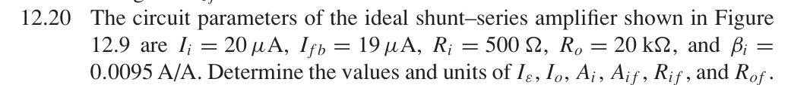

# 12.20 — 并联–串联反馈：电流与端口电阻

## 教材题目与引用图

来源：用户提供的 `electrobook-(4th ed).pdf`。以下页码同时列出书内印刷页码和 PDF 页序号（从 1 起）。

## 未知量 → 向下展开到已知量

按图 12.9 的电流箭头定义，输出电流流入放大器，输入源电阻影响在理想模型中忽略。负反馈使误差电流减小。

$$
\begin{aligned}
I_\varepsilon&\leftarrow I_i-I_{fb},&I_o&\leftarrow I_{fb}/\beta_i,\\
A_i&\leftarrow I_o/I_\varepsilon,&A_{if}&\leftarrow I_o/I_i,\\
R_{if}&\leftarrow R_i/D,&R_{of}&\leftarrow R_oD,\\
D&\leftarrow1+\beta_iA_i\leftarrow I_i/I_\varepsilon.
\end{aligned}
$$

最后一式来自 $I_i=I_\varepsilon+\beta_iA_iI_\varepsilon$。输入并联使电阻除以 $D$；输出串联取样使电阻乘以 $D$，适用于教材理想、无额外负载的反馈二端口。

## 向上代入

$$
\begin{aligned}
I_\varepsilon&=20-19=1\,\mu\mathrm A,\\
I_o&=19/0.0095=2000\,\mu\mathrm A=2\,\mathrm{mA},\\
A_i&=2000/1=2000\,\mathrm{A/A},&A_{if}&=2000/20=100\,\mathrm{A/A},\\
D&=1+0.0095(2000)=20,\\
\boxed{R_{if}}&=500/20=\boxed{25\,\Omega},&
\boxed{R_{of}}&=20\,\mathrm{k\Omega}(20)=\boxed{400\,\mathrm{k\Omega}}.
\end{aligned}
$$

## 验证与下载

本题属于理想反馈模型的代数／拓扑推导；没有指定可唯一复现的器件、电源及工作点。这里不编造晶体管电路或 SPICE 日志。以上结果是手算，不标注为仿真验证通过。

[下载本题 Markdown](../../assets/downloads/ch12-20-60/12-20.md.txt) · [41 题状态清单](status-12-20-60.md)
