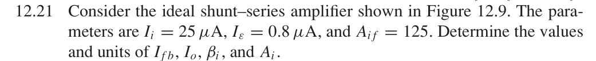
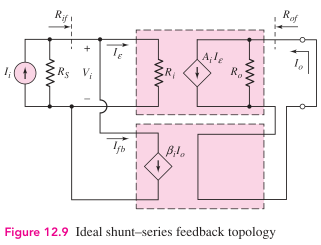

# 12.21 — 由误差电流反求开环参数

## 教材题目与引用图

来源：用户提供的 `electrobook-(4th ed).pdf`。以下页码同时列出书内印刷页码和 PDF 页序号（从 1 起）。

## 未知量 → 向下展开到已知量

按图 12.9 定义，先展开输出和反馈电流，再求反馈系数与开环电流增益：

$$
\begin{aligned}
\beta_i&\leftarrow I_{fb}/I_o,&A_i&\leftarrow I_o/I_\varepsilon,\\
I_{fb}&\leftarrow I_i-I_\varepsilon,&I_o&\leftarrow A_{if}I_i,\\
(I_i,I_\varepsilon,A_{if})&=(25\,\mu\mathrm A,0.8\,\mu\mathrm A,125\,\mathrm{A/A}).
\end{aligned}
$$

## 向上代入

$$
\begin{aligned}
I_{fb}&=25-0.8=24.2\,\mu\mathrm A,\\
I_o&=125(25\,\mu\mathrm A)=3.125\,\mathrm{mA},\\
\boxed{\beta_i}&=24.2/3125=\boxed{0.007744\,\mathrm{A/A}},\\
\boxed{A_i}&=3125/0.8=\boxed{3906.25\,\mathrm{A/A}}.
\end{aligned}
$$

检查：$1+\beta_iA_i=31.25=I_i/I_\varepsilon$，故 $A_i/31.25=125$。这些是理想二端口模型的代数结果，没有加入实际运放输出顺从电压限制。

## 验证与下载

本题属于理想反馈模型的代数／拓扑推导；没有指定可唯一复现的器件、电源及工作点。这里不编造晶体管电路或 SPICE 日志。以上结果是手算，不标注为仿真验证通过。

[下载本题 Markdown](../../assets/downloads/ch12-20-60/12-21.md.txt) · [41 题状态清单](status-12-20-60.md)
