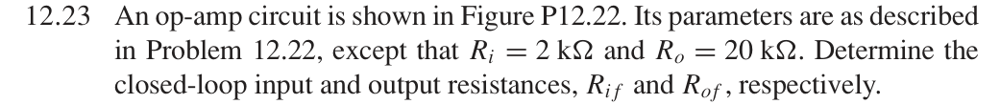
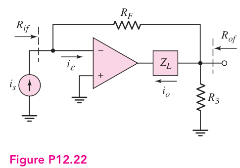
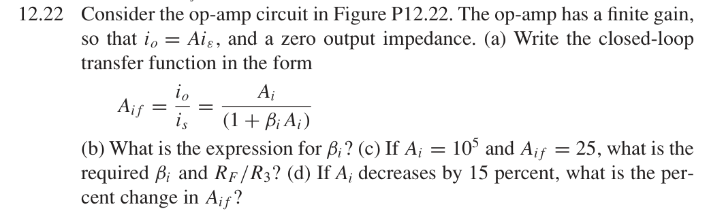

# 12.23 — 并联–串联端口电阻

## 教材题目与引用图

来源：用户提供的 `electrobook-(4th ed).pdf`。以下页码同时列出书内印刷页码和 PDF 页序号（从 1 起）。

## 未知量 → 向下展开

沿用 12.22(c) 的理想反馈参数，输入并联、输出串联：

$$
\begin{aligned}
R_{if}&\leftarrow R_i/D,&R_{of}&\leftarrow R_oD,\\
D&\leftarrow A_i/A_{if},&(A_i,A_{if})&=(10^5,25).
\end{aligned}
$$

## 向上代入

$$
\begin{aligned}
D&=4000,\\
\boxed{R_{if}}&=2000/4000=\boxed{0.5\,\Omega},\\
\boxed{R_{of}}&=20000(4000)=\boxed{80\,\mathrm{M\Omega}}.
\end{aligned}
$$

这里使用题目新给出的 $R_i=2\,\mathrm{k\Omega}$、$R_o=20\,\mathrm{k\Omega}$，替代 12.22 的零输出阻抗条件。结果是本节理想拓扑的端口电阻，不包括另接负载；不可把有限输入电阻的实际运放直接当作虚地而声称严格电路解。

## 验证与下载

本题属于理想反馈模型的代数／拓扑推导；没有指定可唯一复现的器件、电源及工作点。这里不编造晶体管电路或 SPICE 日志。以上结果是手算，不标注为仿真验证通过。

[下载本题 Markdown](../../assets/downloads/ch12-20-60/12-23.md.txt) · [41 题状态清单](status-12-20-60.md)
