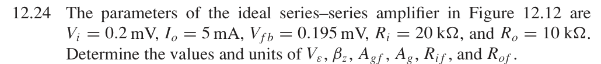

# 12.24 — 串联–串联反馈：跨导和电阻

## 教材题目与引用图

来源：用户提供的 `electrobook-(4th ed).pdf`。以下页码同时列出书内印刷页码和 PDF 页序号（从 1 起）。

## 未知量 → 向下展开

$$
\begin{aligned}
R_{if}&\leftarrow R_iD,&R_{of}&\leftarrow R_oD,&D&\leftarrow1+\beta_zA_g,\\
\beta_z&\leftarrow V_{fb}/I_o,&A_g&\leftarrow I_o/V_\varepsilon,&A_{gf}&\leftarrow I_o/V_i,\\
V_\varepsilon&\leftarrow V_i-V_{fb}.&&&
\end{aligned}
$$

两端均采用串联连接；理想反馈网络不额外加载输出，源电阻效应忽略。$\beta_z$ 的单位是 Ω，$A_g$ 的单位是 S，故环路增益无量纲。

## 向上代入

$$
\begin{aligned}
V_\varepsilon&=0.2-0.195=0.005\,\mathrm{mV}=5\,\mu\mathrm V,\\
\beta_z&=0.195\,\mathrm{mV}/5\,\mathrm{mA}=0.039\,\Omega,\\
A_{gf}&=5\,\mathrm{mA}/0.2\,\mathrm{mV}=25\,\mathrm S,\\
A_g&=5\,\mathrm{mA}/5\,\mu\mathrm V=1000\,\mathrm S,\\
D&=1+0.039(1000)=40,\\
\boxed{R_{if}}&=20\,\mathrm{k\Omega}(40)=\boxed{800\,\mathrm{k\Omega}},\\
\boxed{R_{of}}&=10\,\mathrm{k\Omega}(40)=\boxed{400\,\mathrm{k\Omega}}.
\end{aligned}
$$

## 验证与下载

本题属于理想反馈模型的代数／拓扑推导；没有指定可唯一复现的器件、电源及工作点。这里不编造晶体管电路或 SPICE 日志。以上结果是手算，不标注为仿真验证通过。

[下载本题 Markdown](../../assets/downloads/ch12-20-60/12-24.md.txt) · [41 题状态清单](status-12-20-60.md)
