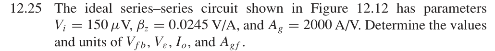
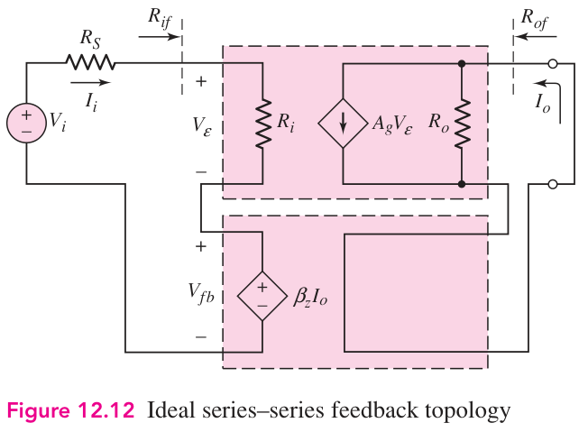

# 12.25 — 串联反馈的误差信号

## 教材题目与引用图

来源：用户提供的 `electrobook-(4th ed).pdf`。以下页码同时列出书内印刷页码和 PDF 页序号（从 1 起）。

## 未知量 → 向下展开

$$
\begin{aligned}
V_{fb}&\leftarrow\beta_zI_o,&I_o&\leftarrow A_gV_\varepsilon,\\
V_\varepsilon&\leftarrow V_i-V_{fb}\leftarrow V_i-\beta_zA_gV_\varepsilon,\\
A_{gf}&\leftarrow I_o/V_i\leftarrow A_g/(1+\beta_zA_g).
\end{aligned}
$$

误差与反馈相互依赖，必须先解闭合方程，不能用 $V_\varepsilon=V_i$ 代入。

## 向上代入

$$
\begin{aligned}
D&=1+(0.0245)(2000)=50,\\
V_\varepsilon&=150\,\mu\mathrm V/50=3\,\mu\mathrm V,\\
I_o&=2000\,\mathrm S(3\,\mu\mathrm V)=6\,\mathrm{mA},\\
V_{fb}&=0.0245\,\Omega(6\,\mathrm{mA})=147\,\mu\mathrm V,\\
\boxed{A_{gf}}&=2000/50=\boxed{40\,\mathrm S}.
\end{aligned}
$$

检查：$147+3=150\,\mu\mathrm V$。适用条件与图 12.12 相同：理想电流取样、忽略源电阻影响。

## 验证与下载

本题属于理想反馈模型的代数／拓扑推导；没有指定可唯一复现的器件、电源及工作点。这里不编造晶体管电路或 SPICE 日志。以上结果是手算，不标注为仿真验证通过。

[下载本题 Markdown](../../assets/downloads/ch12-20-60/12-25.md.txt) · [41 题状态清单](status-12-20-60.md)
