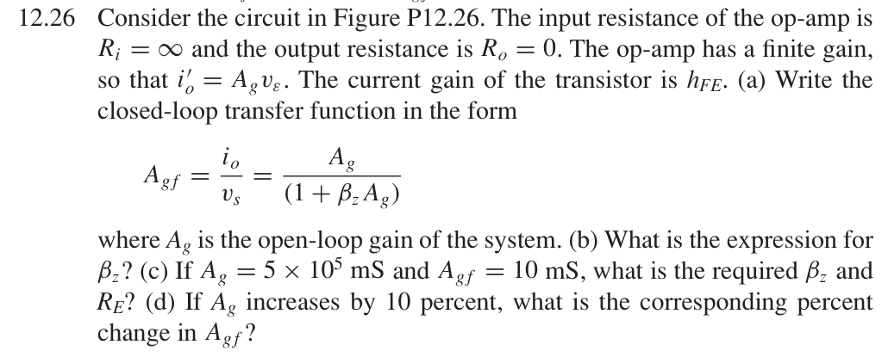
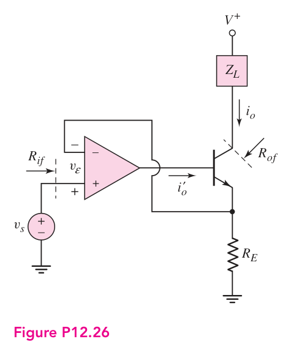

# 12.26 — 运放和晶体管构成的跨导反馈

## 教材题目与引用图

来源：用户提供的 `electrobook-(4th ed).pdf`。以下页码同时列出书内印刷页码和 PDF 页序号（从 1 起）。

## (a)、(b) 所求跨导 → 电流增益 → 反馈电压

题干把运放自身的跨导与整个系统的开环跨导都写成 $A_g$，需先消除符号混淆：以下令 $g_a=i'_o/v_\varepsilon$ 表示运放自身跨导，$A_g=h_{FE}g_a$ 表示从差模输入到集电极电流的总开环跨导。

先给教材忽略基极电流的反馈近似：

$$
\begin{aligned}
A_{gf}=i_o/v_s&\leftarrow i_o=A_gv_\varepsilon,\\
v_\varepsilon&\leftarrow v_s-v_E,\quad v_E\simeq i_oR_E,\\
A_g&\leftarrow h_{FE}g_a,\\
i_o&=A_g(v_s-i_oR_E)\quad\Longrightarrow\quad
\boxed{A_{gf}\simeq\frac{A_g}{1+R_EA_g}},\quad\boxed{\beta_z\simeq R_E}.
\end{aligned}
$$

适用条件：晶体管正向放大、$h_{FE}\gg1$、运放输出可以供给所需基极电流。

## (c) 设计电阻 → 反馈系数 → 向上代入

$$
\begin{aligned}
R_E&\simeq\beta_z\leftarrow\frac1{A_{gf}}-\frac1{A_g},\\
A_g&=5\times10^5\,\mathrm{mS}=500\,\mathrm S,\quad A_{gf}=10\,\mathrm{mS}=0.01\,\mathrm S,\\
\boxed{\beta_z}&=100-0.002=\boxed{99.998\,\Omega},\quad
\boxed{R_E\simeq99.998\,\Omega}.
\end{aligned}
$$

## (d) 开环变化 → 环路增益 → 向上代入

$$
\begin{aligned}
\frac{\Delta A_{gf}}{A_{gf}}&=\frac{\delta}{1+T(1+\delta)},\\
T&=\beta_zA_g=49999,\quad\delta=0.1,\\
\boxed{\text{百分比变化}}&=100\frac{0.1}{1+49999(1.1)}
=\boxed{+0.000181819\%}.
\end{aligned}
$$

微分近似为 $+0.0002\%$。

## 单列：有限基极电流修正

由 $i_E=i_o(1+1/h_{FE})$，严格反馈系数是

$$\beta_z=\left(1+\frac1{h_{FE}}\right)R_E,\qquad
R_E=99.998\frac{h_{FE}}{h_{FE}+1}\,\Omega.$$

题目没有给出 $h_{FE}$ 数值，不能为这个修正擅自指定晶体管 β。总开环跨导 $A_g$ 的定义保持不变。

## 验证与下载

本题属于理想反馈模型的代数／拓扑推导；没有指定可唯一复现的器件、电源及工作点。这里不编造晶体管电路或 SPICE 日志。以上结果是手算，不标注为仿真验证通过。

[下载本题 Markdown](../../assets/downloads/ch12-20-60/12-26.md.txt) · [41 题状态清单](status-12-20-60.md)
