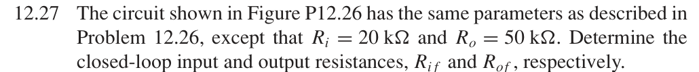

# 12.27 — 串联–串联放大器的端口电阻

## 教材题目与引用图

来源：用户提供的 `electrobook-(4th ed).pdf`。以下页码同时列出书内印刷页码和 PDF 页序号（从 1 起）。

## 未知量 → 向下展开

$$
\begin{aligned}
R_{if}&\leftarrow R_iD,&R_{of}&\leftarrow R_oD,\\
D&\leftarrow A_g/A_{gf},&(A_g,A_{gf})&=(500\,\mathrm S,0.01\,\mathrm S).
\end{aligned}
$$

本题替换 12.26 的理想端口电阻；按本节理想反馈二端口公式，两端串联使电阻均增大。

## 向上代入

$$
\begin{aligned}
D&=50000,\\
\boxed{R_{if}}&=20\,\mathrm{k\Omega}(50000)=\boxed{1\,\mathrm{G\Omega}},\\
\boxed{R_{of}}&=50\,\mathrm{k\Omega}(50000)=\boxed{2.5\,\mathrm{G\Omega}}.
\end{aligned}
$$

这是未并接负载的理想反馈模型电阻。未给出器件漏电、结电容、饱和及电源范围，不能把它解释为任意频率、任意电压下的实测电阻。

## 验证与下载

本题属于理想反馈模型的代数／拓扑推导；没有指定可唯一复现的器件、电源及工作点。这里不编造晶体管电路或 SPICE 日志。以上结果是手算，不标注为仿真验证通过。

[下载本题 Markdown](../../assets/downloads/ch12-20-60/12-27.md.txt) · [41 题状态清单](status-12-20-60.md)
