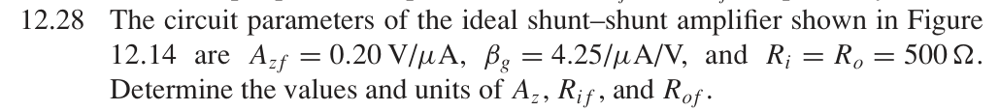

# 12.28 — 并联–并联反馈的跨阻与电阻

## 教材题目与引用图

来源：用户提供的 `electrobook-(4th ed).pdf`。以下页码同时列出书内印刷页码和 PDF 页序号（从 1 起）。

## 未知量 → 向下展开

教材扫描中的 $\beta_g=4.25/\mu\mathrm A/\mathrm V$ 有多余斜线；按反馈跨导的量纲读取为 $4.25\,\mu\mathrm A/\mathrm V$，原图保留供核对。

$$
\begin{aligned}
R_{if},R_{of}&\leftarrow R_i/D,R_o/D,&D&\leftarrow1+\beta_gA_z,\\
A_z&\leftarrow\frac{A_{zf}}{1-\beta_gA_{zf}},&
(A_{zf},\beta_g)&=(0.20\,\mathrm{V/\mu A},4.25\,\mu\mathrm{A/V}).
\end{aligned}
$$

反解来自 $A_{zf}=A_z/(1+\beta_gA_z)$；两端并联使电阻均减小。所给闭环增益须满足 $\beta_gA_{zf}<1$ 才对应正的有限开环跨阻。

## 向上代入

$$
\begin{aligned}
\beta_gA_{zf}&=0.85,\\
\boxed{A_z}&=0.20/0.15=\boxed{1.333333\,\mathrm{V/\mu A}=1.333333\,\mathrm{M\Omega}},\\
D&=1/(1-0.85)=6.666667,\\
\boxed{R_{if}=R_{of}}&=500/6.666667=\boxed{75\,\Omega}.
\end{aligned}
$$

## 验证与下载

本题属于理想反馈模型的代数／拓扑推导；没有指定可唯一复现的器件、电源及工作点。这里不编造晶体管电路或 SPICE 日志。以上结果是手算，不标注为仿真验证通过。

[下载本题 Markdown](../../assets/downloads/ch12-20-60/12-28.md.txt) · [41 题状态清单](status-12-20-60.md)
