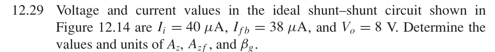
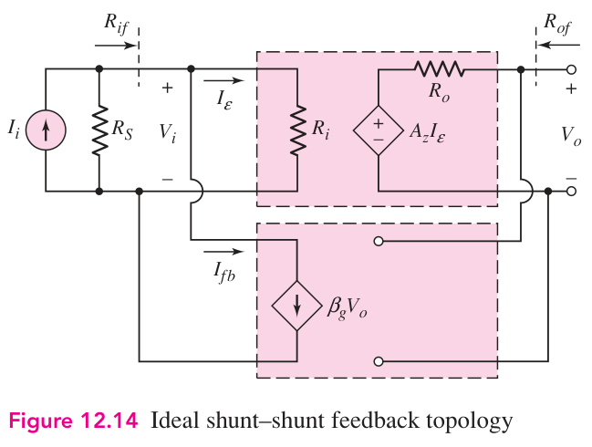

# 12.29 — 由电流和输出电压求跨阻

## 教材题目与引用图

来源：用户提供的 `electrobook-(4th ed).pdf`。以下页码同时列出书内印刷页码和 PDF 页序号（从 1 起）。

## 未知量 → 向下展开

$$
\begin{aligned}
A_z&\leftarrow V_o/I_\varepsilon\leftarrow V_o/(I_i-I_{fb}),\\
A_{zf}&\leftarrow V_o/I_i,\qquad\beta_g\leftarrow I_{fb}/V_o.
\end{aligned}
$$

图 12.14 的受控源采用正跨阻，反馈电流从输入节点流出；因此误差电流是相减关系。

## 向上代入

$$
\begin{aligned}
I_\varepsilon&=40-38=2\,\mu\mathrm A,\\
\boxed{A_z}&=8\,\mathrm V/(2\,\mu\mathrm A)=\boxed{4\,\mathrm{M\Omega}},\\
\boxed{A_{zf}}&=8\,\mathrm V/(40\,\mu\mathrm A)=\boxed{200\,\mathrm{k\Omega}},\\
\boxed{\beta_g}&=38\,\mu\mathrm A/(8\,\mathrm V)=\boxed{4.75\,\mu\mathrm S}.
\end{aligned}
$$

检查：$1+\beta_gA_z=20$，$4\,\mathrm{M\Omega}/20=200\,\mathrm{k\Omega}$。

## 验证与下载

本题属于理想反馈模型的代数／拓扑推导；没有指定可唯一复现的器件、电源及工作点。这里不编造晶体管电路或 SPICE 日志。以上结果是手算，不标注为仿真验证通过。

[下载本题 Markdown](../../assets/downloads/ch12-20-60/12-29.md.txt) · [41 题状态清单](status-12-20-60.md)
