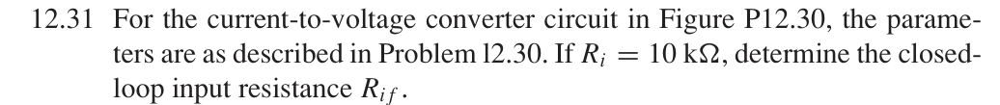
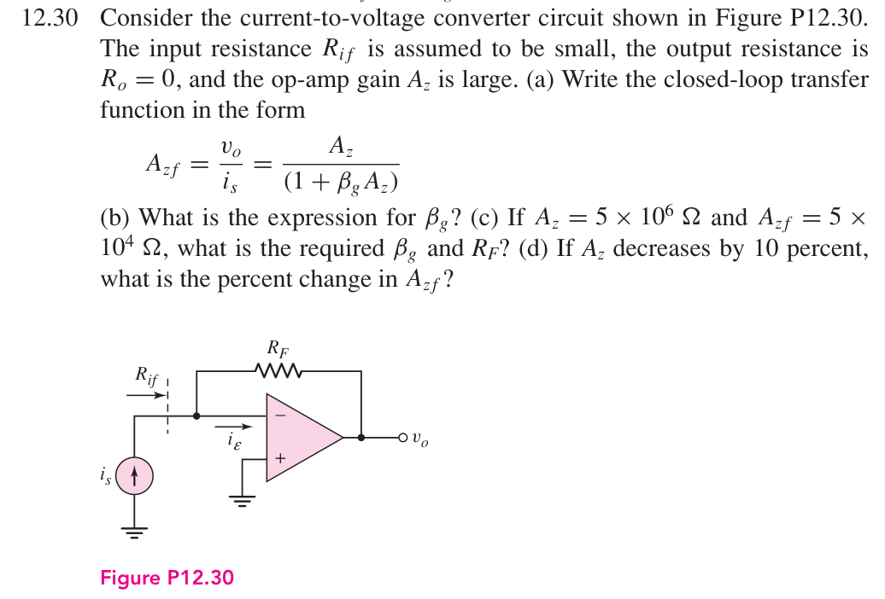

# 12.31 — 跨阻反馈输入电阻

## 教材题目与引用图

来源：用户提供的 `electrobook-(4th ed).pdf`。以下页码同时列出书内印刷页码和 PDF 页序号（从 1 起）。

## 未知量 → 向下展开

按题目要求的理想并联反馈近似，

$$
\begin{aligned}
R_{if}&\leftarrow R_i/D,\\
D&\leftarrow |A_z|/|A_{zf}|\leftarrow (5\times10^6)/(5\times10^4).
\end{aligned}
$$

## 向上代入：教材近似

$$\boxed{R_{if}\simeq10\,\mathrm{k\Omega}/100=100\,\Omega}.$$

## 单列：保留反馈电阻对输入的直接加载

若把有限 $R_i$ 置于运放输入端、采用 $v_o=-Zi_\varepsilon$，测试源 $v_x$ 对应

$$
\begin{aligned}
i_x&=v_x/R_i+(v_x-v_o)/R_F,\quad v_o=-Zv_x/R_i,\\
R_{if,\mathrm{exact}}&=\frac{R_i}{1+Z/R_F+R_i/R_F},\\
R_F&=50.5050505\,\mathrm{k\Omega}\quad\text{（由 12.30(c)）},\\
R_{if,\mathrm{exact}}&=10000/(100+0.198)=99.802391\,\Omega.
\end{aligned}
$$

此差异来自反馈支路加载，不是电路接错；教材近似忽略 $R_i/R_F$ 相对于 $1+Z/R_F$ 的贡献。

## 验证与下载

本题属于理想反馈模型的代数／拓扑推导；没有指定可唯一复现的器件、电源及工作点。这里不编造晶体管电路或 SPICE 日志。以上结果是手算，不标注为仿真验证通过。

[下载本题 Markdown](../../assets/downloads/ch12-20-60/12-31.md.txt) · [41 题状态清单](status-12-20-60.md)
