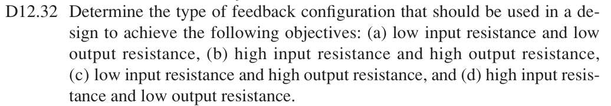

# 12.32 — 由输入输出电阻要求选择反馈拓扑

## 教材题目与引用图

来源：用户提供的 `electrobook-(4th ed).pdf`。以下页码同时列出书内印刷页码和 PDF 页序号（从 1 起）。

## 未知拓扑 → 端口要求 → 连接规则

从每个设计目标向下展开到输入、输出端的电阻变化，再用测试源关系判断连接方式。对于稳定负反馈、$T>0$，令 $D=1+T>1$。

$$
\begin{aligned}
R_{if}\text{低}&\leftarrow i_i\text{在求和节点相加}\leftarrow R_i/D\quad(\text{输入并联}),\\
R_{if}\text{高}&\leftarrow v_i\text{含反馈压降}\leftarrow R_iD\quad(\text{输入串联}),\\
R_{of}\text{低}&\leftarrow\text{输出电压取样}\leftarrow R_o/D\quad(\text{输出并联}),\\
R_{of}\text{高}&\leftarrow\text{输出电流取样}\leftarrow R_oD\quad(\text{输出串联}).
\end{aligned}
$$

## 向上组合：四个小问

|小问|输入要求|输出要求|反馈拓扑|放大器类型|
|---|---|---|---|---|
|(a)|低|低|并联–并联|跨阻，V/A|
|(b)|高|高|串联–串联|跨导，A/V|
|(c)|低|高|并联–串联|电流，A/A|
|(d)|高|低|串联–并联|电压，V/V|

没有给定电路元件或数值；答案是拓扑选择，不唯一规定某一实际电路。

## 验证与下载

本题属于理想反馈模型的代数／拓扑推导；没有指定可唯一复现的器件、电源及工作点。这里不编造晶体管电路或 SPICE 日志。以上结果是手算，不标注为仿真验证通过。

[下载本题 Markdown](../../assets/downloads/ch12-20-60/12-32.md.txt) · [41 题状态清单](status-12-20-60.md)
