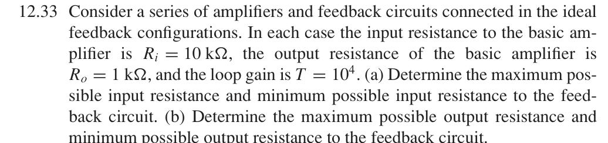

# 12.33 — 四种理想反馈中的电阻极值

## 教材题目与引用图

来源：用户提供的 `electrobook-(4th ed).pdf`。以下页码同时列出书内印刷页码和 PDF 页序号（从 1 起）。

## (a)、(b) 所求极值 → 连接方式 → 环路增益

$$
\begin{aligned}
R_{if,\max}&\leftarrow R_iD\quad(\text{输入串联}),&R_{if,\min}&\leftarrow R_i/D\quad(\text{输入并联}),\\
R_{of,\max}&\leftarrow R_oD\quad(\text{输出串联}),&R_{of,\min}&\leftarrow R_o/D\quad(\text{输出并联}),\\
D&\leftarrow1+T,&(R_i,R_o,T)&=(10\,\mathrm{k\Omega},1\,\mathrm{k\Omega},10^4).
\end{aligned}
$$

## 向上代入

$$
\begin{aligned}
D&=10001,\\
R_{if,\max}&=100.01\,\mathrm{M\Omega}\simeq100\,\mathrm{M\Omega},\\
R_{if,\min}&=0.99990001\,\Omega\simeq1\,\Omega,\\
R_{of,\max}&=10.001\,\mathrm{M\Omega}\simeq10\,\mathrm{M\Omega},\\
R_{of,\min}&=0.099990001\,\Omega\simeq0.1\,\Omega.
\end{aligned}
$$

近似值使用 $1+T\simeq T$，条件为 $T\gg1$。这里的“最大／最小”仅比较给定理想拓扑，不涉及晶体管击穿、带宽或噪声约束。

## 验证与下载

本题属于理想反馈模型的代数／拓扑推导；没有指定可唯一复现的器件、电源及工作点。这里不编造晶体管电路或 SPICE 日志。以上结果是手算，不标注为仿真验证通过。

[下载本题 Markdown](../../assets/downloads/ch12-20-60/12-33.md.txt) · [41 题状态清单](status-12-20-60.md)
