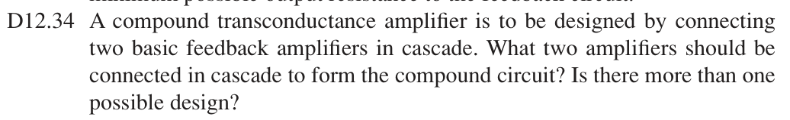

# 12.34 — 级联构成复合跨导放大器

## 教材题目与引用图

来源：用户提供的 `electrobook-(4th ed).pdf`。以下页码同时列出书内印刷页码和 PDF 页序号（从 1 起）。

## 未知级联方式 → 中间信号类型 → 已知四种增益量纲

所求 $G=I_o/V_i$ 的输入必须是电压，输出必须是电流。两级之间的中间量只能选电压或电流：

$$
\begin{aligned}
G=\frac{I_o}{V_i}
&\leftarrow\frac{I_o}{V_x}\frac{V_x}{V_i}
\leftarrow G_2A_{v1},\\
G=\frac{I_o}{V_i}
&\leftarrow\frac{I_o}{I_x}\frac{I_x}{V_i}
\leftarrow A_{i2}G_1.
\end{aligned}
$$

## 向上组合：两种设计

|中间信号|第一级|第二级|总跨导|
|---|---|---|---|
|电压 $V_x$|电压放大器，串联–并联反馈|跨导放大器，串联–串联反馈|$G_2A_{v1}$|
|电流 $I_x$|跨导放大器，串联–串联反馈|电流放大器，并联–串联反馈|$A_{i2}G_1$|

所以不止一种设计。在教材理想级联下，第一种要求电压级输出电阻远小于后级输入电阻，第二种要求跨导级输出电阻远大于电流级输入电阻。否则还要乘相应的分压或分流因子，不能直接相乘。题目未要求具体增益和电源，不能据此指定唯一元件值。

## 验证与下载

本题属于理想反馈模型的代数／拓扑推导；没有指定可唯一复现的器件、电源及工作点。这里不编造晶体管电路或 SPICE 日志。以上结果是手算，不标注为仿真验证通过。

[下载本题 Markdown](../../assets/downloads/ch12-20-60/12-34.md.txt) · [41 题状态清单](status-12-20-60.md)
