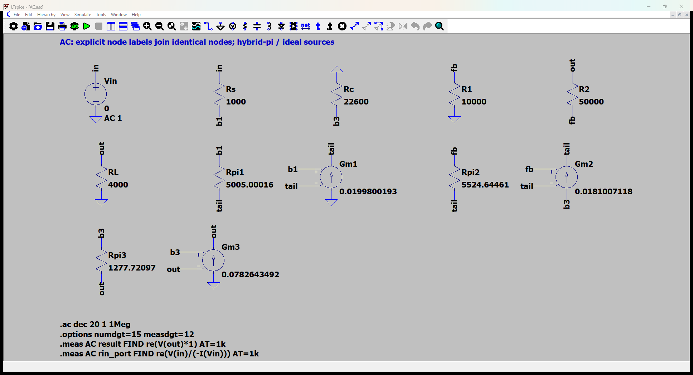
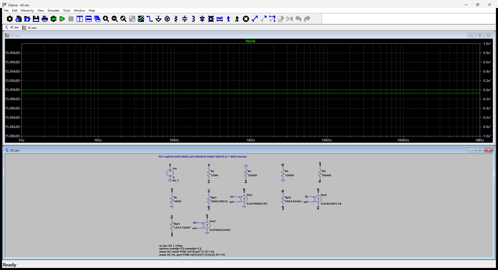

# 12.36 — 差分级与射极跟随器

[41 题完成清单](status-12-20-60.md) · [本题文件包](../../assets/downloads/ch12-20-60/p12-36.zip)

## 教材题目与引用图

来源：用户提供的 `electrobook-(4th ed).pdf`，页序号从 1 起。

## 按教材模型展开推导

### (a) 工作点 → 尾电流分配 → 电源和电阻

$$
\begin{aligned}
V_O,I_{C1},I_{C2},I_{C3}&\leftarrow\text{DC KCL 与 }V_{BE}=0.7\,\mathrm V,\\
I_{C1}+I_{C2}&=\frac{\beta}{\beta+1}(1\,\mathrm{mA}),\\
V_{B1}=V_{B2}&=-R_S I_{C1}/\beta,\\
(V_O-V_{B2})/R_2&=V_{B2}/R_1+I_{C2}/\beta,\\
\frac{\beta+1}{\beta}I_{C3}&=2\,\mathrm{mA}+V_O/R_L+(V_O-V_{B2})/R_2,\\
V_O+0.7&=12-R_C(I_{C2}+I_{C3}/\beta).
\end{aligned}
$$

未知量向下展开到这组线性方程后，代入 $R_S=1k,R_C=22.6k,R_1=10k,R_2=50k,R_L=4k,\beta=100$ 即闭合。若进一步忽略全部直流基极电流，会得到 $I_{C1}=I_{C2}=0.5\,\mathrm{mA}$、$I_{C3}=2\,\mathrm{mA}$、$V_O=0$；这是较粗的平衡近似，下面的主表保留有限 β。

### (b) 增益 → 跨导 → (a) 工作点

$A_{vf}\leftarrow v_o/v_i\leftarrow$ 下列交流 KCL $\leftarrow g_{mj}=I_{Cj}/26\,\mathrm{mV}$。尾电流源和输出恒流源交流开路；尾节点浮动，不能将两个发射极直接接交流地。输入 1 kΩ 串联电阻保留。

### 从依赖量展开到可代入的节点方程

恒流源交流开路；尾节点不是交流地。有限基极电流纳入 DC KCL。

未知的 $g_m,r_\pi$ 先由静态电流展开：$g_{mj}=I_{Cj}/V_T$、$r_{\pi j}=\beta/g_{mj}$，$V_T=26$ mV；$r_o=\infty$。向上代入如下，单位明确列出。

|管号|$I_C$ (mA)|$g_m$ (mS)|$r_\pi$ (Ω)|
|---|---:|---:|---:|
|Q1|0.5194805028|19.98001934|5005.000161|
|Q2|0.4706185071|18.10071181|5524.644613|
|Q3|2.03487308|78.26434922|1277.720967|

直流节点值由上面的固定 $V_{BE}$ 与电流 KCL 得到；表中 **不是**指数晶体管模型的输出。所有下表节点名与 `DC.cir` 一致，电压相对地：

|节点|直流电压 (V)|
|---|---:|
|`b1`|-0.005194805028|
|`b3`|0.9041404234|
|`fb`|-0.005194805028|
|`out`|0.2041404234|
|`s`|0|
|`tail`|-0.705194805|
|`vcc`|12|

DC 网表的每管用 `Vbe` 维持 0.7 V、用 F 源实现 $I_C=\beta I_B$；这是教材分段近似的独立电路实现，不预设待求电流。

为了逐节点核对，下面直接列出与原理图同名的全部节点 KCL。先由这些方程确定输出节点及输入电流，再向上组成所求比值。$i_V$ 是独立／受控电压源由正端流向负端的电流，所有理想直流电源在交流中接地，理想恒流偏置在交流中开路。

$$
\begin{aligned}
-\frac{(v_{\mathrm{in}}-v_{\mathrm{b1}})}{\mathrm{Rs}}+\frac{(v_{\mathrm{b1}}-v_{\mathrm{tail}})}{\mathrm{Rpi1}}&=0\quad(v_{\mathrm{b1}}\text{ 节点})\\[5pt]
-\frac{-v_{\mathrm{b3}}}{\mathrm{Rc}}+\mathrm{Gm2}(v_{\mathrm{fb}}-v_{\mathrm{tail}})+\frac{(v_{\mathrm{b3}}-v_{\mathrm{out}})}{\mathrm{Rpi3}}&=0\quad(v_{\mathrm{b3}}\text{ 节点})\\[5pt]
\frac{v_{\mathrm{fb}}}{\mathrm{R1}}-\frac{(v_{\mathrm{out}}-v_{\mathrm{fb}})}{\mathrm{R2}}+\frac{(v_{\mathrm{fb}}-v_{\mathrm{tail}})}{\mathrm{Rpi2}}&=0\quad(v_{\mathrm{fb}}\text{ 节点})
\end{aligned}
$$

$$
\begin{aligned}
i_{\mathrm{Vin}}+\frac{(v_{\mathrm{in}}-v_{\mathrm{b1}})}{\mathrm{Rs}}&=0\quad(v_{\mathrm{in}}\text{ 节点})\\[5pt]
\frac{(v_{\mathrm{out}}-v_{\mathrm{fb}})}{\mathrm{R2}}+\frac{v_{\mathrm{out}}}{\mathrm{RL}}-\frac{(v_{\mathrm{b3}}-v_{\mathrm{out}})}{\mathrm{Rpi3}}-\mathrm{Gm3}(v_{\mathrm{b3}}-v_{\mathrm{out}})&=0\quad(v_{\mathrm{out}}\text{ 节点})\\[5pt]
-\frac{(v_{\mathrm{b1}}-v_{\mathrm{tail}})}{\mathrm{Rpi1}}-\mathrm{Gm1}(v_{\mathrm{b1}}-v_{\mathrm{tail}})-\frac{(v_{\mathrm{fb}}-v_{\mathrm{tail}})}{\mathrm{Rpi2}}-\mathrm{Gm2}(v_{\mathrm{fb}}-v_{\mathrm{tail}})&=0\quad(v_{\mathrm{tail}}\text{ 节点})
\end{aligned}
$$

$$
\begin{aligned}
v_{\mathrm{in}}&=\mathrm{Vin}
\end{aligned}
$$

本组方程中的已知量如下。G 的系数为器件跨导（S），E 为开环电压增益或不加载电路的测量转换；不是题目闭环答案。1 V／1 A 是线性响应归一化，不是允许的大信号幅度。

|元件|连接节点（顺序同网表）|参数（SI 单位）|
|---|---|---:|
|`Vin`|`in → 0`|1|
|`Rs`|`in → b1`|1000|
|`Rc`|`0 → b3`|22600|
|`R1`|`fb → 0`|10000|
|`R2`|`out → fb`|50000|
|`RL`|`out → 0`|4000|
|`Rpi1`|`b1 → tail`|5005.00016077|
|`Gm1`|`0 → tail → b1 → tail`|0.0199800193382|
|`Rpi2`|`fb → tail`|5524.64461286|
|`Gm2`|`b3 → tail → fb → tail`|0.0181007118118|
|`Rpi3`|`b3 → out`|1277.72096749|
|`Gm3`|`0 → out → b3 → out`|0.0782643492161|

### 向上代入得到结果

将上述已知参数代入 KCL（线性方程组数值求解），再取目标端口量。计算脚本为仓库中的 `scripts/ch12_models.py`，与 LTspice 引擎独立。

主结果：**5.681510966 V/V**。

信号源端口电阻：374197.7142 Ω。减去外部串联电阻后，放大器输入电阻为 373197.7142 Ω。

保持图中电阻与负载的输出测试电阻：11.80493775 Ω。

## 实际 LTspice 电路与频响截图

以下为 **LTspice 26.1.1 for Windows 实际窗口截图**，下方是教材小信号等效原理图，上方是引擎生成的 AC 曲线。同名节点标签表示电气相连。

未加入题目没有给出的结电容；因此 1 Hz–1 MHz 的平坦曲线只验证本页中频／理想等效模型，不代表实际器件带宽。对比值在 **1 kHz、同一套 $g_m,r_\pi$、同一端口定义**下提取。原日志的 AC 测量以 dB 和相位显示，数值表按 $x=10^{d/20}\cos\phi$ 换回线性值；180° 对应负号。

<section class="p1240-result-panel">
<h3>LTspice 原始运行日志</h3>

AC.log
<pre class="p1240-log"><code>LTspice 26.1.1 for Windows
Circuit: C:\Users\tongs\Documents\GitHub\zhihu-physics-notes\docs\assets\downloads\ch12-20-60\p12-36\AC.net
Start Time: Tue Sep 22 09:56:19 2026
Options:numdgt=15 measdgt=12
solver = Normal
Maximum thread count: 16
tnom = 27
temp = 27
method = trap
.OP point found by inspection.
.OP point found by inspection.
Total elapsed time: 0.226 seconds.
Total iterations: 0

Files loaded:
C:\Users\tongs\Documents\GitHub\zhihu-physics-notes\docs\assets\downloads\ch12-20-60\p12-36\AC.net

result: re(V(out)*1)=(15.0892769841dB,0°) at 1000
rin_port: re(V(in)/(-I(Vin)))=(111.462022589dB,0°) at 1000
</code></pre>

DC.log
<pre class="p1240-log"><code>LTspice 26.1.1 for Windows
Circuit: C:\Users\tongs\Documents\GitHub\zhihu-physics-notes\docs\assets\downloads\ch12-20-60\p12-36\DC.cir
Start Time: Tue Sep 22 09:55:52 2026
Options:numdgt=15 measdgt=12
solver = Normal
Maximum thread count: 16
tnom = 27
temp = 27
method = trap
Total elapsed time: 0.015 seconds.
Total iterations: 5

Files loaded:
C:\Users\tongs\Documents\GitHub\zhihu-physics-notes\docs\assets\downloads\ch12-20-60\p12-36\DC.cir

ic1: (I(Vbe1)*100)=0.000519480502794 at 12
ic2: (I(Vbe2)*100)=0.000470618507107 at 12
ic3: (I(Vbe3)*100)=0.00203487307962 at 12
v_b1: V(b1)=-0.00519480502794 at 12
v_b3: V(b3)=0.904140423386 at 12
v_fb: V(fb)=-0.00519480502794 at 12
v_out: V(out)=0.204140423386 at 12
v_s: V(s)=0 at 12
v_tail: V(tail)=-0.705194805028 at 12
v_vcc: V(vcc)=12 at 12
</code></pre>

Rout.log
<pre class="p1240-log"><code>LTspice 26.1.1 for Windows
Circuit: C:\Users\tongs\Documents\GitHub\zhihu-physics-notes\docs\assets\downloads\ch12-20-60\p12-36\Rout.cir
Start Time: Tue Sep 22 09:55:52 2026
Options:numdgt=15 measdgt=12
solver = Normal
Maximum thread count: 16
tnom = 27
temp = 27
method = trap
.OP point found by inspection.
.OP point found by inspection.
Total elapsed time: 0.019 seconds.
Total iterations: 0

Files loaded:
C:\Users\tongs\Documents\GitHub\zhihu-physics-notes\docs\assets\downloads\ch12-20-60\p12-36\Rout.cir

rout_port: re(V(out))=(21.4412740224dB,0°) at 1000
</code></pre>

</section>
<section class="p1240-result-panel">
<h3>教材计算与实际仿真</h3>

<table><thead><tr><th>物理量</th><th>教材近似计算</th><th>实际仿真</th><th>单位</th><th>相对误差</th><th>原因／定义</th></tr></thead><tbody><tr><td>主结果</td><td>5.681510966</td><td>5.681510965</td><td>V/V</td><td>-6.2469e-09%</td><td>相同教材等效模型；数值舍入</td></tr><tr><td>输入测试端口电阻</td><td>374197.7142</td><td>374197.7135</td><td>Ω</td><td>-1.9507e-07%</td><td>相同端口；包含源电阻时的换算见上文</td></tr><tr><td>输出测试端口电阻</td><td>11.80493775</td><td>11.80493775</td><td>Ω</td><td>-4.4521e-08%</td><td>保持原负载；放大器自身值另列</td></tr><tr><td>IC1</td><td>0.0005194805028</td><td>0.0005194805028</td><td>A</td><td>+1.9723e-11%</td><td>固定VBE、有限β的同一偏置模型</td></tr><tr><td>IC2</td><td>0.0004706185071</td><td>0.0004706185071</td><td>A</td><td>-1.9674e-11%</td><td>固定VBE、有限β的同一偏置模型</td></tr><tr><td>IC3</td><td>0.00203487308</td><td>0.00203487308</td><td>A</td><td>+7.031e-11%</td><td>固定VBE、有限β的同一偏置模型</td></tr><tr><td>DC out</td><td>0.2041404234</td><td>0.2041404234</td><td>V</td><td>+4.3399e-11%</td><td>固定VBE近似；与AC扰动区分</td></tr></tbody></table>

计算来自上文节点方程，不以日志数值回填手算列。相对误差为 (仿真−计算)/计算；手算为零时只列绝对误差。同模型吻合验证代数与接线，不证明忽略寄生参数的近似适用于任意实物。

</section>

## 下载与复现

[本题完整文件包](../../assets/downloads/ch12-20-60/p12-36.zip) · [12.20–12.60 全部成果包](../../assets/downloads/ch12-20-60.zip)

- [AC.asc](../../assets/downloads/ch12-20-60/p12-36/AC.asc)
- [AC.cir](../../assets/downloads/ch12-20-60/p12-36/AC.cir)
- [AC.log](../../assets/downloads/ch12-20-60/p12-36/AC.log)
- [AC.plt](../../assets/downloads/ch12-20-60/p12-36/AC.plt)
- [AC.raw](../../assets/downloads/ch12-20-60/p12-36/AC.raw)
- [DC.cir](../../assets/downloads/ch12-20-60/p12-36/DC.cir)
- [DC.log](../../assets/downloads/ch12-20-60/p12-36/DC.log)
- [DC.raw](../../assets/downloads/ch12-20-60/p12-36/DC.raw)
- [Rout.asc](../../assets/downloads/ch12-20-60/p12-36/Rout.asc)
- [Rout.cir](../../assets/downloads/ch12-20-60/p12-36/Rout.cir)
- [Rout.log](../../assets/downloads/ch12-20-60/p12-36/Rout.log)
- [Rout.raw](../../assets/downloads/ch12-20-60/p12-36/Rout.raw)

完整解压后用 LTspice 打开 `AC.asc`，运行并按 **Ctrl+L** 查看本机新生成的日志。`AC.plt` 为波形选择配置；`Rout.asc`（如有）单独测试输出电阻，`DC.cir`（如有）验证教材固定 VBE 偏置。模型与参数直接写在文件中，不依赖外部器件库。
