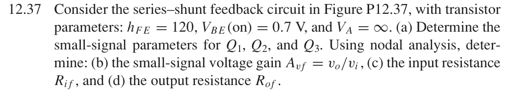
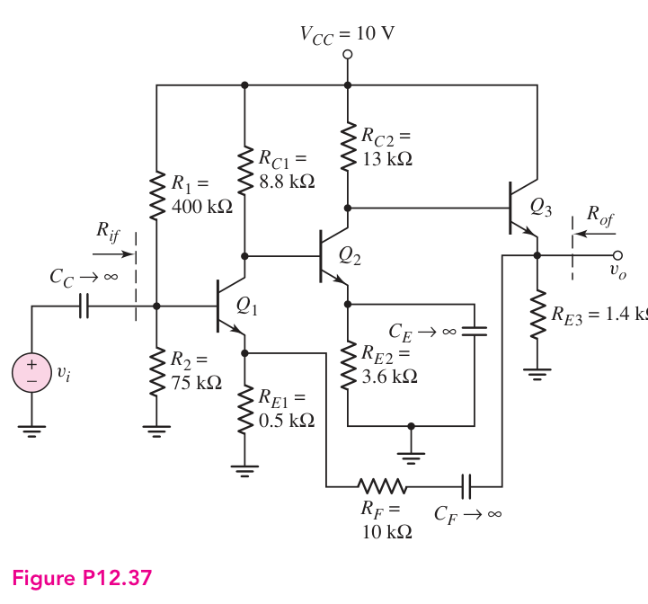
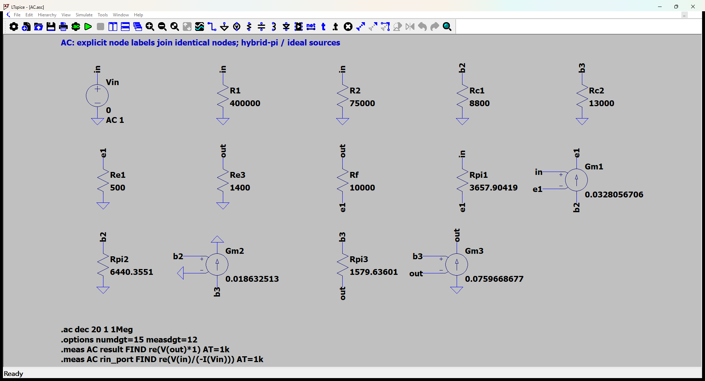
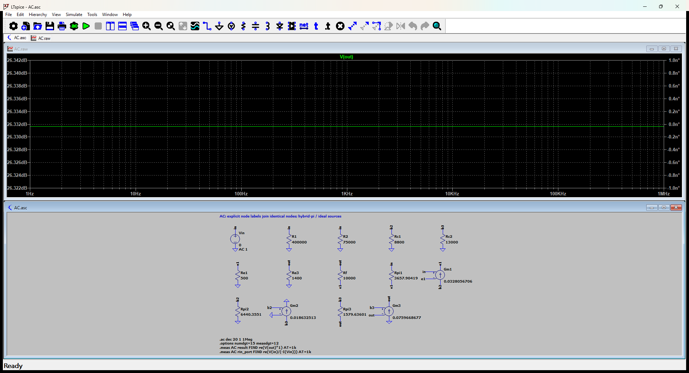

# 12.37 — 三级反馈电压放大器的节点分析

[41 题完成清单](status-12-20-60.md) · [本题文件包](../../assets/downloads/ch12-20-60/p12-37.zip)

## 教材题目与引用图

来源：用户提供的 `electrobook-(4th ed).pdf`，页序号从 1 起。

## 按教材模型展开推导

### (a) 参数 → 静态电流 → 偏置网络

$$
\begin{aligned}
(g_{mj},r_{\pi j})&\leftarrow(I_{Cj}/V_T,\beta V_T/I_{Cj}),\\
I_{E1}&\leftarrow\frac{V_{TH}-0.7}{R_{E1}+R_{TH}/(\beta+1)},\\
V_{TH}&=10\frac{75}{400+75},\quad R_{TH}=400k\parallel75k,\\
I_{E2}&=\frac{10-R_{C1}I_{C1}-0.7}{R_{E2}+R_{C1}/(\beta+1)},\\
I_{E3}&=\frac{10-R_{C2}I_{C2}-0.7}{R_{E3}+R_{C2}/(\beta+1)},\quad I_{Cj}=\frac\beta{\beta+1}I_{Ej}.
\end{aligned}
$$

自上式最下层的电源、电阻、β 往上求出三管电流，再求 $g_m,r_\pi$，不能把相邻级基极负载忽略。

### (b)–(d) 三个端口量

$A_{vf}\leftarrow v_o/v_i$；$R_{if}\leftarrow v_i/[-i(V_{in})]$，包括输入分压电阻；$R_{of}\leftarrow v_x/i_x$，输入交流置零，保留 $R_{E3}$。三者共享下面展开的交流节点方程。$C_E$ 仅旁路 Q2 发射极，$R_{E1}$ 仍参与反馈。

### 从依赖量展开到可代入的节点方程

CE 将 Q2 发射极交流接地；CF 只在交流把 RF 接到输出；CC 在中频短路。

未知的 $g_m,r_\pi$ 先由静态电流展开：$g_{mj}=I_{Cj}/V_T$、$r_{\pi j}=\beta/g_{mj}$，$V_T=26$ mV；$r_o=\infty$。向上代入如下，单位明确列出。

|管号|$I_C$ (mA)|$g_m$ (mS)|$r_\pi$ (Ω)|
|---|---:|---:|---:|
|Q1|0.8529474356|32.8056706|3657.904192|
|Q2|0.4844453375|18.63251298|6440.3551|
|Q3|1.975138561|75.96686773|1579.636012|

直流节点值由上面的固定 $V_{BE}$ 与电流 KCL 得到；表中 **不是**指数晶体管模型的输出。所有下表节点名与 `DC.cir` 一致，电压相对地：

|节点|直流电压 (V)|
|---|---:|
|`b1`|1.130027665|
|`b2`|2.458536575|
|`b3`|3.488237269|
|`e1`|0.4300276655|
|`e2`|1.758536575|
|`out`|2.788237269|
|`vcc`|10|

DC 网表的每管用 `Vbe` 维持 0.7 V、用 F 源实现 $I_C=\beta I_B$；这是教材分段近似的独立电路实现，不预设待求电流。

为了逐节点核对，下面直接列出与原理图同名的全部节点 KCL。先由这些方程确定输出节点及输入电流，再向上组成所求比值。$i_V$ 是独立／受控电压源由正端流向负端的电流，所有理想直流电源在交流中接地，理想恒流偏置在交流中开路。

$$
\begin{aligned}
\frac{v_{\mathrm{b2}}}{\mathrm{Rc1}}+\mathrm{Gm1}(v_{\mathrm{in}}-v_{\mathrm{e1}})+\frac{v_{\mathrm{b2}}}{\mathrm{Rpi2}}&=0\quad(v_{\mathrm{b2}}\text{ 节点})\\[5pt]
\frac{v_{\mathrm{b3}}}{\mathrm{Rc2}}+\mathrm{Gm2}v_{\mathrm{b2}}+\frac{(v_{\mathrm{b3}}-v_{\mathrm{out}})}{\mathrm{Rpi3}}&=0\quad(v_{\mathrm{b3}}\text{ 节点})\\[5pt]
\frac{v_{\mathrm{e1}}}{\mathrm{Re1}}-\frac{(v_{\mathrm{out}}-v_{\mathrm{e1}})}{\mathrm{Rf}}-\frac{(v_{\mathrm{in}}-v_{\mathrm{e1}})}{\mathrm{Rpi1}}-\mathrm{Gm1}(v_{\mathrm{in}}-v_{\mathrm{e1}})&=0\quad(v_{\mathrm{e1}}\text{ 节点})
\end{aligned}
$$

$$
\begin{aligned}
i_{\mathrm{Vin}}+\frac{v_{\mathrm{in}}}{\mathrm{R1}}+\frac{v_{\mathrm{in}}}{\mathrm{R2}}+\frac{(v_{\mathrm{in}}-v_{\mathrm{e1}})}{\mathrm{Rpi1}}&=0\quad(v_{\mathrm{in}}\text{ 节点})\\[5pt]
\frac{v_{\mathrm{out}}}{\mathrm{Re3}}+\frac{(v_{\mathrm{out}}-v_{\mathrm{e1}})}{\mathrm{Rf}}-\frac{(v_{\mathrm{b3}}-v_{\mathrm{out}})}{\mathrm{Rpi3}}-\mathrm{Gm3}(v_{\mathrm{b3}}-v_{\mathrm{out}})&=0\quad(v_{\mathrm{out}}\text{ 节点})
\end{aligned}
$$

$$
\begin{aligned}
v_{\mathrm{in}}&=\mathrm{Vin}
\end{aligned}
$$

本组方程中的已知量如下。G 的系数为器件跨导（S），E 为开环电压增益或不加载电路的测量转换；不是题目闭环答案。1 V／1 A 是线性响应归一化，不是允许的大信号幅度。

|元件|连接节点（顺序同网表）|参数（SI 单位）|
|---|---|---:|
|`Vin`|`in → 0`|1|
|`R1`|`in → 0`|400000|
|`R2`|`in → 0`|75000|
|`Rc1`|`b2 → 0`|8800|
|`Rc2`|`b3 → 0`|13000|
|`Re1`|`e1 → 0`|500|
|`Re3`|`out → 0`|1400|
|`Rf`|`out → e1`|10000|
|`Rpi1`|`in → e1`|3657.90419162|
|`Gm1`|`b2 → e1 → in → e1`|0.0328056706009|
|`Rpi2`|`b2 → 0`|6440.35510006|
|`Gm2`|`b3 → 0 → b2 → 0`|0.0186325129804|
|`Rpi3`|`b3 → out`|1579.63601222|
|`Gm3`|`0 → out → b3 → out`|0.0759668677286|

### 向上代入得到结果

将上述已知参数代入 KCL（线性方程组数值求解），再取目标端口量。计算脚本为仓库中的 `scripts/ch12_models.py`，与 LTspice 引擎独立。

主结果：**20.72915371 V/V**。

信号源端口电阻：62329.32982 Ω。

保持图中电阻与负载的输出测试电阻：1.41593663 Ω。

## 实际 LTspice 电路与频响截图

以下为 **LTspice 26.1.1 for Windows 实际窗口截图**，下方是教材小信号等效原理图，上方是引擎生成的 AC 曲线。同名节点标签表示电气相连。

未加入题目没有给出的结电容；因此 1 Hz–1 MHz 的平坦曲线只验证本页中频／理想等效模型，不代表实际器件带宽。对比值在 **1 kHz、同一套 $g_m,r_\pi$、同一端口定义**下提取。原日志的 AC 测量以 dB 和相位显示，数值表按 $x=10^{d/20}\cos\phi$ 换回线性值；180° 对应负号。

<section class="p1240-result-panel">
<h3>LTspice 原始运行日志</h3>

AC.log
<pre class="p1240-log"><code>LTspice 26.1.1 for Windows
Circuit: C:\Users\tongs\Documents\GitHub\zhihu-physics-notes\docs\assets\downloads\ch12-20-60\p12-37\AC.net
Start Time: Tue Sep 22 09:56:25 2026
Options:numdgt=15 measdgt=12
solver = Normal
Maximum thread count: 16
tnom = 27
temp = 27
method = trap
.OP point found by inspection.
.OP point found by inspection.
Total elapsed time: 0.105 seconds.
Total iterations: 0

Files loaded:
C:\Users\tongs\Documents\GitHub\zhihu-physics-notes\docs\assets\downloads\ch12-20-60\p12-37\AC.net

result: re(V(out)*1)=(26.33163144dB,0°) at 1000
rin_port: re(V(in)/(-I(Vin)))=(95.8938491459dB,0°) at 1000
</code></pre>

DC.log
<pre class="p1240-log"><code>LTspice 26.1.1 for Windows
Circuit: C:\Users\tongs\Documents\GitHub\zhihu-physics-notes\docs\assets\downloads\ch12-20-60\p12-37\DC.cir
Start Time: Tue Sep 22 09:55:53 2026
Options:numdgt=15 measdgt=12
solver = Normal
Maximum thread count: 16
tnom = 27
temp = 27
method = trap
Total elapsed time: 0.015 seconds.
Total iterations: 5

Files loaded:
C:\Users\tongs\Documents\GitHub\zhihu-physics-notes\docs\assets\downloads\ch12-20-60\p12-37\DC.cir

ic1: (I(Vbe1)*120)=0.000852947435625 at 10
ic2: (I(Vbe2)*120)=0.00048444533749 at 10
ic3: (I(Vbe3)*120)=0.00197513856094 at 10
v_b1: V(b1)=1.13002766546 at 10
v_b2: V(b2)=2.45853657509 at 10
v_b3: V(b3)=3.48823726853 at 10
v_e1: V(e1)=0.430027665461 at 10
v_e2: V(e2)=1.75853657509 at 10
v_out: V(out)=2.78823726853 at 10
v_vcc: V(vcc)=10 at 10
</code></pre>

Rout.log
<pre class="p1240-log"><code>LTspice 26.1.1 for Windows
Circuit: C:\Users\tongs\Documents\GitHub\zhihu-physics-notes\docs\assets\downloads\ch12-20-60\p12-37\Rout.cir
Start Time: Tue Sep 22 09:55:54 2026
Options:numdgt=15 measdgt=12
solver = Normal
Maximum thread count: 16
tnom = 27
temp = 27
method = trap
.OP point found by inspection.
.OP point found by inspection.
Total elapsed time: 0.017 seconds.
Total iterations: 0

Files loaded:
C:\Users\tongs\Documents\GitHub\zhihu-physics-notes\docs\assets\downloads\ch12-20-60\p12-37\Rout.cir

rout_port: re(V(out))=(3.0208763455dB,0°) at 1000
</code></pre>

</section>
<section class="p1240-result-panel">
<h3>教材计算与实际仿真</h3>

<table><thead><tr><th>物理量</th><th>教材近似计算</th><th>实际仿真</th><th>单位</th><th>相对误差</th><th>原因／定义</th></tr></thead><tbody><tr><td>主结果</td><td>20.72915371</td><td>20.72915371</td><td>V/V</td><td>+1.0669e-09%</td><td>相同教材等效模型；数值舍入</td></tr><tr><td>输入测试端口电阻</td><td>62329.32982</td><td>62329.32982</td><td>Ω</td><td>+4.0567e-10%</td><td>相同端口；包含源电阻时的换算见上文</td></tr><tr><td>输出测试端口电阻</td><td>1.41593663</td><td>1.415936631</td><td>Ω</td><td>+5.8563e-08%</td><td>保持原负载；放大器自身值另列</td></tr><tr><td>IC1</td><td>0.0008529474356</td><td>0.0008529474356</td><td>A</td><td>+4.6765e-11%</td><td>固定VBE、有限β的同一偏置模型</td></tr><tr><td>IC2</td><td>0.0004844453375</td><td>0.0004844453375</td><td>A</td><td>+6.2631e-11%</td><td>固定VBE、有限β的同一偏置模型</td></tr><tr><td>IC3</td><td>0.001975138561</td><td>0.001975138561</td><td>A</td><td>-1.7137e-10%</td><td>固定VBE、有限β的同一偏置模型</td></tr><tr><td>DC out</td><td>2.788237269</td><td>2.788237269</td><td>V</td><td>-6.2578e-11%</td><td>固定VBE近似；与AC扰动区分</td></tr></tbody></table>

计算来自上文节点方程，不以日志数值回填手算列。相对误差为 (仿真−计算)/计算；手算为零时只列绝对误差。同模型吻合验证代数与接线，不证明忽略寄生参数的近似适用于任意实物。

</section>

## 下载与复现

[本题完整文件包](../../assets/downloads/ch12-20-60/p12-37.zip) · [12.20–12.60 全部成果包](../../assets/downloads/ch12-20-60.zip)

- [AC.asc](../../assets/downloads/ch12-20-60/p12-37/AC.asc)
- [AC.cir](../../assets/downloads/ch12-20-60/p12-37/AC.cir)
- [AC.log](../../assets/downloads/ch12-20-60/p12-37/AC.log)
- [AC.plt](../../assets/downloads/ch12-20-60/p12-37/AC.plt)
- [AC.raw](../../assets/downloads/ch12-20-60/p12-37/AC.raw)
- [DC.cir](../../assets/downloads/ch12-20-60/p12-37/DC.cir)
- [DC.log](../../assets/downloads/ch12-20-60/p12-37/DC.log)
- [DC.raw](../../assets/downloads/ch12-20-60/p12-37/DC.raw)
- [Rout.asc](../../assets/downloads/ch12-20-60/p12-37/Rout.asc)
- [Rout.cir](../../assets/downloads/ch12-20-60/p12-37/Rout.cir)
- [Rout.log](../../assets/downloads/ch12-20-60/p12-37/Rout.log)
- [Rout.raw](../../assets/downloads/ch12-20-60/p12-37/Rout.raw)

完整解压后用 LTspice 打开 `AC.asc`，运行并按 **Ctrl+L** 查看本机新生成的日志。`AC.plt` 为波形选择配置；`Rout.asc`（如有）单独测试输出电阻，`DC.cir`（如有）验证教材固定 VBE 偏置。模型与参数直接写在文件中，不依赖外部器件库。
