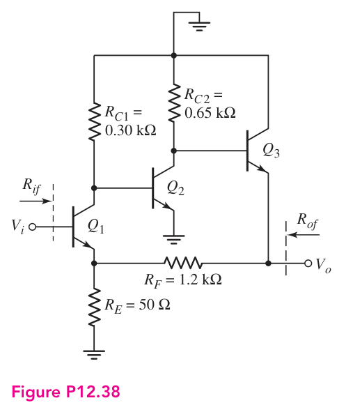
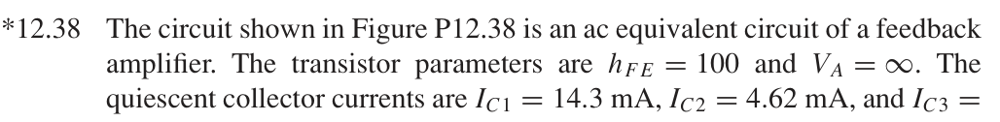
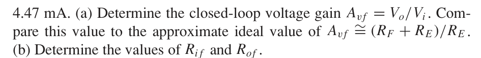
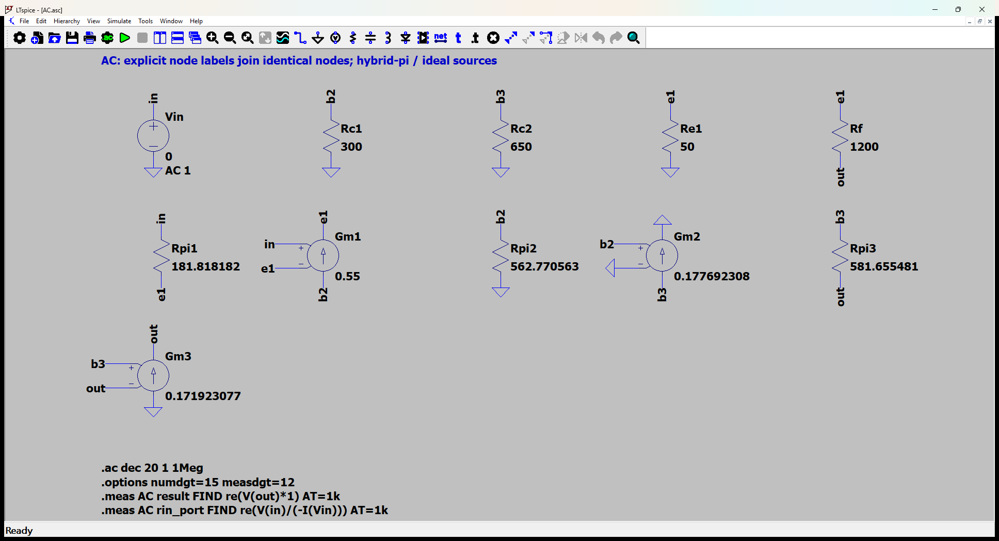
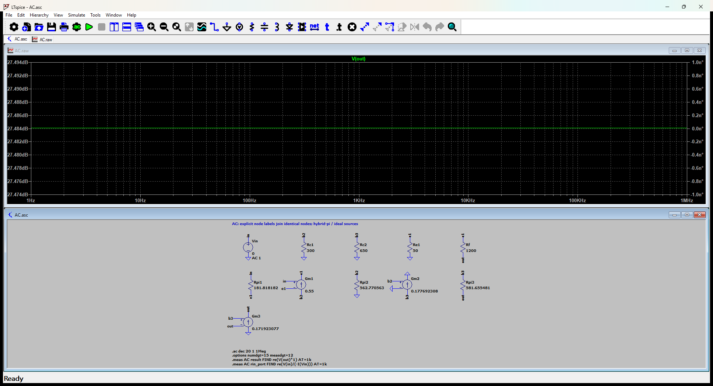

# 12.38 — 给定偏置的三级交流反馈网络

[41 题完成清单](status-12-20-60.md) · [本题文件包](../../assets/downloads/ch12-20-60/p12-38.zip)

## 教材题目与引用图

来源：用户提供的 `electrobook-(4th ed).pdf`，页序号从 1 起。

## 按教材模型展开推导

### (a) 增益及理想极限

$$
\begin{aligned}
A_{vf}&\leftarrow v_o/v_i\leftarrow\text{三级节点方程}\leftarrow(g_{mj},r_{\pi j}),\\
g_{mj}&\leftarrow I_{Cj}/V_T,\quad r_{\pi j}\leftarrow100/g_{mj},\\
(I_{C1},I_{C2},I_{C3})&=(14.3,4.62,4.47)\,\mathrm{mA},\quad V_T=26\,\mathrm{mV},\\
A_{vf,\mathrm{ideal}}&\leftarrow1+R_F/R_E=1+1200/50=25.
\end{aligned}
$$

保留有限 $g_m$ 和基极电流，节点解为 $23.67027119$，比理想值低 $5.318915\%$。这个偏差是有限环路增益和反馈网络加载，不是仿真误差。

### (b) 输入、输出电阻

$R_{if}=v_i/i_i$，$i_i=(v_i-v_{e1})/r_{\pi1}$；$R_{of}$ 令输入置零后在输出注入测试电流。题目只给交流等效电路和静态电流，不应编造未给出的电源、偏置电阻或 DC 原图。

### 从依赖量展开到可代入的节点方程

未知的 $g_m,r_\pi$ 先由静态电流展开：$g_{mj}=I_{Cj}/V_T$、$r_{\pi j}=\beta/g_{mj}$，$V_T=26$ mV；$r_o=\infty$。向上代入如下，单位明确列出。

|管号|$I_C$ (mA)|$g_m$ (mS)|$r_\pi$ (Ω)|
|---|---:|---:|---:|
|Q1|14.3|550|181.8181818|
|Q2|4.62|177.6923077|562.7705628|
|Q3|4.47|171.9230769|581.655481|

为了逐节点核对，下面直接列出与原理图同名的全部节点 KCL。先由这些方程确定输出节点及输入电流，再向上组成所求比值。$i_V$ 是独立／受控电压源由正端流向负端的电流，所有理想直流电源在交流中接地，理想恒流偏置在交流中开路。

$$
\begin{aligned}
\frac{v_{\mathrm{b2}}}{\mathrm{Rc1}}+\mathrm{Gm1}(v_{\mathrm{in}}-v_{\mathrm{e1}})+\frac{v_{\mathrm{b2}}}{\mathrm{Rpi2}}&=0\quad(v_{\mathrm{b2}}\text{ 节点})\\[5pt]
\frac{v_{\mathrm{b3}}}{\mathrm{Rc2}}+\mathrm{Gm2}v_{\mathrm{b2}}+\frac{(v_{\mathrm{b3}}-v_{\mathrm{out}})}{\mathrm{Rpi3}}&=0\quad(v_{\mathrm{b3}}\text{ 节点})\\[5pt]
\frac{v_{\mathrm{e1}}}{\mathrm{Re1}}+\frac{(v_{\mathrm{e1}}-v_{\mathrm{out}})}{\mathrm{Rf}}-\frac{(v_{\mathrm{in}}-v_{\mathrm{e1}})}{\mathrm{Rpi1}}-\mathrm{Gm1}(v_{\mathrm{in}}-v_{\mathrm{e1}})&=0\quad(v_{\mathrm{e1}}\text{ 节点})
\end{aligned}
$$

$$
\begin{aligned}
i_{\mathrm{Vin}}+\frac{(v_{\mathrm{in}}-v_{\mathrm{e1}})}{\mathrm{Rpi1}}&=0\quad(v_{\mathrm{in}}\text{ 节点})\\[5pt]
-\frac{(v_{\mathrm{e1}}-v_{\mathrm{out}})}{\mathrm{Rf}}-\frac{(v_{\mathrm{b3}}-v_{\mathrm{out}})}{\mathrm{Rpi3}}-\mathrm{Gm3}(v_{\mathrm{b3}}-v_{\mathrm{out}})&=0\quad(v_{\mathrm{out}}\text{ 节点})
\end{aligned}
$$

$$
\begin{aligned}
v_{\mathrm{in}}&=\mathrm{Vin}
\end{aligned}
$$

本组方程中的已知量如下。G 的系数为器件跨导（S），E 为开环电压增益或不加载电路的测量转换；不是题目闭环答案。1 V／1 A 是线性响应归一化，不是允许的大信号幅度。

|元件|连接节点（顺序同网表）|参数（SI 单位）|
|---|---|---:|
|`Vin`|`in → 0`|1|
|`Rc1`|`b2 → 0`|300|
|`Rc2`|`b3 → 0`|650|
|`Re1`|`e1 → 0`|50|
|`Rf`|`e1 → out`|1200|
|`Rpi1`|`in → e1`|181.818181818|
|`Gm1`|`b2 → e1 → in → e1`|0.55|
|`Rpi2`|`b2 → 0`|562.770562771|
|`Gm2`|`b3 → 0 → b2 → 0`|0.177692307692|
|`Rpi3`|`b3 → out`|581.655480984|
|`Gm3`|`0 → out → b3 → out`|0.171923076923|

### 向上代入得到结果

将上述已知参数代入 KCL（线性方程组数值求解），再取目标端口量。计算脚本为仓库中的 `scripts/ch12_models.py`，与 LTspice 引擎独立。

主结果：**23.67027119 V/V**。

信号源端口电阻：94564.73667 Ω。

保持图中电阻与负载的输出测试电阻：0.6423542933 Ω。

## 实际 LTspice 电路与频响截图

以下为 **LTspice 26.1.1 for Windows 实际窗口截图**，下方是教材小信号等效原理图，上方是引擎生成的 AC 曲线。同名节点标签表示电气相连。

未加入题目没有给出的结电容；因此 1 Hz–1 MHz 的平坦曲线只验证本页中频／理想等效模型，不代表实际器件带宽。对比值在 **1 kHz、同一套 $g_m,r_\pi$、同一端口定义**下提取。原日志的 AC 测量以 dB 和相位显示，数值表按 $x=10^{d/20}\cos\phi$ 换回线性值；180° 对应负号。

<section class="p1240-result-panel">
<h3>LTspice 原始运行日志</h3>

AC.log
<pre class="p1240-log"><code>LTspice 26.1.1 for Windows
Circuit: C:\Users\tongs\Documents\GitHub\zhihu-physics-notes\docs\assets\downloads\ch12-20-60\p12-38\AC.net
Start Time: Tue Sep 22 10:00:35 2026
Options:numdgt=15 measdgt=12
solver = Normal
Maximum thread count: 16
tnom = 27
temp = 27
method = trap
.OP point found by inspection.
.OP point found by inspection.
Total elapsed time: 0.067 seconds.
Total iterations: 0

Files loaded:
C:\Users\tongs\Documents\GitHub\zhihu-physics-notes\docs\assets\downloads\ch12-20-60\p12-38\AC.net

result: re(V(out)*1)=(27.484064675dB,0°) at 1000
rin_port: re(V(in)/(-I(Vin)))=(99.5145843749dB,0°) at 1000
</code></pre>

Rout.log
<pre class="p1240-log"><code>LTspice 26.1.1 for Windows
Circuit: C:\Users\tongs\Documents\GitHub\zhihu-physics-notes\docs\assets\downloads\ch12-20-60\p12-38\Rout.cir
Start Time: Tue Sep 22 09:55:55 2026
Options:numdgt=15 measdgt=12
solver = Normal
Maximum thread count: 16
tnom = 27
temp = 27
method = trap
.OP point found by inspection.
.OP point found by inspection.
Total elapsed time: 0.013 seconds.
Total iterations: 0

Files loaded:
C:\Users\tongs\Documents\GitHub\zhihu-physics-notes\docs\assets\downloads\ch12-20-60\p12-38\Rout.cir

rout_port: re(V(out))=(-3.84450739656dB,0°) at 1000
</code></pre>

</section>
<section class="p1240-result-panel">
<h3>教材计算与实际仿真</h3>

<table><thead><tr><th>物理量</th><th>教材近似计算</th><th>实际仿真</th><th>单位</th><th>相对误差</th><th>原因／定义</th></tr></thead><tbody><tr><td>主结果</td><td>23.67027119</td><td>23.67027119</td><td>V/V</td><td>+1.0155e-08%</td><td>相同教材等效模型；数值舍入</td></tr><tr><td>输入测试端口电阻</td><td>94564.73667</td><td>94564.73693</td><td>Ω</td><td>+2.7747e-07%</td><td>相同端口；包含源电阻时的换算见上文</td></tr><tr><td>输出测试端口电阻</td><td>0.6423542933</td><td>0.6423542918</td><td>Ω</td><td>-2.2393e-07%</td><td>保持原负载；放大器自身值另列</td></tr></tbody></table>

计算来自上文节点方程，不以日志数值回填手算列。相对误差为 (仿真−计算)/计算；手算为零时只列绝对误差。同模型吻合验证代数与接线，不证明忽略寄生参数的近似适用于任意实物。

</section>

## 下载与复现

[本题完整文件包](../../assets/downloads/ch12-20-60/p12-38.zip) · [12.20–12.60 全部成果包](../../assets/downloads/ch12-20-60.zip)

- [AC.asc](../../assets/downloads/ch12-20-60/p12-38/AC.asc)
- [AC.cir](../../assets/downloads/ch12-20-60/p12-38/AC.cir)
- [AC.log](../../assets/downloads/ch12-20-60/p12-38/AC.log)
- [AC.plt](../../assets/downloads/ch12-20-60/p12-38/AC.plt)
- [AC.raw](../../assets/downloads/ch12-20-60/p12-38/AC.raw)
- [Rout.asc](../../assets/downloads/ch12-20-60/p12-38/Rout.asc)
- [Rout.cir](../../assets/downloads/ch12-20-60/p12-38/Rout.cir)
- [Rout.log](../../assets/downloads/ch12-20-60/p12-38/Rout.log)
- [Rout.raw](../../assets/downloads/ch12-20-60/p12-38/Rout.raw)

完整解压后用 LTspice 打开 `AC.asc`，运行并按 **Ctrl+L** 查看本机新生成的日志。`AC.plt` 为波形选择配置；`Rout.asc`（如有）单独测试输出电阻，`DC.cir`（如有）验证教材固定 VBE 偏置。模型与参数直接写在文件中，不依赖外部器件库。
