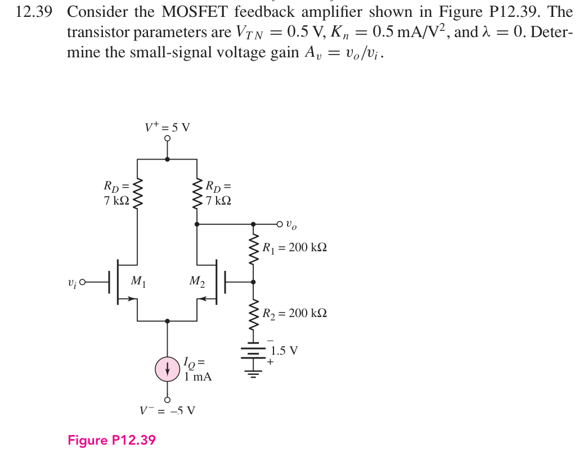
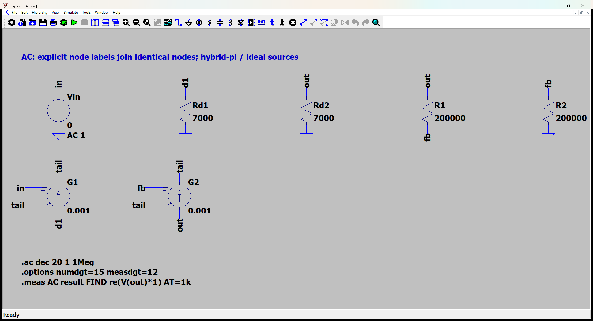
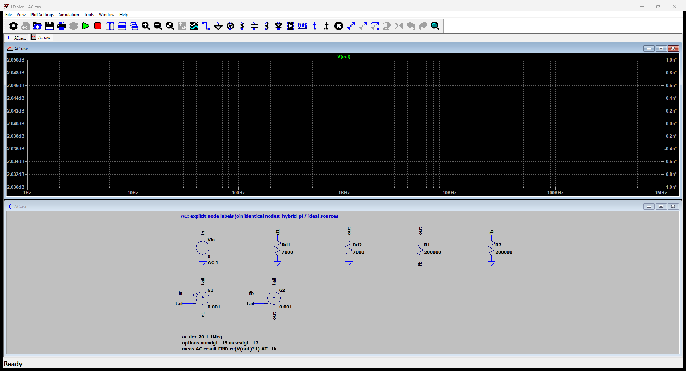

# 12.39 — MOS 差分对与电阻反馈

[41 题完成清单](status-12-20-60.md) · [本题文件包](../../assets/downloads/ch12-20-60/p12-39.zip)

## 教材题目与引用图

来源：用户提供的 `electrobook-(4th ed).pdf`，页序号从 1 起。

## 按教材模型展开推导

### 增益 → 差分跨导 → 静态电流

$$
\begin{aligned}
A_v&\leftarrow\frac{g_m/2}{1/R_D+1/(R_1+R_2)+(g_m/2)\beta_f},\\
\beta_f&\leftarrow R_2/(R_1+R_2)=1/2,\quad
 g_m\leftarrow2\sqrt{K_nI_D},\\
I_D&\simeq I_Q/2=0.5\,\mathrm{mA},\quad K_n=0.5\,\mathrm{mA/V^2}.
\end{aligned}
$$

向上代入得到 $g_m=1\,\mathrm{mS}$，$A_v=1.264679313$。公式来自尾源交流开路后 $i_{d2}=g_m(v_{g2}-v_i)/2$，以及输出节点 KCL。反馈分压器下端接 **−1.5 V**，不是 +1.5 V；交流时该理想电压源短路接地。

偏置近似给出 $v_O\simeq1.5\,\mathrm V$、$v_{G2}\simeq0$、源节点约 −1.5 V；两管 $V_{DS}\simeq3\,\mathrm V>V_{OV}=1\,\mathrm V$，饱和条件满足。此近似忽略分压器的直流负载（约 7.5 µA）；不能将其声称为完整非线性工作点。

### 从依赖量展开到可代入的节点方程

教材偏置近似忽略 400 kΩ 分压支路的直流负载；交流保留该支路。gm1=gm2=1 mS；λ=0、体端接源极。

为了逐节点核对，下面直接列出与原理图同名的全部节点 KCL。先由这些方程确定输出节点及输入电流，再向上组成所求比值。$i_V$ 是独立／受控电压源由正端流向负端的电流，所有理想直流电源在交流中接地，理想恒流偏置在交流中开路。

$$
\begin{aligned}
\frac{v_{\mathrm{d1}}}{\mathrm{Rd1}}+\mathrm{G1}(v_{\mathrm{in}}-v_{\mathrm{tail}})&=0\quad(v_{\mathrm{d1}}\text{ 节点})\\[5pt]
-\frac{(v_{\mathrm{out}}-v_{\mathrm{fb}})}{\mathrm{R1}}+\frac{v_{\mathrm{fb}}}{\mathrm{R2}}&=0\quad(v_{\mathrm{fb}}\text{ 节点})\\[5pt]
i_{\mathrm{Vin}}&=0\quad(v_{\mathrm{in}}\text{ 节点})
\end{aligned}
$$

$$
\begin{aligned}
\frac{v_{\mathrm{out}}}{\mathrm{Rd2}}+\frac{(v_{\mathrm{out}}-v_{\mathrm{fb}})}{\mathrm{R1}}+\mathrm{G2}(v_{\mathrm{fb}}-v_{\mathrm{tail}})&=0\quad(v_{\mathrm{out}}\text{ 节点})\\[5pt]
-\mathrm{G1}(v_{\mathrm{in}}-v_{\mathrm{tail}})-\mathrm{G2}(v_{\mathrm{fb}}-v_{\mathrm{tail}})&=0\quad(v_{\mathrm{tail}}\text{ 节点})
\end{aligned}
$$

$$
\begin{aligned}
v_{\mathrm{in}}&=\mathrm{Vin}
\end{aligned}
$$

本组方程中的已知量如下。G 的系数为器件跨导（S），E 为开环电压增益或不加载电路的测量转换；不是题目闭环答案。1 V／1 A 是线性响应归一化，不是允许的大信号幅度。

|元件|连接节点（顺序同网表）|参数（SI 单位）|
|---|---|---:|
|`Vin`|`in → 0`|1|
|`Rd1`|`d1 → 0`|7000|
|`Rd2`|`out → 0`|7000|
|`R1`|`out → fb`|200000|
|`R2`|`fb → 0`|200000|
|`G1`|`d1 → tail → in → tail`|0.001|
|`G2`|`out → tail → fb → tail`|0.001|

### 向上代入得到结果

将上述已知参数代入 KCL（线性方程组数值求解），再取目标端口量。计算脚本为仓库中的 `scripts/ch12_models.py`，与 LTspice 引擎独立。

主结果：**1.264679313 V/V**。

保持图中电阻与负载的输出测试电阻：2529.358627 Ω。

## 实际 LTspice 电路与频响截图

以下为 **LTspice 26.1.1 for Windows 实际窗口截图**，下方是教材小信号等效原理图，上方是引擎生成的 AC 曲线。同名节点标签表示电气相连。

未加入题目没有给出的结电容；因此 1 Hz–1 MHz 的平坦曲线只验证本页中频／理想等效模型，不代表实际器件带宽。对比值在 **1 kHz、同一套 $g_m,r_\pi$、同一端口定义**下提取。原日志的 AC 测量以 dB 和相位显示，数值表按 $x=10^{d/20}\cos\phi$ 换回线性值；180° 对应负号。

<section class="p1240-result-panel">
<h3>LTspice 原始运行日志</h3>

AC.log
<pre class="p1240-log"><code>LTspice 26.1.1 for Windows
Circuit: C:\Users\tongs\Documents\GitHub\zhihu-physics-notes\docs\assets\downloads\ch12-20-60\p12-39\AC.net
Start Time: Tue Sep 22 10:00:41 2026
Options:numdgt=15 measdgt=12
solver = Normal
Maximum thread count: 16
tnom = 27
temp = 27
method = trap
ERROR: Node tail is floating and connected to current source G1

.OP point found by inspection.
.OP point found by inspection.
Total elapsed time: 0.103 seconds.
Total iterations: 0

Files loaded:
C:\Users\tongs\Documents\GitHub\zhihu-physics-notes\docs\assets\downloads\ch12-20-60\p12-39\AC.net

result: re(V(out)*1)=(2.03960829599dB,0°) at 1000
</code></pre>

DeviceDC.log
<pre class="p1240-log"><code>LTspice 26.1.1 for Windows
Circuit: C:\Users\tongs\Documents\GitHub\zhihu-physics-notes\docs\assets\downloads\ch12-20-60\p12-39\DeviceDC.cir
Start Time: Tue Sep 22 09:55:56 2026
Options:numdgt=15 measdgt=12 reltol=1e-9 abstol=1e-14 vntol=1e-10
solver = Normal
Maximum thread count: 16
tnom = 27
temp = 27
method = trap
abstol = 1e-14
reltol = 1e-09
volttol = 1e-10
Instance &quot;M1&quot;: Length shorter than recommended for a level 1 MOSFET.
Instance &quot;M1&quot;: Width narrower than recommended for a level 1 MOSFET.
Instance &quot;M2&quot;: Length shorter than recommended for a level 1 MOSFET.
Instance &quot;M2&quot;: Width narrower than recommended for a level 1 MOSFET.
Total elapsed time: 0.018 seconds.
Total iterations: 13

Files loaded:
C:\Users\tongs\Documents\GitHub\zhihu-physics-notes\docs\assets\downloads\ch12-20-60\p12-39\DeviceDC.cir

id1: Id(M1)=0.0005047425278 at 5
id2: Id(M2)=0.0004952574722 at 5
vout: V(out)=1.48102967529 at 5
</code></pre>

Rout.log
<pre class="p1240-log"><code>LTspice 26.1.1 for Windows
Circuit: C:\Users\tongs\Documents\GitHub\zhihu-physics-notes\docs\assets\downloads\ch12-20-60\p12-39\Rout.cir
Start Time: Tue Sep 22 09:55:56 2026
Options:numdgt=15 measdgt=12
solver = Normal
Maximum thread count: 16
tnom = 27
temp = 27
method = trap
ERROR: Node tail is floating and connected to current source G1

.OP point found by inspection.
.OP point found by inspection.
Total elapsed time: 0.019 seconds.
Total iterations: 0

Files loaded:
C:\Users\tongs\Documents\GitHub\zhihu-physics-notes\docs\assets\downloads\ch12-20-60\p12-39\Rout.cir

rout_port: re(V(out))=(68.0602082093dB,0°) at 1000
</code></pre>

</section>
<section class="p1240-result-panel">
<h3>教材计算与实际仿真</h3>

<table><thead><tr><th>物理量</th><th>教材近似计算</th><th>实际仿真</th><th>单位</th><th>相对误差</th><th>原因／定义</th></tr></thead><tbody><tr><td>主结果</td><td>1.264679313</td><td>1.264679313</td><td>V/V</td><td>-3.4939e-12%</td><td>相同教材等效模型；数值舍入</td></tr><tr><td>输出测试端口电阻</td><td>2529.358627</td><td>2529.358627</td><td>Ω</td><td>+3.4618e-10%</td><td>保持原负载；放大器自身值另列</td></tr><tr><td>id1（器件DC）</td><td>0.0005</td><td>0.0005047425278</td><td>A</td><td>+0.94851%</td><td>单列器件模型：偏置近似、26mV与27°C热电压差异</td></tr><tr><td>id2（器件DC）</td><td>0.0005</td><td>0.0004952574722</td><td>A</td><td>-0.94851%</td><td>单列器件模型：偏置近似、26mV与27°C热电压差异</td></tr><tr><td>VO（器件DC）</td><td>1.5</td><td>1.481029675</td><td>V</td><td>-1.2647%</td><td>分压器直流加载；手算平衡近似</td></tr></tbody></table>

计算来自上文节点方程，不以日志数值回填手算列。相对误差为 (仿真−计算)/计算；手算为零时只列绝对误差。同模型吻合验证代数与接线，不证明忽略寄生参数的近似适用于任意实物。

</section>

### 单列：非线性器件直流检查

`DeviceDC.cir` 使用 LEVEL=1 MOS 或题给 IS 的 BJT 器件，在27°C实际运行。它与上面的教材近似偏置不同，**没有用新工作点悄悄替换上方 AC 对比的参数**。MOS 差异来自分压器负载／差分对非平衡；BJT 差异还包含26 mV近似与27°C实际热电压的区别。

|日志量|实际值（SI）|
|---|---:|
|`id1`|0.0005047425278|
|`id2`|0.0004952574722|
|`vout`|1.48102967529|
## 下载与复现

[本题完整文件包](../../assets/downloads/ch12-20-60/p12-39.zip) · [12.20–12.60 全部成果包](../../assets/downloads/ch12-20-60.zip)

- [AC.asc](../../assets/downloads/ch12-20-60/p12-39/AC.asc)
- [AC.cir](../../assets/downloads/ch12-20-60/p12-39/AC.cir)
- [AC.log](../../assets/downloads/ch12-20-60/p12-39/AC.log)
- [AC.plt](../../assets/downloads/ch12-20-60/p12-39/AC.plt)
- [AC.raw](../../assets/downloads/ch12-20-60/p12-39/AC.raw)
- [DeviceDC.cir](../../assets/downloads/ch12-20-60/p12-39/DeviceDC.cir)
- [DeviceDC.log](../../assets/downloads/ch12-20-60/p12-39/DeviceDC.log)
- [DeviceDC.raw](../../assets/downloads/ch12-20-60/p12-39/DeviceDC.raw)
- [Rout.asc](../../assets/downloads/ch12-20-60/p12-39/Rout.asc)
- [Rout.cir](../../assets/downloads/ch12-20-60/p12-39/Rout.cir)
- [Rout.log](../../assets/downloads/ch12-20-60/p12-39/Rout.log)
- [Rout.raw](../../assets/downloads/ch12-20-60/p12-39/Rout.raw)

完整解压后用 LTspice 打开 `AC.asc`，运行并按 **Ctrl+L** 查看本机新生成的日志。`AC.plt` 为波形选择配置；`Rout.asc`（如有）单独测试输出电阻，`DC.cir`（如有）验证教材固定 VBE 偏置。模型与参数直接写在文件中，不依赖外部器件库。
