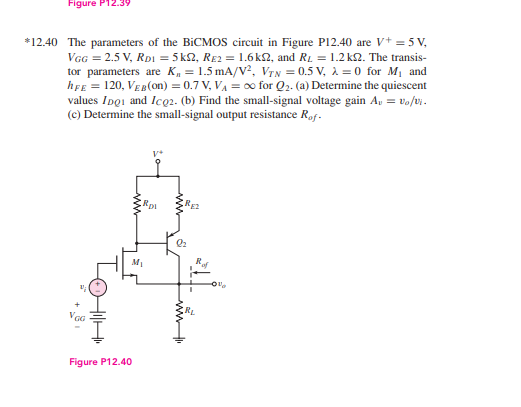
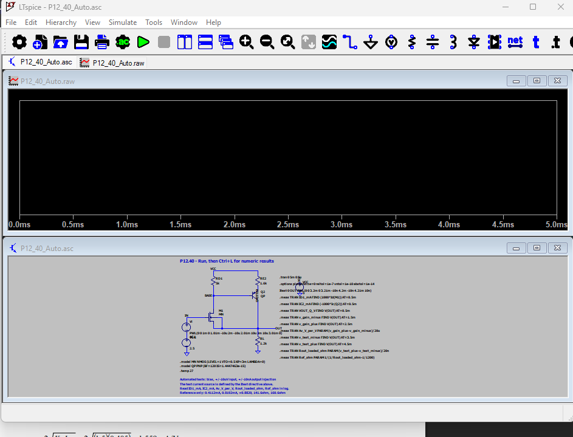
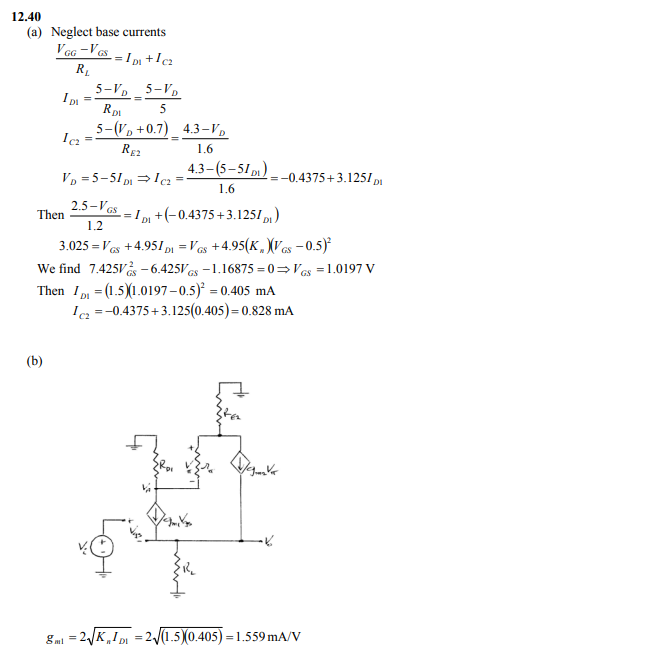
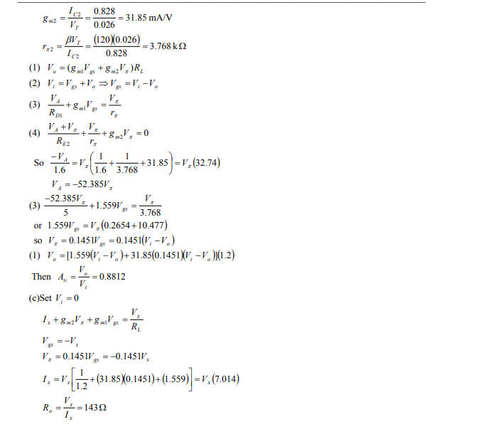

# 12.40 — BiCMOS 反馈电路：手算与 LTspice 对照

本页整理题目 12.40 的直流偏置、小信号增益、输出电阻，以及可下载运行的 LTspice 文件。

## 题目与原电路图

{ loading=lazy }

[打开题目与电路原图](../../assets/images/p12-40/problem-and-circuit.png)

## 下载与运行

[下载自动测量完整 ZIP](../../assets/downloads/P12_40_Auto.zip){ .md-button .md-button--primary }

完整解压后，用 **LTspice 打开 `P12_40_Auto.asc` → 点击 Run → 按 Ctrl+L**（View → SPICE Output Log）查看数字。波形窗口没有选曲线时会显示空白，测量数字在日志窗口内。

ZIP 包含原理图、两个配套晶体管符号、独立网表、使用说明、原始日志摘录及本页的对比说明。`.asy` 文件须与 `.asc` 保持在同一目录。

单独下载：

- [原理图 P12_40_Auto.asc](../../assets/downloads/p12-40/P12_40_Auto.asc)
- [NMOS 符号 P12_NMOS.asy](../../assets/downloads/p12-40/P12_NMOS.asy)
- [PNP 符号 P12_PNP.asy](../../assets/downloads/p12-40/P12_PNP.asy)
- [独立 SPICE 网表 P12_40_Auto.cir](../../assets/downloads/p12-40/P12_40_Auto.cir)
- [使用说明 README.txt](../../assets/downloads/p12-40/README.txt)
- [Ctrl+L 原始测量日志摘录](../../assets/downloads/p12-40/P12_40_original_measurements.log)
- [最初的 AC 扫频版本 ZIP](../../assets/downloads/P12_40_LTspice.zip)

!!! note "验证状态"
    原始版本已由作者在 LTspice 中运行，实际测量值列于下表。当前下载版加入了双精度波形保存，并修正输出电阻的命名；**尚未收到修正版的 LTspice 重跑日志**。表中的精确模型参考值来自电路方程求解，不冒充修正版的实测结果。

## LTspice 电路与运行截图

下图是作者运行 `P12_40_Auto.asc` 时提供的 LTspice 实际界面：下方为电路与自动测量指令，上方为尚未选择曲线的波形窗口。数值结果通过 **Ctrl+L** 查看，已记录在本页日志中。这是原始版本的截图，并非精度修正版重跑后的截图。



[打开 LTspice 截图原图](../../assets/images/p12-40/ltspice-schematic-run.png)

## 参数与模型

$V^+=5\,\mathrm V$，$V_{GG}=2.5\,\mathrm V$，$R_{D1}=5\,\mathrm{k\Omega}$，$R_{E2}=1.6\,\mathrm{k\Omega}$，$R_L=1.2\,\mathrm{k\Omega}$。M₁ 为 NMOS，Q₂ 为 PNP；M₁ 源极与 Q₂ 集电极共同接输出。

采用 $I_{D1}=K_n(V_{GS}-V_{TN})^2$，$K_n=1.5\,\mathrm{mA/V^2}$，$V_{TN}=0.5\,\mathrm V$，$\lambda=0$。SPICE 的 LEVEL=1 模型在 $W/L=1$ 时应设 `KP=3m`。

Q₂ 的 `BF=120`，不指定 VAF（无 Early 效应）；在 27°C 下用 `IS=1.4447463e-15` 使工作点 $V_{EB}$ 约为 0.7 V。这是为教材近似选定的模型参数，并不是对某个实际器件的测量拟合。未加入寄生电容。

## LaTeX 展开推导：从未知量到已知量

向下箭头表示“这个待求量还依赖哪些量”，展开到给定参数后，再从下向上代入。下面沿用所给教材解答的近似：**直流部分忽略基极电流，小信号部分保留有限的 $\beta=120$**。所有电流均以题目中的正向大小计。

### (a) 静态电流：先向下展开

令 $V_D$ 为 M₁ 漏极（也是 Q₂ 基极）的直流电压，$V_E$ 为 Q₂ 发射极电压。M₁ 源极和 Q₂ 集电极共同接输出 $V_O$。

$$
\begin{gathered}
\boxed{I_{DQ1}\;?,\qquad I_{CQ2}\;?}\\[6pt]
\begin{array}{ccc}
\downarrow && \downarrow\\[4pt]
I_{D1}=K_n(V_{GS}-V_{TN})^2
&& I_{C2}\simeq\dfrac{V^+-V_E}{R_{E2}}\\[8pt]
\downarrow && \downarrow\\[4pt]
V_{GS}=V_{GG}-V_O
&& V_E=V_D+V_{EB}\\[8pt]
\downarrow && \downarrow\\[4pt]
V_O=R_L(I_{D1}+I_{C2})
&& V_D\simeq V^+-R_{D1}I_{D1}
\end{array}\\[8pt]
\boxed{\begin{gathered}
V^+=5\,\mathrm V,\quad V_{GG}=2.5\,\mathrm V,\quad V_{EB}=0.7\,\mathrm V\\
R_{D1}=5\,\mathrm{k\Omega},\quad R_{E2}=1.6\,\mathrm{k\Omega},\quad R_L=1.2\,\mathrm{k\Omega}\\
K_n=1.5\,\mathrm{mA/V^2},\quad V_{TN}=0.5\,\mathrm V
\end{gathered}}
\end{gathered}
$$

这里有反馈：电流决定输出电压，输出电压又决定 $V_{GS}$，所以不能将所有未知量独立地逐个求出。把依赖关系代回，闭合成一个方程即可。

### (a) 从已知量向上代入

以下数值方程统一采用 **V、mA、kΩ**，因此 $\mathrm{mA}\times\mathrm{k\Omega}=\mathrm V$。

$$
\begin{aligned}
I_{C2}
&\simeq\frac{5-(V_D+0.7)}{1.6}\\[4pt]
&=\frac{4.3-(5-5I_{D1})}{1.6}\\[4pt]
&=-0.4375+3.125I_{D1}.
\end{aligned}
$$

再把两支电流代回输出节点：

$$
\begin{aligned}
\frac{2.5-V_{GS}}{1.2}
&=I_{D1}+I_{C2}\\
&=-0.4375+4.125I_{D1}\\[4pt]
\Longrightarrow\qquad
3.025&=V_{GS}+4.95I_{D1}\\
&=V_{GS}+4.95(1.5)(V_{GS}-0.5)^2.
\end{aligned}
$$

现在右侧只剩一个未知量：

$$
\begin{gathered}
7.425V_{GS}^2-6.425V_{GS}-1.16875=0\\[6pt]
\downarrow\quad V_{GS}>V_{TN}\text{，选取满足导通条件的根}\\[6pt]
\boxed{V_{GS}\simeq1.0197\,\mathrm V}\\[8pt]
\begin{array}{ccc}
\swarrow && \searrow\\[3pt]
I_{D1}=1.5(1.0197-0.5)^2
&& I_{C2}=-0.4375+3.125I_{D1}\\[6pt]
\boxed{I_{DQ1}\simeq0.405\,\mathrm{mA}}
&& \boxed{I_{CQ2}\simeq0.828\,\mathrm{mA}}
\end{array}
\end{gathered}
$$

沿用教材保留位数，得到上述电流。再检查所用工作区假设：

$$
\begin{aligned}
V_O&=2.5-1.0197\simeq1.4803\,\mathrm V,\\
V_D&\simeq5-5(0.405)=2.975\,\mathrm V,\\
V_E&\simeq V_D+0.7=3.675\,\mathrm V.
\end{aligned}
$$

$V_{DS1}\simeq1.495\,\mathrm V>V_{GS}-V_{TN}\simeq0.520\,\mathrm V$，M₁ 满足饱和区条件；Q₂ 有 $V_E>V_B>V_C$，符合 PNP 正向放大区假设。

### (b) 电压增益：先向下展开

交流小信号下，两个直流电源接交流地。定义 **PNP 的控制电压为 $v_\pi=v_e-v_d$**，于是其流入输出节点的集电极小信号电流为 $g_{m2}v_\pi$。同时 $v_{gs}=v_i-v_o$。

先把待求增益展开为两个支路共同提供的输出电流：

$$
\begin{gathered}
\boxed{A_v=\frac{v_o}{v_i}\;?}\\[6pt]
\downarrow\\[4pt]
v_o=R_L\bigl(g_{m1}v_{gs}+g_{m2}v_\pi\bigr)\\[6pt]
\begin{array}{ccc}
\swarrow && \searrow\\[3pt]
v_{gs}=v_i-v_o && v_\pi=\alpha v_{gs}
\end{array}\\[8pt]
\downarrow\\[4pt]
v_o=R_L\bigl(g_{m1}+g_{m2}\alpha\bigr)(v_i-v_o)\\[8pt]
\downarrow\\[4pt]
A_v=\frac{R_L(g_{m1}+g_{m2}\alpha)}{1+R_L(g_{m1}+g_{m2}\alpha)}.
\end{gathered}
$$

这里 $\alpha\equiv v_\pi/v_{gs}$ 只是这张电路中的电压比，**不是 BJT 的共基极电流增益**。下面继续展开它和三个小信号参数，不能把它们当作已知。

$$
\begin{gathered}
\boxed{g_{m1}\;?,\quad g_{m2}\;?,\quad r_{\pi2}\;?}\\[6pt]
\begin{array}{ccc}
\downarrow&\downarrow&\downarrow\\[4pt]
g_{m1}=2\sqrt{K_nI_{DQ1}}
&g_{m2}=\dfrac{I_{CQ2}}{V_T}
&r_{\pi2}=\dfrac{\beta V_T}{I_{CQ2}}\\[8pt]
\downarrow&\downarrow&\downarrow\\[4pt]
K_n,\ I_{DQ1}\text{（由 (a) 求得）}
&I_{CQ2},\ V_T
&\beta,\ V_T,\ I_{CQ2}
\end{array}\\[8pt]
\boxed{V_T=0.026\,\mathrm V,\qquad\beta=120}.
\end{gathered}
$$

### (b) 电压比也要继续展开：$\alpha$ 从哪里来？

在漏极／基极节点和发射极节点分别列 KCL：

$$
\begin{aligned}
\text{漏极／基极：}\qquad
\frac{v_d}{R_{D1}}+g_{m1}v_{gs}
&=\frac{v_\pi}{r_{\pi2}},\\[6pt]
\text{发射极：}\qquad
\frac{v_d+v_\pi}{R_{E2}}+
\frac{v_\pi}{r_{\pi2}}+g_{m2}v_\pi
&=0.
\end{aligned}
$$

先从第二式消去 $v_d$，再代入第一式：

$$
\begin{gathered}
v_d=-\left[1+R_{E2}\left(g_{m2}+\frac1{r_{\pi2}}\right)\right]v_\pi\\[8pt]
\downarrow\\[4pt]
g_{m1}v_{gs}
=\left[\frac{1+R_{E2}(g_{m2}+1/r_{\pi2})}{R_{D1}}
+\frac1{r_{\pi2}}\right]v_\pi\\[8pt]
\downarrow\\[4pt]
\boxed{\alpha=\frac{v_\pi}{v_{gs}}
=\frac{g_{m1}R_{D1}}
{1+R_{E2}(g_{m2}+1/r_{\pi2})+R_{D1}/r_{\pi2}}}.
\end{gathered}
$$

因此，这个中间量最终也只依赖已知电阻和由静态电流求出的参数。

### (b) 从已知量向上代入

采用教材取整后的静态电流：

$$
\begin{aligned}
g_{m1}&=2\sqrt{(1.5)(0.405)}\simeq1.559\,\mathrm{mS},\\[4pt]
g_{m2}&=\frac{0.828}{0.026}\simeq31.85\,\mathrm{mS},\\[4pt]
r_{\pi2}&=\frac{120(0.026)}{0.828}\simeq3.768\,\mathrm{k\Omega}.
\end{aligned}
$$

继续沿依赖关系向上代入；以下使用 mS 与 kΩ：

$$
\begin{gathered}
\alpha=
\frac{(1.559)(5)}
{1+(1.6)(31.85+1/3.768)+5/3.768}
\simeq0.1451\\[8pt]
\uparrow\\[4pt]
g_{m1}+g_{m2}\alpha
\simeq1.559+(31.85)(0.1451)
=6.180435\,\mathrm{mS}\\[8pt]
\uparrow\\[4pt]
A_v=\frac{(1.2)(6.180435)}{1+(1.2)(6.180435)}\\[8pt]
\boxed{A_v\simeq+0.8812\ \mathrm{V/V}}.
\end{gathered}
$$

### (c) 输出电阻：先向下展开

按照所给解答的定义，**保留 $R_L$**，令小信号输入 $v_i=0$，在输出端施加测试电压 $v_x$，定义 $i_x$ 为从测试源流入电路的电流。直流偏置不变，只令输入的交流扰动为零。

$$
\begin{gathered}
\boxed{R_{of}=\frac{v_x}{i_x}\;?}\\[6pt]
\downarrow\\[4pt]
i_x+g_{m1}v_{gs}+g_{m2}v_\pi=\frac{v_x}{R_L}\\[8pt]
\begin{array}{ccc}
\swarrow&&\searrow\\[3pt]
v_{gs}=v_i-v_x=-v_x
&&v_\pi=\alpha v_{gs}=-\alpha v_x
\end{array}\\[8pt]
\downarrow\\[4pt]
i_x=v_x\left(\frac1{R_L}+g_{m1}+g_{m2}\alpha\right)\\[8pt]
\downarrow\\[4pt]
R_{of}=\frac1{1/R_L+g_{m1}+g_{m2}\alpha}\\[8pt]
\downarrow\\[4pt]
\boxed{R_L\text{ 已知；}\quad g_{m1},\ g_{m2},\ \alpha\text{ 已在 (b) 展开并求得}}.
\end{gathered}
$$

### (c) 从已知量向上代入

$$
\begin{gathered}
\frac1{R_L}+g_{m1}+g_{m2}\alpha
=\frac1{1.2}+1.559+(31.85)(0.1451)\\[4pt]
\simeq7.01377\,\mathrm{mS}\\[8pt]
\uparrow\\[4pt]
R_{of}=\frac1{7.01377\,\mathrm{mS}}
\simeq0.14258\,\mathrm{k\Omega}\\[8pt]
\boxed{R_{of}\simeq143\,\Omega}.
\end{gathered}
$$

增益与输出电阻还可以互相检查：两式有相同的导纳项，直接得到

$$
\boxed{R_{of}=R_L(1-A_v)}
\quad\Longrightarrow\quad
1200(1-0.8812)=142.56\,\Omega.
$$

最后几位与上式稍有不同，只是中间取整所致。这一检查关系适用于此处 $r_{o1},r_{o2}\to\infty$、无体效应且保留负载的模型，不是任意放大器的通用公式。

## 仿真日志与计算对比

左侧为作者实际运行后提供的 **Ctrl+L 原始日志摘录**，右侧与上面的教材推导、保留基极电流的方程参考值并排对照。原始版本的输出电阻受波形保存精度影响；**双精度修正版尚待重新运行，不能把参考值当成已运行结果**。

<div class="p1240-results-grid">
<section class="p1240-result-panel" aria-labelledby="p1240-log-heading">
<h3 id="p1240-log-heading">Ctrl+L 原始运行日志</h3>
<p class="p1240-result-caption">修正前的真实测量摘录；本机路径已省略。可横向滚动查看完整行。</p>
<pre class="p1240-log"><code>id1_ma: (1000*Id(M1))=0.411159853684 at 0.0005
ic2_ma: (-1000*Ic(Q2))=0.819213571958 at 0.0005
vout_q_v: V(OUT)=1.47644817829 at 0.0005
v_gain_minus: V(OUT)=1.4764393568 at 0.0015
v_gain_plus: V(OUT)=1.47645699978 at 0.0025
av_v_per_v: (v_gain_plus-v_gain_minus)/20u=0.882148742676
v_test_minus: V(OUT)=1.47644674778 at 0.0035
v_test_plus: V(OUT)=1.47644948959 at 0.0045
rout_loaded_ohm: (v_test_plus-v_test_minus)/20n=137.090682983
rof_ohm: 1/(1/rout_loaded_ohm-1/1200)=154.772205819</code></pre>
<p><a href="../../../assets/downloads/p12-40/P12_40_original_measurements.log">下载原始日志摘录</a></p>
<p class="p1240-result-note">旧日志中的 <code>rof_ohm</code> 指不含负载的电阻。题目 (c) 应对照 <code>rout_loaded_ohm</code>；新版已更正字段命名。</p>
</section>
<section class="p1240-result-panel" aria-labelledby="p1240-comparison-heading">
<h3 id="p1240-comparison-heading">教材、仿真与方程计算</h3>
<div class="p1240-table-scroll" tabindex="0" role="region" aria-label="计算与仿真结果对比表">
<table>
<thead><tr><th>量</th><th>教材答案</th><th>原始仿真</th><th>方程参考</th></tr></thead>
<tbody><tr><td>I_D1</td><td>0.405 mA</td><td>0.41115985 mA</td><td>0.41116 mA</td></tr>
<tr><td>I_C2（大小）</td><td>0.828 mA</td><td>0.81921357 mA</td><td>0.81921 mA</td></tr>
<tr><td>V_OQ</td><td>约 1.4803 V¹</td><td>1.47644818 V</td><td>1.47645 V</td></tr>
<tr><td>A_v</td><td>0.8812</td><td>0.88214874</td><td>0.88197</td></tr>
<tr><td>(c) R_of，包含 R_L</td><td>143 Ω</td><td>137.09068 Ω²</td><td>141.63622 Ω</td></tr>
<tr><td>补充：不含 R_L</td><td>未给出</td><td>154.77221 Ω²</td><td>160.59078 Ω</td></tr></tbody>
</table>
</div>
<p class="p1240-result-note">¹ 由教材 V_GS 推得。² 原始电阻读数受测量精度影响。</p>
<p>教材直流部分忽略基极电流，小信号部分仍保留 β = 120；SPICE 保留直流基极电流。教材还采用 V_T = 26 mV 并作中间取整。</p>
<p>静态电流差异约 1%–1.5%，增益十分接近。电阻应在双精度修正版重跑后再确认。</p>
</section>
</div>

## 为什么题目 (c) 要保留负载

教材最后的测试电流关系包含 $1/R_L$：

$$
I_x=V_x\left[\frac{1}{R_L}+g_{m2}(0.1451)+g_{m1}\right].
$$

代入以 mS 为单位的导纳得到约 7.014 mS，因此 $R_{of}\approx143\,\Omega$。本页按这份答案的定义，将 **包含负载的输出电阻**作为题目 (c) 的结果。

新版下载文件中的名称：

| 日志字段 | 含义 |
|---|---|
| `ID1_mA` | M₁ 静态漏电流，mA |
| `IC2_mA` | Q₂ 静态集电极电流大小，mA |
| `Av_V_per_V` | 小信号电压增益，V/V |
| `Rof_ohm` | 对应题目 (c)，包含 $R_L$，Ω |
| `Rout_loaded_ohm` | 与 `Rof_ohm` 相同，保留作明确标记 |
| `Rout_unloaded_ohm` | 同一偏置下扣除 $R_L$ 导纳的补充结果，Ω |

旧日志中的 `rof_ohm` 曾表示不含 $R_L$ 的值；为保存原始记录，日志摘录没有改写数值或旧字段名。**不要把旧日志的 `rof_ohm` 与新版同名字段直接比较。**

## 自动测量与精度修正

一次瞬态仿真依次测量：0.5 ms 的静态值；输入为正负 10 µV 时的输出；输入恢复零扰动后，输出端注入正负 10 nA 时的电压。测试电流源 `Itest` 通过原理图上的 SPICE 指令加入。

$$
A_v\approx\frac{v_o(+10\,\mu\mathrm V)-v_o(-10\,\mu\mathrm V)}{20\,\mu\mathrm V},
\qquad
R_{of}\approx\frac{v_o(+10\,\mathrm{nA})-v_o(-10\,\mathrm{nA})}{20\,\mathrm{nA}}.
$$

电阻测试的电压差只有约 2.8 µV，叠加在约 1.476 V 的直流值上。原日志中的采样值表现出单精度量化，两个相近电压相减会放大舍入误差。新版加入：

```spice
.options numdgt=15 measdgt=10 plotwinsize=0 reltol=1e-7 vntol=1e-10 abstol=1e-14
```

`numdgt=15` 启用双精度数据保存；`measdgt=10` 控制测量输出位数。[ADI 官方参数参考](https://github.com/analogdevicesinc/ltspice-reference/blob/main/ai_ref/SIMULATION-COMMANDS-REFERENCE.md)

$R_L$ 在测量中始终保留，以维持原偏置。额外的不含负载结果通过下式求出：

$$
R_{\mathrm{unloaded}}=\left(\frac1{R_{of}}-\frac1{R_L}\right)^{-1}.
$$


## 解答截图与小信号等效电路

以下为本次讨论提供的解答截图，供对照上面的计算与仿真；其中直流计算忽略基极电流，输出电阻计算包含负载。

### 静态工作点与小信号等效电路

{ loading=lazy }

[打开原图](../../assets/images/p12-40/solution-bias-and-small-signal.png)

### 电压增益与输出电阻

{ loading=lazy }

[打开原图](../../assets/images/p12-40/solution-gain-and-resistance.png)
