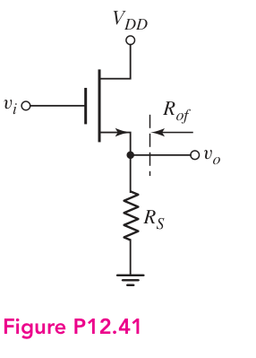
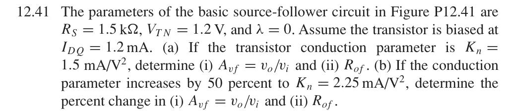
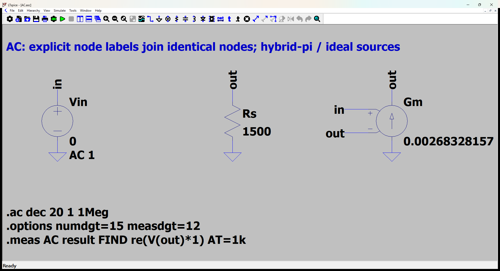
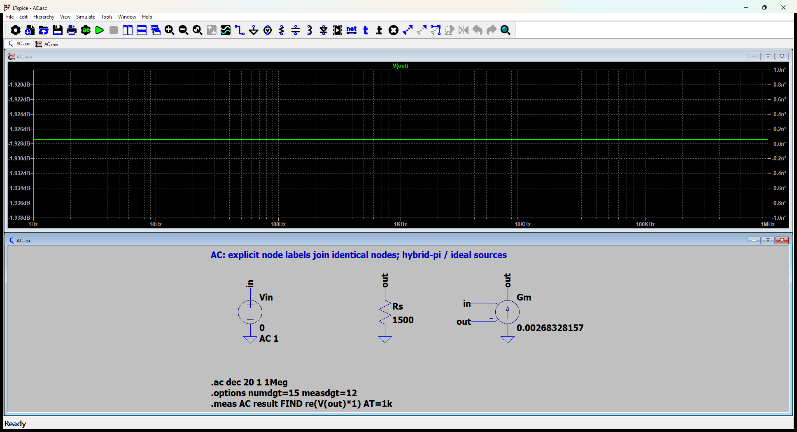
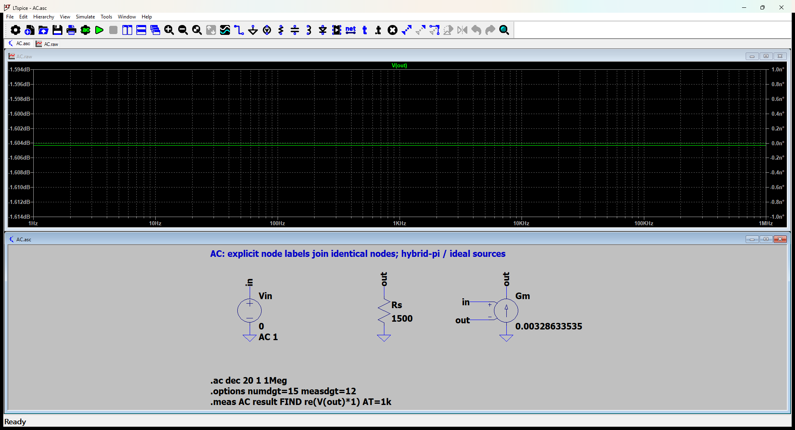

# 12.41 — 固定偏置电流的源极跟随器

[41 题完成清单](status-12-20-60.md) · [本题文件包](../../assets/downloads/ch12-20-60/p12-41.zip)

## 教材题目与引用图

来源：用户提供的 `electrobook-(4th ed).pdf`，页序号从 1 起。





## 按教材模型展开推导


### (a)(i)(ii) 增益、电阻 → 跨导 → 给定电流

$$
\begin{aligned}
A_{vf}&\leftarrow\frac{g_mR_S}{1+g_mR_S},&R_{of}&\leftarrow\frac1{g_m+1/R_S},\\
g_m&\leftarrow2\sqrt{K_nI_{DQ}},&(K_n,I_{DQ},R_S)&=(1.5\,\mathrm{mA/V^2},1.2\,\mathrm{mA},1.5\,\mathrm{k\Omega}).
\end{aligned}
$$

来自输出 KCL $v_o/R_S=g_m(v_i-v_o)$；测电阻时 $v_i=0$、保留原图 $R_S$。向上代入：$g_m=2.683281573\,\mathrm{mS}$，$A_{vf}=0.8009919500$、$R_{of}=298.51207495\,\Omega$。

### (b)(i)(ii) 百分比变化 → 新参数 → 向上代入

题目仍假设 $I_{DQ}=1.2\,\mathrm{mA}$；并不是固定未给出的栅极偏置电压。

$$
\begin{aligned}
g'_m&=\sqrt{1.5}\,g_m=3.286335345\,\mathrm{mS},\\
A'_{vf}&=0.8313518018,\quad R'_{of}=252.97229727\,\Omega,\\
\Delta A/A&=(A'_{vf}/A_{vf}-1),\quad
\Delta R/R=(R'_{of}/R_{of}-1).
\end{aligned}
$$

数值百分比在下方第二工况中列出。这里只含题设 $\lambda=0$ 的无体效应模型；题目未给衬底偏置，因此没有加入未知体效应参数。

### 从依赖量展开到可代入的节点方程

按题目假定每个 Kn 情况下均保持 IDQ=1.2 mA；未给偏置电压，不擅自固定 VGG。


为了逐节点核对，下面直接列出与原理图同名的全部节点 KCL。先由这些方程确定输出节点及输入电流，再向上组成所求比值。$i_V$ 是独立／受控电压源由正端流向负端的电流，所有理想直流电源在交流中接地，理想恒流偏置在交流中开路。

$$
\begin{aligned}
i_{\mathrm{Vin}}&=0\quad(v_{\mathrm{in}}\text{ 节点})\\[5pt]
\frac{v_{\mathrm{out}}}{\mathrm{Rs}}-\mathrm{Gm}(v_{\mathrm{in}}-v_{\mathrm{out}})&=0\quad(v_{\mathrm{out}}\text{ 节点})
\end{aligned}
$$

$$
\begin{aligned}
v_{\mathrm{in}}&=\mathrm{Vin}
\end{aligned}
$$

本组方程中的已知量如下。G 的系数为器件跨导（S），E 为开环电压增益或不加载电路的测量转换；不是题目闭环答案。1 V／1 A 是线性响应归一化，不是允许的大信号幅度。

|元件|连接节点（顺序同网表）|参数（SI 单位）|
|---|---|---:|
|`Vin`|`in → 0`|1|
|`Rs`|`out → 0`|1500|
|`Gm`|`0 → out → in → out`|0.002683281573|

### 向上代入得到结果

将上述已知参数代入 KCL（线性方程组数值求解），再取目标端口量。计算脚本为仓库中的 `scripts/ch12_models.py`，与 LTspice 引擎独立。

主结果：**0.80099195 V/V**。

保持图中电阻与负载的输出测试电阻：298.512075 Ω。

第二工况：$A_v=0.8313518018$，$R_{of}=252.9722973$ Ω；增益变化 **3.7902818%**，电阻变化 **-15.25559%**。

## 实际 LTspice 电路与频响截图

以下为 **LTspice 26.1.1 for Windows 实际窗口截图**，下方是教材小信号等效原理图，上方是引擎生成的 AC 曲线。同名节点标签表示电气相连。





未加入题目没有给出的结电容；因此 1 Hz–1 MHz 的平坦曲线只验证本页中频／理想等效模型，不代表实际器件带宽。对比值在 **1 kHz、同一套 $g_m,r_\pi$、同一端口定义**下提取。原日志的 AC 测量以 dB 和相位显示，数值表按 $x=10^{d/20}\cos\phi$ 换回线性值；180° 对应负号。

<div class="p1240-results-grid">
<section class="p1240-result-panel">
<h3>LTspice 原始运行日志</h3>
<details open><summary>AC.log</summary><pre class="p1240-log"><code>LTspice 26.1.1 for Windows
Circuit: C:\Users\tongs\Documents\GitHub\zhihu-physics-notes\docs\assets\downloads\ch12-20-60\p12-41\AC.net
Start Time: Tue Sep 22 10:00:51 2026
Options:numdgt=15 measdgt=12
solver = Normal
Maximum thread count: 16
tnom = 27
temp = 27
method = trap
.OP point found by inspection.
.OP point found by inspection.
Total elapsed time: 0.058 seconds.
Total iterations: 0

Files loaded:
C:\Users\tongs\Documents\GitHub\zhihu-physics-notes\docs\assets\downloads\ch12-20-60\p12-41\AC.net

result: re(V(out)*1)=(-1.92743697298dB,0°) at 1000
</code></pre></details>
<details><summary>Rout.log</summary><pre class="p1240-log"><code>LTspice 26.1.1 for Windows
Circuit: C:\Users\tongs\Documents\GitHub\zhihu-physics-notes\docs\assets\downloads\ch12-20-60\p12-41\Rout.cir
Start Time: Tue Sep 22 09:55:58 2026
Options:numdgt=15 measdgt=12
solver = Normal
Maximum thread count: 16
tnom = 27
temp = 27
method = trap
.OP point found by inspection.
.OP point found by inspection.
Total elapsed time: 0.018 seconds.
Total iterations: 0

Files loaded:
C:\Users\tongs\Documents\GitHub\zhihu-physics-notes\docs\assets\downloads\ch12-20-60\p12-41\Rout.cir

rout_port: re(V(out))=(49.4992380724dB,0°) at 1000
</code></pre></details>
</section>
<section class="p1240-result-panel">
<h3>教材计算与实际仿真</h3>
<div class="p1240-table-scroll"><table><thead><tr><th>物理量</th><th>教材近似计算</th><th>实际仿真</th><th>单位</th><th>相对误差</th><th>原因／定义</th></tr></thead><tbody><tr><td>主结果</td><td>0.80099195</td><td>0.8009919499</td><td>V/V</td><td>-2.2271e-08%</td><td>相同教材等效模型；数值舍入</td></tr><tr><td>输出测试端口电阻</td><td>298.512075</td><td>298.5120752</td><td>Ω</td><td>+8.932e-08%</td><td>保持原负载；放大器自身值另列</td></tr><tr><td>(b) Av</td><td>0.8313518018</td><td>0.831351802</td><td>V/V</td><td>+2.5479e-08%</td><td>Kn增加50%，保持给定IDQ</td></tr><tr><td>(b) Rof</td><td>252.9722973</td><td>252.9722969</td><td>Ω</td><td>-1.2615e-07%</td><td>同一负载与固定偏置电流</td></tr></tbody></table></div>
<p>计算来自上文节点方程，不以日志数值回填手算列。相对误差为 (仿真−计算)/计算；手算为零时只列绝对误差。同模型吻合验证代数与接线，不证明忽略寄生参数的近似适用于任意实物。</p>
</section>
</div>


### 第二工况的实际验证

[第二工况 ASC](../../assets/downloads/ch12-20-60/p12-41b/AC.asc) · [AC日志](../../assets/downloads/ch12-20-60/p12-41b/AC.log) · [输出电阻日志](../../assets/downloads/ch12-20-60/p12-41b/Rout.log)



```text
LTspice 26.1.1 for Windows
Circuit: C:\Users\tongs\Documents\GitHub\zhihu-physics-notes\docs\assets\downloads\ch12-20-60\p12-41b\AC.net
Start Time: Tue Sep 22 10:00:56 2026
Options:numdgt=15 measdgt=12
solver = Normal
Maximum thread count: 16
tnom = 27
temp = 27
method = trap
.OP point found by inspection.
.OP point found by inspection.
Total elapsed time: 0.049 seconds.
Total iterations: 0

Files loaded:
C:\Users\tongs\Documents\GitHub\zhihu-physics-notes\docs\assets\downloads\ch12-20-60\p12-41b\AC.net

result: re(V(out)*1)=(-1.60430315006dB,0°) at 1000

```
## 下载与复现

[本题完整文件包](../../assets/downloads/ch12-20-60/p12-41.zip) · [12.20–12.60 全部成果包](../../assets/downloads/ch12-20-60.zip)

- [AC.asc](../../assets/downloads/ch12-20-60/p12-41/AC.asc)
- [AC.cir](../../assets/downloads/ch12-20-60/p12-41/AC.cir)
- [AC.log](../../assets/downloads/ch12-20-60/p12-41/AC.log)
- [AC.plt](../../assets/downloads/ch12-20-60/p12-41/AC.plt)
- [AC.raw](../../assets/downloads/ch12-20-60/p12-41/AC.raw)
- [Rout.asc](../../assets/downloads/ch12-20-60/p12-41/Rout.asc)
- [Rout.cir](../../assets/downloads/ch12-20-60/p12-41/Rout.cir)
- [Rout.log](../../assets/downloads/ch12-20-60/p12-41/Rout.log)
- [Rout.raw](../../assets/downloads/ch12-20-60/p12-41/Rout.raw)

完整解压后用 LTspice 打开 `AC.asc`，运行并按 **Ctrl+L** 查看本机新生成的日志。`AC.plt` 为波形选择配置；`Rout.asc`（如有）单独测试输出电阻，`DC.cir`（如有）验证教材固定 VBE 偏置。模型与参数直接写在文件中，不依赖外部器件库。
