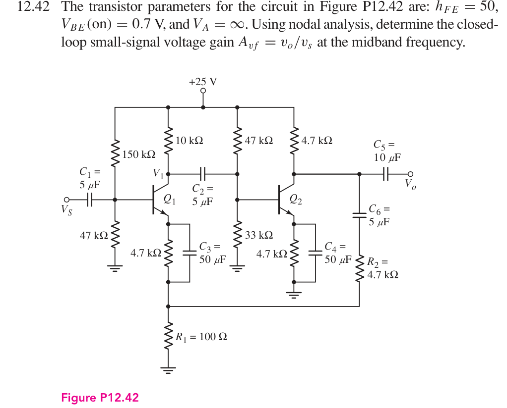
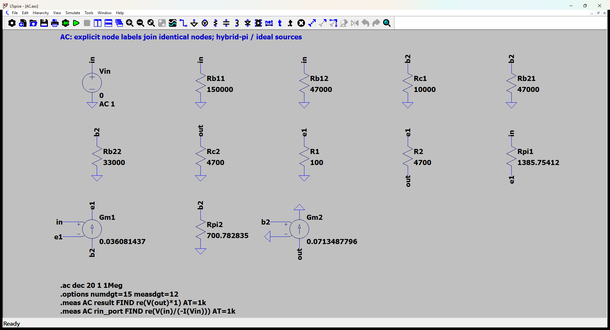
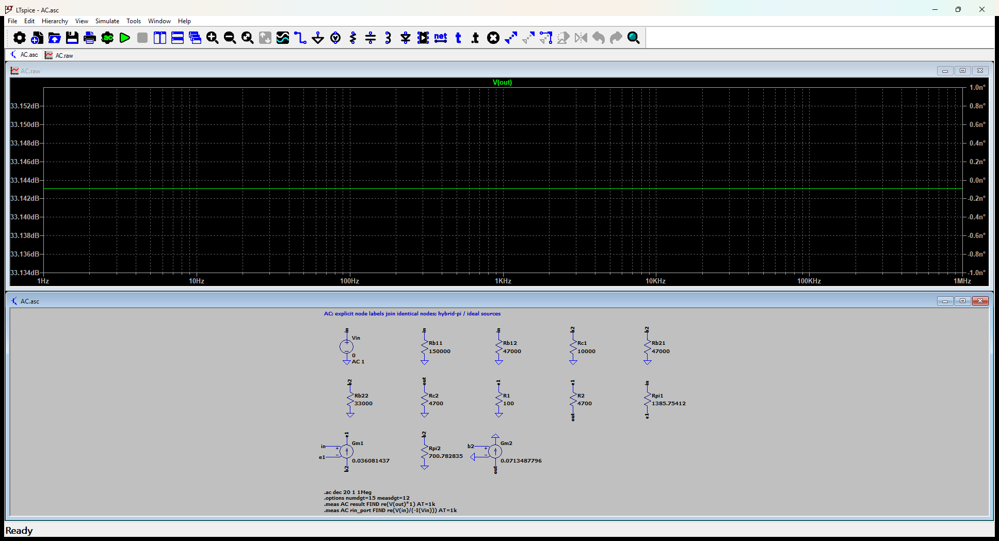

# 12.42 — 双共射级的中频反馈

[41 题完成清单](status-12-20-60.md) · [本题文件包](../../assets/downloads/ch12-20-60/p12-42.zip)

## 教材题目与引用图

来源：用户提供的 `electrobook-(4th ed).pdf`，页序号从 1 起。

## 按教材模型展开推导

### 所求中频增益 → 三节点 → 两个静态电流

$$
\begin{aligned}
A_{vf}&\leftarrow v_o/v_s\leftarrow(v_{e1},v_{b2},v_o),\\
(g_{m1},g_{m2},r_{\pi1},r_{\pi2})&\leftarrow(I_{C1},I_{C2},\beta,V_T),\\
I_{E1}&=\frac{25(47/197)-0.7}{(4.7k+100)+(150k\parallel47k)/51},\\
I_{E2}&=\frac{25(33/80)-0.7}{4.7k+(47k\parallel33k)/51},\quad I_C=\frac{50}{51}I_E.
\end{aligned}
$$

直流所有电容开路。中频所有电容视作短路，特别注意 $C_3$ 旁路的是 4.7 kΩ，**不是**下面的 100 Ω；$C_6$ 把输出经 4.7 kΩ 反馈到这个节点。$C_5$ 外端没有给出负载，故输出测量开路。交流网表验证的是中频极限，扫频曲线平坦不代表真实电容电路没有低频截止。

### 从依赖量展开到可代入的节点方程

中频 C1–C6 视为短路；C3 跨接 4.7 kΩ 而不旁路 100 Ω。输出开路，题目没有给负载电阻。

未知的 $g_m,r_\pi$ 先由静态电流展开：$g_{mj}=I_{Cj}/V_T$、$r_{\pi j}=\beta/g_{mj}$，$V_T=26$ mV；$r_o=\infty$。向上代入如下，单位明确列出。

|管号|$I_C$ (mA)|$g_m$ (mS)|$r_\pi$ (Ω)|
|---|---:|---:|---:|
|Q1|0.938117361|36.08143696|1385.754122|
|Q2|1.855068268|71.34877956|700.7828349|

直流节点值由上面的固定 $V_{BE}$ 与电流 KCL 得到；表中 **不是**指数晶体管模型的输出。所有下表节点名与 `DC.cir` 一致，电压相对地：

|节点|直流电压 (V)|
|---|---:|
|`b1`|5.293022599|
|`b2`|9.593197279|
|`c1`|15.61882639|
|`e1`|4.593022599|
|`e2`|8.893197279|
|`f`|0.09568797082|
|`out`|16.28117914|
|`vcc`|25|

DC 网表的每管用 `Vbe` 维持 0.7 V、用 F 源实现 $I_C=\beta I_B$；这是教材分段近似的独立电路实现，不预设待求电流。

为了逐节点核对，下面直接列出与原理图同名的全部节点 KCL。先由这些方程确定输出节点及输入电流，再向上组成所求比值。$i_V$ 是独立／受控电压源由正端流向负端的电流，所有理想直流电源在交流中接地，理想恒流偏置在交流中开路。

$$
\begin{aligned}
\frac{v_{\mathrm{b2}}}{\mathrm{Rc1}}+\frac{v_{\mathrm{b2}}}{\mathrm{Rb21}}+\frac{v_{\mathrm{b2}}}{\mathrm{Rb22}}+\mathrm{Gm1}(v_{\mathrm{in}}-v_{\mathrm{e1}})+\frac{v_{\mathrm{b2}}}{\mathrm{Rpi2}}&=0\quad(v_{\mathrm{b2}}\text{ 节点})\\[5pt]
\frac{v_{\mathrm{e1}}}{\mathrm{R1}}+\frac{(v_{\mathrm{e1}}-v_{\mathrm{out}})}{\mathrm{R2}}-\frac{(v_{\mathrm{in}}-v_{\mathrm{e1}})}{\mathrm{Rpi1}}-\mathrm{Gm1}(v_{\mathrm{in}}-v_{\mathrm{e1}})&=0\quad(v_{\mathrm{e1}}\text{ 节点})\\[5pt]
i_{\mathrm{Vin}}+\frac{v_{\mathrm{in}}}{\mathrm{Rb11}}+\frac{v_{\mathrm{in}}}{\mathrm{Rb12}}+\frac{(v_{\mathrm{in}}-v_{\mathrm{e1}})}{\mathrm{Rpi1}}&=0\quad(v_{\mathrm{in}}\text{ 节点})
\end{aligned}
$$

$$
\begin{aligned}
\frac{v_{\mathrm{out}}}{\mathrm{Rc2}}-\frac{(v_{\mathrm{e1}}-v_{\mathrm{out}})}{\mathrm{R2}}+\mathrm{Gm2}v_{\mathrm{b2}}&=0\quad(v_{\mathrm{out}}\text{ 节点})
\end{aligned}
$$

$$
\begin{aligned}
v_{\mathrm{in}}&=\mathrm{Vin}
\end{aligned}
$$

本组方程中的已知量如下。G 的系数为器件跨导（S），E 为开环电压增益或不加载电路的测量转换；不是题目闭环答案。1 V／1 A 是线性响应归一化，不是允许的大信号幅度。

|元件|连接节点（顺序同网表）|参数（SI 单位）|
|---|---|---:|
|`Vin`|`in → 0`|1|
|`Rb11`|`in → 0`|150000|
|`Rb12`|`in → 0`|47000|
|`Rc1`|`b2 → 0`|10000|
|`Rb21`|`b2 → 0`|47000|
|`Rb22`|`b2 → 0`|33000|
|`Rc2`|`out → 0`|4700|
|`R1`|`e1 → 0`|100|
|`R2`|`e1 → out`|4700|
|`Rpi1`|`in → e1`|1385.75412207|
|`Gm1`|`b2 → e1 → in → e1`|0.0360814369618|
|`Rpi2`|`b2 → 0`|700.78283485|
|`Gm2`|`out → 0 → b2 → 0`|0.0713487795555|

### 向上代入得到结果

将上述已知参数代入 KCL（线性方程组数值求解），再取目标端口量。计算脚本为仓库中的 `scripts/ch12_models.py`，与 LTspice 引擎独立。

主结果：**45.41020593 V/V**。

信号源端口电阻：27472.02458 Ω。

保持图中电阻与负载的输出测试电阻：128.1266541 Ω。

## 实际 LTspice 电路与频响截图

以下为 **LTspice 26.1.1 for Windows 实际窗口截图**，下方是教材小信号等效原理图，上方是引擎生成的 AC 曲线。同名节点标签表示电气相连。

未加入题目没有给出的结电容；因此 1 Hz–1 MHz 的平坦曲线只验证本页中频／理想等效模型，不代表实际器件带宽。对比值在 **1 kHz、同一套 $g_m,r_\pi$、同一端口定义**下提取。原日志的 AC 测量以 dB 和相位显示，数值表按 $x=10^{d/20}\cos\phi$ 换回线性值；180° 对应负号。

<section class="p1240-result-panel">
<h3>LTspice 原始运行日志</h3>

AC.log
<pre class="p1240-log"><code>LTspice 26.1.1 for Windows
Circuit: C:\Users\tongs\Documents\GitHub\zhihu-physics-notes\docs\assets\downloads\ch12-20-60\p12-42\AC.net
Start Time: Tue Sep 22 10:01:01 2026
Options:numdgt=15 measdgt=12
solver = Normal
Maximum thread count: 16
tnom = 27
temp = 27
method = trap
.OP point found by inspection.
.OP point found by inspection.
Total elapsed time: 0.076 seconds.
Total iterations: 0

Files loaded:
C:\Users\tongs\Documents\GitHub\zhihu-physics-notes\docs\assets\downloads\ch12-20-60\p12-42\AC.net

result: re(V(out)*1)=(33.1430694278dB,0°) at 1000
rin_port: re(V(in)/(-I(Vin)))=(88.7778133274dB,0°) at 1000
</code></pre>

DC.log
<pre class="p1240-log"><code>LTspice 26.1.1 for Windows
Circuit: C:\Users\tongs\Documents\GitHub\zhihu-physics-notes\docs\assets\downloads\ch12-20-60\p12-42\DC.cir
Start Time: Tue Sep 22 09:56:00 2026
Options:numdgt=15 measdgt=12
solver = Normal
Maximum thread count: 16
tnom = 27
temp = 27
method = trap
Total elapsed time: 0.009 seconds.
Total iterations: 7

Files loaded:
C:\Users\tongs\Documents\GitHub\zhihu-physics-notes\docs\assets\downloads\ch12-20-60\p12-42\DC.cir

ic1: (I(Vbe1)*50)=0.000938117361006 at 25
ic2: (I(Vbe2)*50)=0.00185506826844 at 25
v_b1: V(b1)=5.29302259948 at 25
v_b2: V(b2)=9.59319727891 at 25
v_c1: V(c1)=15.6188263899 at 25
v_e1: V(e1)=4.59302259948 at 25
v_e2: V(e2)=8.89319727891 at 25
v_f: V(f)=0.0956879708226 at 25
v_out: V(out)=16.2811791383 at 25
v_vcc: V(vcc)=25 at 25
</code></pre>

Rout.log
<pre class="p1240-log"><code>LTspice 26.1.1 for Windows
Circuit: C:\Users\tongs\Documents\GitHub\zhihu-physics-notes\docs\assets\downloads\ch12-20-60\p12-42\Rout.cir
Start Time: Tue Sep 22 09:56:00 2026
Options:numdgt=15 measdgt=12
solver = Normal
Maximum thread count: 16
tnom = 27
temp = 27
method = trap
.OP point found by inspection.
.OP point found by inspection.
Total elapsed time: 0.012 seconds.
Total iterations: 0

Files loaded:
C:\Users\tongs\Documents\GitHub\zhihu-physics-notes\docs\assets\downloads\ch12-20-60\p12-42\Rout.cir

rout_port: re(V(out))=(42.1527896918dB,0°) at 1000
</code></pre>

</section>
<section class="p1240-result-panel">
<h3>教材计算与实际仿真</h3>

<table><thead><tr><th>物理量</th><th>教材近似计算</th><th>实际仿真</th><th>单位</th><th>相对误差</th><th>原因／定义</th></tr></thead><tbody><tr><td>主结果</td><td>45.41020593</td><td>45.41020593</td><td>V/V</td><td>+5.6839e-09%</td><td>相同教材等效模型；数值舍入</td></tr><tr><td>输入测试端口电阻</td><td>27472.02458</td><td>27472.02458</td><td>Ω</td><td>+8.0019e-09%</td><td>相同端口；包含源电阻时的换算见上文</td></tr><tr><td>输出测试端口电阻</td><td>128.1266541</td><td>128.1266539</td><td>Ω</td><td>-9.8085e-08%</td><td>保持原负载；放大器自身值另列</td></tr><tr><td>IC1</td><td>0.000938117361</td><td>0.000938117361</td><td>A</td><td>+4.4854e-11%</td><td>固定VBE、有限β的同一偏置模型</td></tr><tr><td>IC2</td><td>0.001855068268</td><td>0.001855068268</td><td>A</td><td>-1.1476e-10%</td><td>固定VBE、有限β的同一偏置模型</td></tr><tr><td>DC out</td><td>16.28117914</td><td>16.28117914</td><td>V</td><td>-1.3509e-10%</td><td>固定VBE近似；与AC扰动区分</td></tr></tbody></table>

计算来自上文节点方程，不以日志数值回填手算列。相对误差为 (仿真−计算)/计算；手算为零时只列绝对误差。同模型吻合验证代数与接线，不证明忽略寄生参数的近似适用于任意实物。

</section>

## 下载与复现

[本题完整文件包](../../assets/downloads/ch12-20-60/p12-42.zip) · [12.20–12.60 全部成果包](../../assets/downloads/ch12-20-60.zip)

- [AC.asc](../../assets/downloads/ch12-20-60/p12-42/AC.asc)
- [AC.cir](../../assets/downloads/ch12-20-60/p12-42/AC.cir)
- [AC.log](../../assets/downloads/ch12-20-60/p12-42/AC.log)
- [AC.plt](../../assets/downloads/ch12-20-60/p12-42/AC.plt)
- [AC.raw](../../assets/downloads/ch12-20-60/p12-42/AC.raw)
- [DC.cir](../../assets/downloads/ch12-20-60/p12-42/DC.cir)
- [DC.log](../../assets/downloads/ch12-20-60/p12-42/DC.log)
- [DC.raw](../../assets/downloads/ch12-20-60/p12-42/DC.raw)
- [Rout.asc](../../assets/downloads/ch12-20-60/p12-42/Rout.asc)
- [Rout.cir](../../assets/downloads/ch12-20-60/p12-42/Rout.cir)
- [Rout.log](../../assets/downloads/ch12-20-60/p12-42/Rout.log)
- [Rout.raw](../../assets/downloads/ch12-20-60/p12-42/Rout.raw)

完整解压后用 LTspice 打开 `AC.asc`，运行并按 **Ctrl+L** 查看本机新生成的日志。`AC.plt` 为波形选择配置；`Rout.asc`（如有）单独测试输出电阻，`DC.cir`（如有）验证教材固定 VBE 偏置。模型与参数直接写在文件中，不依赖外部器件库。
