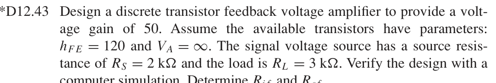
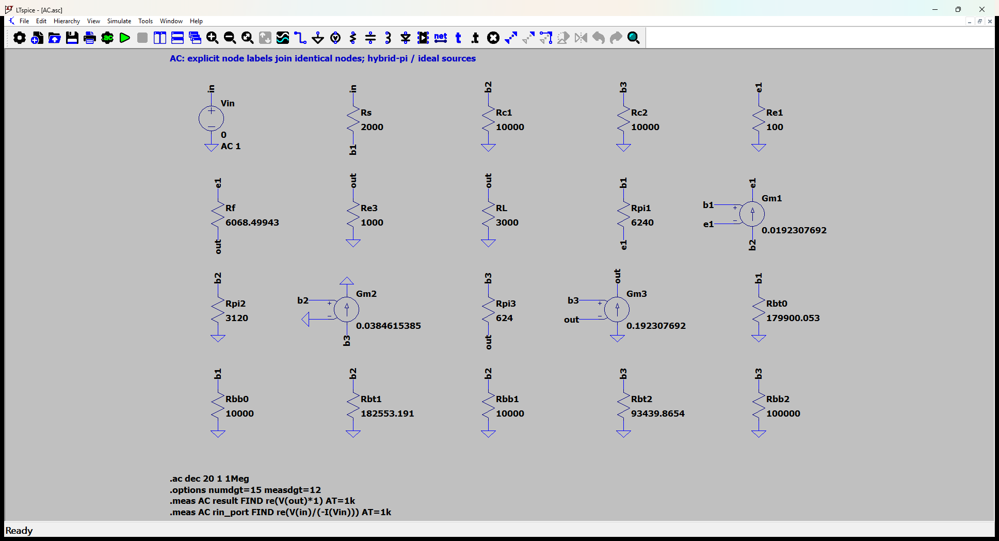
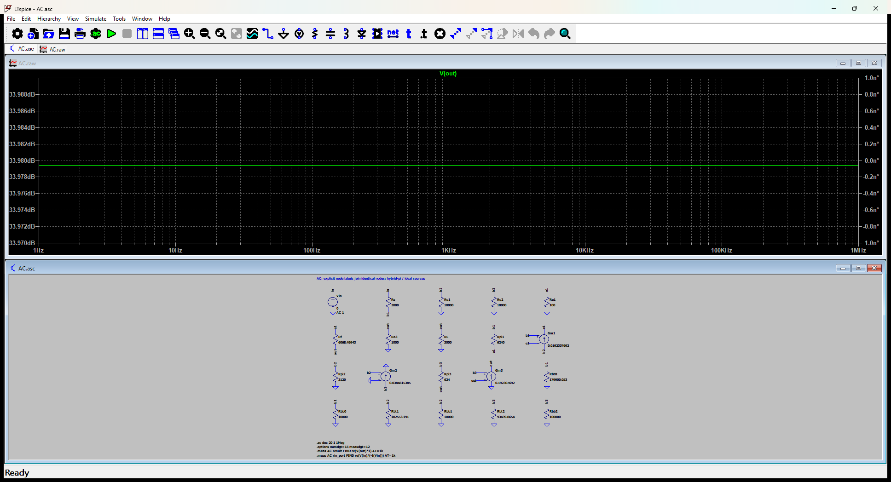

# 12.43 — 增益 50 的分立三级反馈设计

[41 题完成清单](status-12-20-60.md) · [本题文件包](../../assets/downloads/ch12-20-60/p12-43.zip)

## 教材题目与引用图

来源：用户提供的 `electrobook-(4th ed).pdf`，页序号从 1 起。



## 按教材模型展开推导


### 设计目标 → 反馈电阻 → 三管偏置与负载

选择两级共射加一级射极跟随器，反馈从输出经 $R_F$ 返回 Q1 发射极；基极、级间、输出和反馈支路采用隔直耦合，在指定中频视为短路。设计自由量明确选择为 $V_{CC}=15\,\mathrm V$、$R_{C1}=R_{C2}=10\,\mathrm{k\Omega}$、$R_{E1}=100\,\Omega$、$R_{E3}=1\,\mathrm{k\Omega}$、$I_C=(0.5,1,5)\,\mathrm{mA}$。题给 $R_S=2k,R_L=3k,\beta=120$ 始终保留。

$$
\begin{aligned}
R_F&\leftarrow A_v(R_F)=50\leftarrow\text{含分压器加载的节点方程},\\
R_{Bj,top}&\leftarrow\frac{15-V_{Bj}}{V_{Bj}/R_{Bj,bottom}+I_{Cj}/120},\\
V_{B1}&=0.7+I_{C1}(121/120)(100),\quad V_{B2}=0.7,\\
V_{B3}&=0.7+I_{C3}(121/120)(1000),\\
(R_{B1,bottom},R_{B2,bottom},R_{B3,bottom})&=(10k,10k,100k).
\end{aligned}
$$

向上先确定分压电阻，再求小信号参数，最后只改变设计变量 $R_F$ 解 $A_v=50$；没有修改 β 或工作点凑答案。最终电阻和工作点列于下方。输入电阻应扣除外部 2 kΩ；输出电阻另外列出含负载值与去除 3 kΩ 导纳的放大器值。此设计指定的是中频增益，未指定带宽，实际耦合电容值需按目标最低频率选取。

### 从依赖量展开到可代入的节点方程

设计选择 RC1=RC2=10 kΩ、RE1=100 Ω、RE3=1 kΩ，IC=(0.5,1,5) mA，电源15V。三级之间、输入、输出、RF均用隔直耦合电容；中频理想电容短路，DC开路。各基极用独立电阻分压偏置，实际分压电阻加载保留。

未知的 $g_m,r_\pi$ 先由静态电流展开：$g_{mj}=I_{Cj}/V_T$、$r_{\pi j}=\beta/g_{mj}$，$V_T=26$ mV；$r_o=\infty$。向上代入如下，单位明确列出。

|管号|$I_C$ (mA)|$g_m$ (mS)|$r_\pi$ (Ω)|
|---|---:|---:|---:|
|Q1|0.5|19.23076923|6240|
|Q2|1|38.46153846|3120|
|Q3|5|192.3076923|624|

直流节点值由上面的固定 $V_{BE}$ 与电流 KCL 得到；表中 **不是**指数晶体管模型的输出。所有下表节点名与 `DC.cir` 一致，电压相对地：

|节点|直流电压 (V)|
|---|---:|
|`b1`|0.7504166667|
|`b2`|0.7|
|`b3`|5.741666667|
|`c1`|10|
|`c2`|5|
|`e1`|0.05041666667|
|`out`|5.041666667|
|`vcc`|15|

DC 网表的每管用 `Vbe` 维持 0.7 V、用 F 源实现 $I_C=\beta I_B$；这是教材分段近似的独立电路实现，不预设待求电流。

为了逐节点核对，下面直接列出与原理图同名的全部节点 KCL。先由这些方程确定输出节点及输入电流，再向上组成所求比值。$i_V$ 是独立／受控电压源由正端流向负端的电流，所有理想直流电源在交流中接地，理想恒流偏置在交流中开路。

$$
\begin{aligned}
-\frac{(v_{\mathrm{in}}-v_{\mathrm{b1}})}{\mathrm{Rs}}+\frac{(v_{\mathrm{b1}}-v_{\mathrm{e1}})}{\mathrm{Rpi1}}+\frac{v_{\mathrm{b1}}}{\mathrm{Rbt0}}+\frac{v_{\mathrm{b1}}}{\mathrm{Rbb0}}&=0\quad(v_{\mathrm{b1}}\text{ 节点})\\[5pt]
\frac{v_{\mathrm{b2}}}{\mathrm{Rc1}}+\mathrm{Gm1}(v_{\mathrm{b1}}-v_{\mathrm{e1}})+\frac{v_{\mathrm{b2}}}{\mathrm{Rpi2}}+\frac{v_{\mathrm{b2}}}{\mathrm{Rbt1}}+\frac{v_{\mathrm{b2}}}{\mathrm{Rbb1}}&=0\quad(v_{\mathrm{b2}}\text{ 节点})\\[5pt]
\frac{v_{\mathrm{b3}}}{\mathrm{Rc2}}+\mathrm{Gm2}v_{\mathrm{b2}}+\frac{(v_{\mathrm{b3}}-v_{\mathrm{out}})}{\mathrm{Rpi3}}+\frac{v_{\mathrm{b3}}}{\mathrm{Rbt2}}+\frac{v_{\mathrm{b3}}}{\mathrm{Rbb2}}&=0\quad(v_{\mathrm{b3}}\text{ 节点})
\end{aligned}
$$

$$
\begin{aligned}
\frac{v_{\mathrm{e1}}}{\mathrm{Re1}}+\frac{(v_{\mathrm{e1}}-v_{\mathrm{out}})}{\mathrm{Rf}}-\frac{(v_{\mathrm{b1}}-v_{\mathrm{e1}})}{\mathrm{Rpi1}}-\mathrm{Gm1}(v_{\mathrm{b1}}-v_{\mathrm{e1}})&=0\quad(v_{\mathrm{e1}}\text{ 节点})\\[5pt]
i_{\mathrm{Vin}}+\frac{(v_{\mathrm{in}}-v_{\mathrm{b1}})}{\mathrm{Rs}}&=0\quad(v_{\mathrm{in}}\text{ 节点})\\[5pt]
-\frac{(v_{\mathrm{e1}}-v_{\mathrm{out}})}{\mathrm{Rf}}+\frac{v_{\mathrm{out}}}{\mathrm{Re3}}+\frac{v_{\mathrm{out}}}{\mathrm{RL}}-\frac{(v_{\mathrm{b3}}-v_{\mathrm{out}})}{\mathrm{Rpi3}}-\mathrm{Gm3}(v_{\mathrm{b3}}-v_{\mathrm{out}})&=0\quad(v_{\mathrm{out}}\text{ 节点})
\end{aligned}
$$

$$
\begin{aligned}
v_{\mathrm{in}}&=\mathrm{Vin}
\end{aligned}
$$

本组方程中的已知量如下。G 的系数为器件跨导（S），E 为开环电压增益或不加载电路的测量转换；不是题目闭环答案。1 V／1 A 是线性响应归一化，不是允许的大信号幅度。

|元件|连接节点（顺序同网表）|参数（SI 单位）|
|---|---|---:|
|`Vin`|`in → 0`|1|
|`Rs`|`in → b1`|2000|
|`Rc1`|`b2 → 0`|10000|
|`Rc2`|`b3 → 0`|10000|
|`Re1`|`e1 → 0`|100|
|`Rf`|`e1 → out`|6068.49943475|
|`Re3`|`out → 0`|1000|
|`RL`|`out → 0`|3000|
|`Rpi1`|`b1 → e1`|6240|
|`Gm1`|`b2 → e1 → b1 → e1`|0.0192307692308|
|`Rpi2`|`b2 → 0`|3120|
|`Gm2`|`b3 → 0 → b2 → 0`|0.0384615384615|
|`Rpi3`|`b3 → out`|624|
|`Gm3`|`0 → out → b3 → out`|0.192307692308|
|`Rbt0`|`b1 → 0`|179900.052604|
|`Rbb0`|`b1 → 0`|10000|
|`Rbt1`|`b2 → 0`|182553.191489|
|`Rbb1`|`b2 → 0`|10000|
|`Rbt2`|`b3 → 0`|93439.8654331|
|`Rbb2`|`b3 → 0`|100000|

### 向上代入得到结果

将上述已知参数代入 KCL（线性方程组数值求解），再取目标端口量。计算脚本为仓库中的 `scripts/ch12_models.py`，与 LTspice 引擎独立。

主结果：**50 V/V**。

信号源端口电阻：11391.01487 Ω。减去外部串联电阻后，放大器输入电阻为 9391.014872 Ω。

保持图中电阻与负载的输出测试电阻：1.214051704 Ω。去除外部负载导纳后，放大器输出电阻为 1.21454321 Ω。

设计数值（电阻单位 Ω，其余按变量定义）：

```json
{
  "RF": 6068.4994347515,
  "RS": 2000,
  "RL": 3000,
  "bias_top": [
    179900.05260389272,
    182553.19148936172,
    93439.86543313709
  ],
  "bias_bottom": [
    10000,
    10000,
    100000
  ],
  "VCC": 15
}
```

## 实际 LTspice 电路与频响截图

以下为 **LTspice 26.1.1 for Windows 实际窗口截图**，下方是教材小信号等效原理图，上方是引擎生成的 AC 曲线。同名节点标签表示电气相连。





未加入题目没有给出的结电容；因此 1 Hz–1 MHz 的平坦曲线只验证本页中频／理想等效模型，不代表实际器件带宽。对比值在 **1 kHz、同一套 $g_m,r_\pi$、同一端口定义**下提取。原日志的 AC 测量以 dB 和相位显示，数值表按 $x=10^{d/20}\cos\phi$ 换回线性值；180° 对应负号。

<div class="p1240-results-grid">
<section class="p1240-result-panel">
<h3>LTspice 原始运行日志</h3>
<details open><summary>AC.log</summary><pre class="p1240-log"><code>LTspice 26.1.1 for Windows
Circuit: C:\Users\tongs\Documents\GitHub\zhihu-physics-notes\docs\assets\downloads\ch12-20-60\p12-43\AC.net
Start Time: Tue Sep 22 10:01:06 2026
Options:numdgt=15 measdgt=12
solver = Normal
Maximum thread count: 16
tnom = 27
temp = 27
method = trap
.OP point found by inspection.
.OP point found by inspection.
Total elapsed time: 0.076 seconds.
Total iterations: 0

Files loaded:
C:\Users\tongs\Documents\GitHub\zhihu-physics-notes\docs\assets\downloads\ch12-20-60\p12-43\AC.net

result: re(V(out)*1)=(33.9794000803dB,0°) at 1000
rin_port: re(V(in)/(-I(Vin)))=(81.1312483785dB,0°) at 1000
</code></pre></details>
<details><summary>DC.log</summary><pre class="p1240-log"><code>LTspice 26.1.1 for Windows
Circuit: C:\Users\tongs\Documents\GitHub\zhihu-physics-notes\docs\assets\downloads\ch12-20-60\p12-43\DC.cir
Start Time: Tue Sep 22 09:56:01 2026
Options:numdgt=15 measdgt=12
solver = Normal
Maximum thread count: 16
tnom = 27
temp = 27
method = trap
Total elapsed time: 0.012 seconds.
Total iterations: 5

Files loaded:
C:\Users\tongs\Documents\GitHub\zhihu-physics-notes\docs\assets\downloads\ch12-20-60\p12-43\DC.cir

ic1: (I(Vbe1)*120)=0.00049999999081 at 15
ic2: (I(Vbe2)*120)=0.0010000000252 at 15
ic3: (I(Vbe3)*120)=0.0050000000012 at 15
v_b1: V(b1)=0.75041666574 at 15
v_b2: V(b2)=0.7 at 15
v_b3: V(b3)=5.74166666788 at 15
v_c1: V(c1)=10.0000000919 at 15
v_c2: V(c2)=4.99999974802 at 15
v_e1: V(e1)=0.05041666574 at 15
v_out: V(out)=5.04166666788 at 15
v_vcc: V(vcc)=15 at 15
</code></pre></details>
<details><summary>Rout.log</summary><pre class="p1240-log"><code>LTspice 26.1.1 for Windows
Circuit: C:\Users\tongs\Documents\GitHub\zhihu-physics-notes\docs\assets\downloads\ch12-20-60\p12-43\Rout.cir
Start Time: Tue Sep 22 09:56:02 2026
Options:numdgt=15 measdgt=12
solver = Normal
Maximum thread count: 16
tnom = 27
temp = 27
method = trap
.OP point found by inspection.
.OP point found by inspection.
Total elapsed time: 0.015 seconds.
Total iterations: 0

Files loaded:
C:\Users\tongs\Documents\GitHub\zhihu-physics-notes\docs\assets\downloads\ch12-20-60\p12-43\Rout.cir

rout_port: re(V(out))=(1.68474366189dB,0°) at 1000
</code></pre></details>
</section>
<section class="p1240-result-panel">
<h3>教材计算与实际仿真</h3>
<div class="p1240-table-scroll"><table><thead><tr><th>物理量</th><th>教材近似计算</th><th>实际仿真</th><th>单位</th><th>相对误差</th><th>原因／定义</th></tr></thead><tbody><tr><td>主结果</td><td>50</td><td>49.99999996</td><td>V/V</td><td>-7.3917e-08%</td><td>相同教材等效模型；数值舍入</td></tr><tr><td>输入测试端口电阻</td><td>11391.01487</td><td>11391.01487</td><td>Ω</td><td>+9.8923e-09%</td><td>相同端口；包含源电阻时的换算见上文</td></tr><tr><td>输出测试端口电阻</td><td>1.214051704</td><td>1.214051705</td><td>Ω</td><td>+5.0252e-08%</td><td>保持原负载；放大器自身值另列</td></tr><tr><td>IC1</td><td>0.0005</td><td>0.0004999999908</td><td>A</td><td>-1.838e-06%</td><td>固定VBE、有限β的同一偏置模型</td></tr><tr><td>IC2</td><td>0.001</td><td>0.001000000025</td><td>A</td><td>+2.52e-06%</td><td>固定VBE、有限β的同一偏置模型</td></tr><tr><td>IC3</td><td>0.005</td><td>0.005000000001</td><td>A</td><td>+2.4e-08%</td><td>固定VBE、有限β的同一偏置模型</td></tr><tr><td>DC out</td><td>5.041666667</td><td>5.041666668</td><td>V</td><td>+2.4066e-08%</td><td>固定VBE近似；与AC扰动区分</td></tr></tbody></table></div>
<p>计算来自上文节点方程，不以日志数值回填手算列。相对误差为 (仿真−计算)/计算；手算为零时只列绝对误差。同模型吻合验证代数与接线，不证明忽略寄生参数的近似适用于任意实物。</p>
</section>
</div>

## 下载与复现

[本题完整文件包](../../assets/downloads/ch12-20-60/p12-43.zip) · [12.20–12.60 全部成果包](../../assets/downloads/ch12-20-60.zip)

- [AC.asc](../../assets/downloads/ch12-20-60/p12-43/AC.asc)
- [AC.cir](../../assets/downloads/ch12-20-60/p12-43/AC.cir)
- [AC.log](../../assets/downloads/ch12-20-60/p12-43/AC.log)
- [AC.plt](../../assets/downloads/ch12-20-60/p12-43/AC.plt)
- [AC.raw](../../assets/downloads/ch12-20-60/p12-43/AC.raw)
- [DC.cir](../../assets/downloads/ch12-20-60/p12-43/DC.cir)
- [DC.log](../../assets/downloads/ch12-20-60/p12-43/DC.log)
- [DC.raw](../../assets/downloads/ch12-20-60/p12-43/DC.raw)
- [Rout.asc](../../assets/downloads/ch12-20-60/p12-43/Rout.asc)
- [Rout.cir](../../assets/downloads/ch12-20-60/p12-43/Rout.cir)
- [Rout.log](../../assets/downloads/ch12-20-60/p12-43/Rout.log)
- [Rout.raw](../../assets/downloads/ch12-20-60/p12-43/Rout.raw)

完整解压后用 LTspice 打开 `AC.asc`，运行并按 **Ctrl+L** 查看本机新生成的日志。`AC.plt` 为波形选择配置；`Rout.asc`（如有）单独测试输出电阻，`DC.cir`（如有）验证教材固定 VBE 偏置。模型与参数直接写在文件中，不依赖外部器件库。
