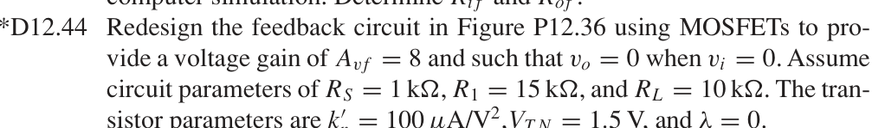
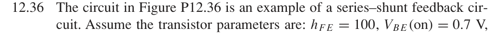
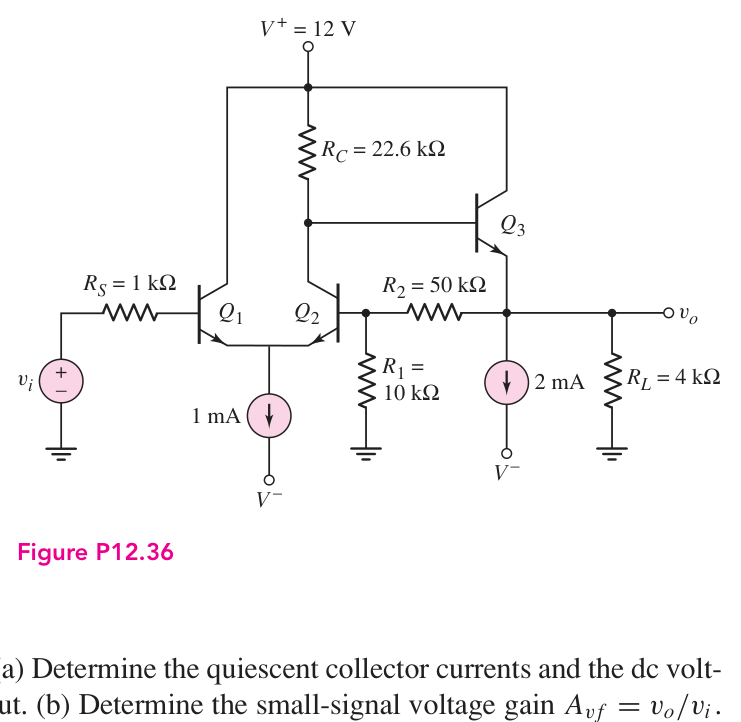
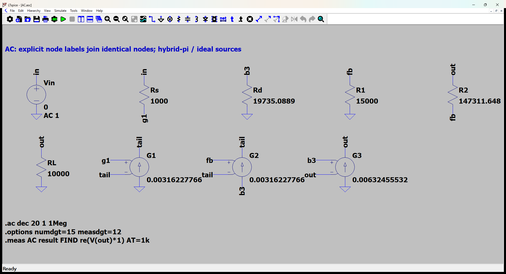
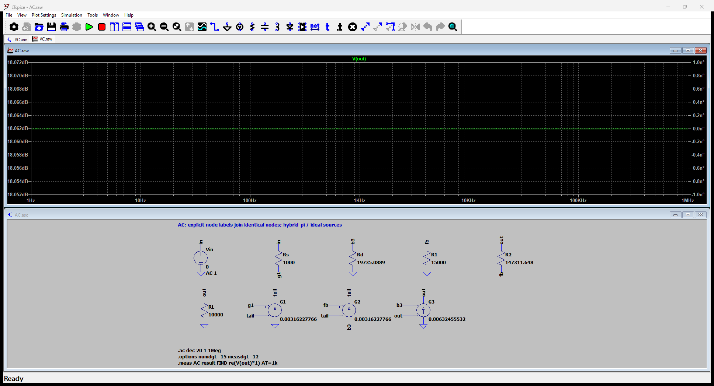

# 12.44 — 以 MOSFET 重设计差分反馈放大器

[41 题完成清单](status-12-20-60.md) · [本题文件包](../../assets/downloads/ch12-20-60/p12-44.zip)

## 教材题目与引用图

来源：用户提供的 `electrobook-(4th ed).pdf`，页序号从 1 起。







## 按教材模型展开推导


### 目标增益和零输出 → 分压比与漏极电阻 → MOS 尺寸及偏置

采用图 P12.36 的差分对加源极跟随器拓扑，三只 NPN 改为 NMOS。自主选择 $V^+=12\,\mathrm V$、$V^-=-12\,\mathrm V$、尾电流 1 mA、输出下拉恒流 2 mA，三管 $W/L=100$。题给 $k'_n=100\,\mu\mathrm{A/V^2}$，所以 $K_n=k'_n(W/L)/2=5\,\mathrm{mA/V^2}$，SPICE 若用 LEVEL=1 应取 KP=100 µA/V²、W/L=100。

$$
\begin{aligned}
(R_D,R_2)&\leftarrow(V_O=0,A_{vf}=8),\\
R_D&=\frac{12-(V_{TN}+\sqrt{I_{D3}/K_n})}{I_{D2}},\quad
 I_{D1}=I_{D2}=0.5\,\mathrm{mA},\ I_{D3}=2\,\mathrm{mA},\\
A_{vf}&=\frac{A_0}{1+1/(g_{m3}R_L)+\beta_f/(g_{m3}R_1)+\beta_fA_0},\\
A_0&=g_{m1}R_D/2,\quad g_{mj}=2\sqrt{K_nI_{Dj}},\\
\beta_f&=\frac{A_0/8-1-1/(g_{m3}R_L)}{A_0+1/(g_{m3}R_1)},\quad
R_2=R_1(1/\beta_f-1).
\end{aligned}
$$

代入 $R_1=15k,R_L=10k,V_{TN}=1.5$，得 $R_D=19.73508894\,\mathrm{k\Omega}$、$R_2=147.31164752\,\mathrm{k\Omega}$。MOS 输入无栅极电流，所以 1 kΩ 源电阻不造成中频压降。静态跟随管栅压 2.1324555 V、输出0 V；差分管公共源压 −1.8162278 V，三管均满足饱和条件。这里是设计选取的电源和电流，不是擅自补写原题已给值。

### 从依赖量展开到可代入的节点方程

自主设计参数：V+=12 V、V−=−12 V、尾电流1 mA、输出恒流下拉2 mA、三管W/L=100；题目指定 knprime=100 µA/V²。


为了逐节点核对，下面直接列出与原理图同名的全部节点 KCL。先由这些方程确定输出节点及输入电流，再向上组成所求比值。$i_V$ 是独立／受控电压源由正端流向负端的电流，所有理想直流电源在交流中接地，理想恒流偏置在交流中开路。

$$
\begin{aligned}
\frac{v_{\mathrm{b3}}}{\mathrm{Rd}}+\mathrm{G2}(v_{\mathrm{fb}}-v_{\mathrm{tail}})&=0\quad(v_{\mathrm{b3}}\text{ 节点})\\[5pt]
\frac{v_{\mathrm{fb}}}{\mathrm{R1}}-\frac{(v_{\mathrm{out}}-v_{\mathrm{fb}})}{\mathrm{R2}}&=0\quad(v_{\mathrm{fb}}\text{ 节点})\\[5pt]
-\frac{(v_{\mathrm{in}}-v_{\mathrm{g1}})}{\mathrm{Rs}}&=0\quad(v_{\mathrm{g1}}\text{ 节点})
\end{aligned}
$$

$$
\begin{aligned}
i_{\mathrm{Vin}}+\frac{(v_{\mathrm{in}}-v_{\mathrm{g1}})}{\mathrm{Rs}}&=0\quad(v_{\mathrm{in}}\text{ 节点})\\[5pt]
\frac{(v_{\mathrm{out}}-v_{\mathrm{fb}})}{\mathrm{R2}}+\frac{v_{\mathrm{out}}}{\mathrm{RL}}-\mathrm{G3}(v_{\mathrm{b3}}-v_{\mathrm{out}})&=0\quad(v_{\mathrm{out}}\text{ 节点})\\[5pt]
-\mathrm{G1}(v_{\mathrm{g1}}-v_{\mathrm{tail}})-\mathrm{G2}(v_{\mathrm{fb}}-v_{\mathrm{tail}})&=0\quad(v_{\mathrm{tail}}\text{ 节点})
\end{aligned}
$$

$$
\begin{aligned}
v_{\mathrm{in}}&=\mathrm{Vin}
\end{aligned}
$$

本组方程中的已知量如下。G 的系数为器件跨导（S），E 为开环电压增益或不加载电路的测量转换；不是题目闭环答案。1 V／1 A 是线性响应归一化，不是允许的大信号幅度。

|元件|连接节点（顺序同网表）|参数（SI 单位）|
|---|---|---:|
|`Vin`|`in → 0`|1|
|`Rs`|`in → g1`|1000|
|`Rd`|`b3 → 0`|19735.0889359|
|`R1`|`fb → 0`|15000|
|`R2`|`out → fb`|147311.647525|
|`RL`|`out → 0`|10000|
|`G1`|`0 → tail → g1 → tail`|0.00316227766017|
|`G2`|`b3 → tail → fb → tail`|0.00316227766017|
|`G3`|`0 → out → b3 → out`|0.00632455532034|

### 向上代入得到结果

将上述已知参数代入 KCL（线性方程组数值求解），再取目标端口量。计算脚本为仓库中的 `scripts/ch12_models.py`，与 LTspice 引擎独立。

主结果：**8 V/V**。

保持图中电阻与负载的输出测试电阻：40.53693412 Ω。

设计数值（电阻单位 Ω，其余按变量定义）：

```json
{
  "RD": 19735.088935932647,
  "R2": 147311.64752471098,
  "beta_feedback": 0.09241480958854996,
  "K": 0.005,
  "gm1": 0.0031622776601683794,
  "gm3": 0.006324555320336759
}
```

## 实际 LTspice 电路与频响截图

以下为 **LTspice 26.1.1 for Windows 实际窗口截图**，下方是教材小信号等效原理图，上方是引擎生成的 AC 曲线。同名节点标签表示电气相连。





未加入题目没有给出的结电容；因此 1 Hz–1 MHz 的平坦曲线只验证本页中频／理想等效模型，不代表实际器件带宽。对比值在 **1 kHz、同一套 $g_m,r_\pi$、同一端口定义**下提取。原日志的 AC 测量以 dB 和相位显示，数值表按 $x=10^{d/20}\cos\phi$ 换回线性值；180° 对应负号。

<div class="p1240-results-grid">
<section class="p1240-result-panel">
<h3>LTspice 原始运行日志</h3>
<details open><summary>AC.log</summary><pre class="p1240-log"><code>LTspice 26.1.1 for Windows
Circuit: C:\Users\tongs\Documents\GitHub\zhihu-physics-notes\docs\assets\downloads\ch12-20-60\p12-44\AC.net
Start Time: Tue Sep 22 10:01:11 2026
Options:numdgt=15 measdgt=12
solver = Normal
Maximum thread count: 16
tnom = 27
temp = 27
method = trap
ERROR: Node tail is floating and connected to current source G1

.OP point found by inspection.
.OP point found by inspection.
Total elapsed time: 0.056 seconds.
Total iterations: 0

Files loaded:
C:\Users\tongs\Documents\GitHub\zhihu-physics-notes\docs\assets\downloads\ch12-20-60\p12-44\AC.net

result: re(V(out)*1)=(18.0617997544dB,0°) at 1000
</code></pre></details>
<details><summary>DeviceDC.log</summary><pre class="p1240-log"><code>LTspice 26.1.1 for Windows
Circuit: C:\Users\tongs\Documents\GitHub\zhihu-physics-notes\docs\assets\downloads\ch12-20-60\p12-44\DeviceDC.cir
Start Time: Tue Sep 22 09:56:03 2026
Options:numdgt=15 measdgt=12 reltol=1e-9 abstol=1e-14 vntol=1e-10
solver = Normal
Maximum thread count: 16
tnom = 27
temp = 27
method = trap
abstol = 1e-14
reltol = 1e-09
volttol = 1e-10
Instance &quot;M1&quot;: Length shorter than recommended for a level 1 MOSFET.
Instance &quot;M2&quot;: Length shorter than recommended for a level 1 MOSFET.
Instance &quot;M3&quot;: Length shorter than recommended for a level 1 MOSFET.
Total elapsed time: 0.019 seconds.
Total iterations: 13

Files loaded:
C:\Users\tongs\Documents\GitHub\zhihu-physics-notes\docs\assets\downloads\ch12-20-60\p12-44\DeviceDC.cir

id1: Id(M1)=0.00050000000243 at 12
id2: Id(M2)=0.00049999999757 at 12
id3: Id(M3)=0.0020000000054 at 12
vout: V(out)=5.08995139868e-08 at 12
</code></pre></details>
<details><summary>Rout.log</summary><pre class="p1240-log"><code>LTspice 26.1.1 for Windows
Circuit: C:\Users\tongs\Documents\GitHub\zhihu-physics-notes\docs\assets\downloads\ch12-20-60\p12-44\Rout.cir
Start Time: Tue Sep 22 09:56:04 2026
Options:numdgt=15 measdgt=12
solver = Normal
Maximum thread count: 16
tnom = 27
temp = 27
method = trap
ERROR: Node tail is floating and connected to current source G1

.OP point found by inspection.
.OP point found by inspection.
Total elapsed time: 0.026 seconds.
Total iterations: 0

Files loaded:
C:\Users\tongs\Documents\GitHub\zhihu-physics-notes\docs\assets\downloads\ch12-20-60\p12-44\Rout.cir

rout_port: re(V(out))=(32.1570180136dB,0°) at 1000
</code></pre></details>
</section>
<section class="p1240-result-panel">
<h3>教材计算与实际仿真</h3>
<div class="p1240-table-scroll"><table><thead><tr><th>物理量</th><th>教材近似计算</th><th>实际仿真</th><th>单位</th><th>相对误差</th><th>原因／定义</th></tr></thead><tbody><tr><td>主结果</td><td>8</td><td>8.000000013</td><td>V/V</td><td>+1.6764e-07%</td><td>相同教材等效模型；数值舍入</td></tr><tr><td>输出测试端口电阻</td><td>40.53693412</td><td>40.53693426</td><td>Ω</td><td>+3.6074e-07%</td><td>保持原负载；放大器自身值另列</td></tr><tr><td>id1（器件DC）</td><td>0.0005</td><td>0.0005000000024</td><td>A</td><td>+4.86e-07%</td><td>单列器件模型：偏置近似、26mV与27°C热电压差异</td></tr><tr><td>id2（器件DC）</td><td>0.0005</td><td>0.0004999999976</td><td>A</td><td>-4.86e-07%</td><td>单列器件模型：偏置近似、26mV与27°C热电压差异</td></tr><tr><td>id3（器件DC）</td><td>0.002</td><td>0.002000000005</td><td>A</td><td>+2.7e-07%</td><td>单列器件模型：偏置近似、26mV与27°C热电压差异</td></tr><tr><td>VO（器件DC）</td><td>0</td><td>5.089951399e-08</td><td>V</td><td>绝对误差 5.09e-08 V（零值不算相对误差）</td><td>理想设计零输出；只比较绝对误差</td></tr></tbody></table></div>
<p>计算来自上文节点方程，不以日志数值回填手算列。相对误差为 (仿真−计算)/计算；手算为零时只列绝对误差。同模型吻合验证代数与接线，不证明忽略寄生参数的近似适用于任意实物。</p>
</section>
</div>

### 单列：非线性器件直流检查

`DeviceDC.cir` 使用 LEVEL=1 MOS 或题给 IS 的 BJT 器件，在27°C实际运行。它与上面的教材近似偏置不同，**没有用新工作点悄悄替换上方 AC 对比的参数**。MOS 差异来自分压器负载／差分对非平衡；BJT 差异还包含26 mV近似与27°C实际热电压的区别。

|日志量|实际值（SI）|
|---|---:|
|`id1`|0.00050000000243|
|`id2`|0.00049999999757|
|`id3`|0.0020000000054|
|`vout`|5.08995139868e-08|
## 下载与复现

[本题完整文件包](../../assets/downloads/ch12-20-60/p12-44.zip) · [12.20–12.60 全部成果包](../../assets/downloads/ch12-20-60.zip)

- [AC.asc](../../assets/downloads/ch12-20-60/p12-44/AC.asc)
- [AC.cir](../../assets/downloads/ch12-20-60/p12-44/AC.cir)
- [AC.log](../../assets/downloads/ch12-20-60/p12-44/AC.log)
- [AC.plt](../../assets/downloads/ch12-20-60/p12-44/AC.plt)
- [AC.raw](../../assets/downloads/ch12-20-60/p12-44/AC.raw)
- [DeviceDC.cir](../../assets/downloads/ch12-20-60/p12-44/DeviceDC.cir)
- [DeviceDC.log](../../assets/downloads/ch12-20-60/p12-44/DeviceDC.log)
- [DeviceDC.raw](../../assets/downloads/ch12-20-60/p12-44/DeviceDC.raw)
- [Rout.asc](../../assets/downloads/ch12-20-60/p12-44/Rout.asc)
- [Rout.cir](../../assets/downloads/ch12-20-60/p12-44/Rout.cir)
- [Rout.log](../../assets/downloads/ch12-20-60/p12-44/Rout.log)
- [Rout.raw](../../assets/downloads/ch12-20-60/p12-44/Rout.raw)

完整解压后用 LTspice 打开 `AC.asc`，运行并按 **Ctrl+L** 查看本机新生成的日志。`AC.plt` 为波形选择配置；`Rout.asc`（如有）单独测试输出电阻，`DC.cir`（如有）验证教材固定 VBE 偏置。模型与参数直接写在文件中，不依赖外部器件库。
