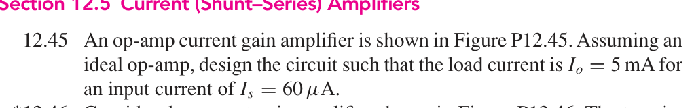
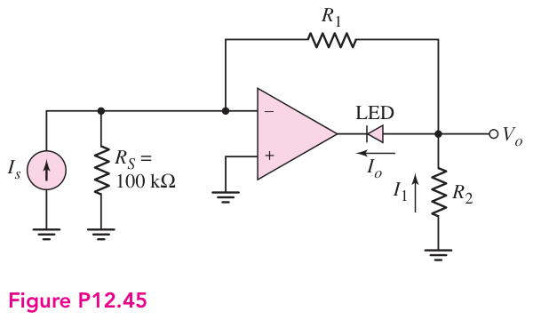
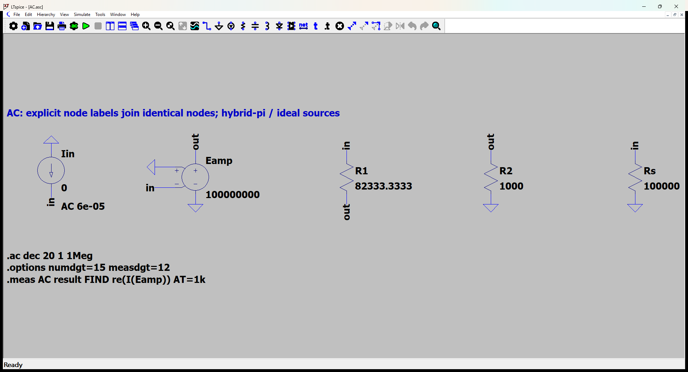
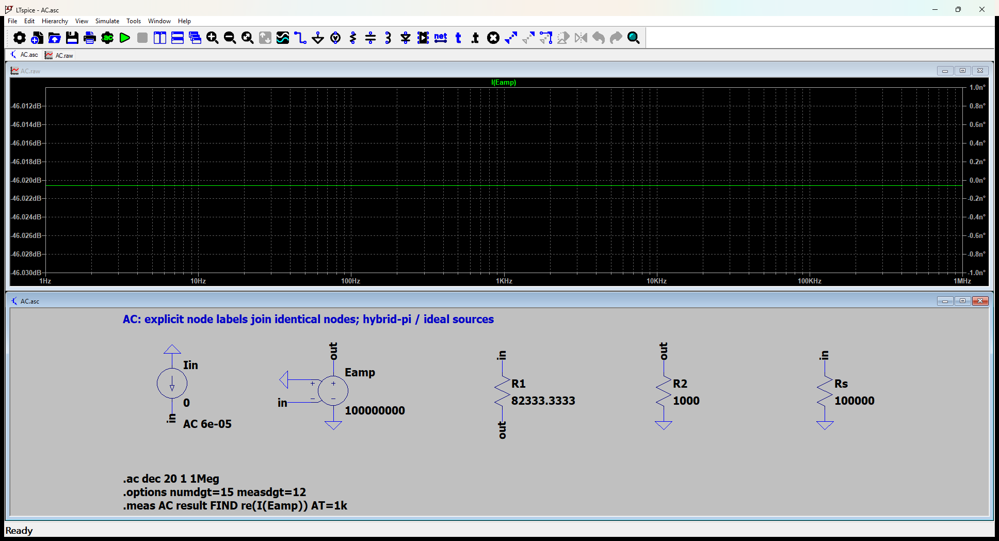

# 12.45 — 理想运放 LED 电流设计

[41 题完成清单](status-12-20-60.md) · [本题文件包](../../assets/downloads/ch12-20-60/p12-45.zip)

## 教材题目与引用图

来源：用户提供的 `electrobook-(4th ed).pdf`，页序号从 1 起。

## 按教材模型展开推导

### 目标 LED 电流 → 电阻比 → 给定输入电流

图中 $I_o$ 向左流入 LED 和运放输出端。理想虚地使 100 kΩ 源电阻不分流：

$$
\begin{aligned}
\frac{R_1}{R_2}&\leftarrow\frac{I_o}{I_s}-1,\\
I_o&=I_s+I_1,\quad V_o=-I_sR_1,\quad I_1=-V_o/R_2,\\
\frac{R_1}{R_2}&=\frac{5\,\mathrm{mA}}{60\,\mu\mathrm A}-1=82.3333333.
\end{aligned}
$$

选择 $R_2=1\,\mathrm{k\Omega}$、$R_1=82.3333333\,\mathrm{k\Omega}$，则 $V_o=-4.94\,\mathrm V$、$I_o=5\,\mathrm{mA}$。运放输出端须达到 $-4.94-V_{LED}$；题目没有给出 LED 压降，故不能声称 ±5 V 电源足够。

交流等效中 LED 的固定压降消失，运放用开环电压增益 $10^8$ 的受控源近似理想器件。表格保留有限开环增益导致的极小误差。它不是把 5 mA 预置到输出电流源。

### 从依赖量展开到可代入的节点方程

增益设计 R1/R2=82.333333。交流等效 LED 为短路，仅验证电流关系；其正向压降未给出，直流电源顺从范围需保留为符号条件。

为了逐节点核对，下面直接列出与原理图同名的全部节点 KCL。先由这些方程确定输出节点及输入电流，再向上组成所求比值。$i_V$ 是独立／受控电压源由正端流向负端的电流，所有理想直流电源在交流中接地，理想恒流偏置在交流中开路。

$$
\begin{aligned}
-\mathrm{Iin}+\frac{(v_{\mathrm{in}}-v_{\mathrm{out}})}{\mathrm{R1}}+\frac{v_{\mathrm{in}}}{\mathrm{Rs}}&=0\quad(v_{\mathrm{in}}\text{ 节点})\\[5pt]
i_{\mathrm{Eamp}}-\frac{(v_{\mathrm{in}}-v_{\mathrm{out}})}{\mathrm{R1}}+\frac{v_{\mathrm{out}}}{\mathrm{R2}}&=0\quad(v_{\mathrm{out}}\text{ 节点})
\end{aligned}
$$

$$
\begin{aligned}
v_{\mathrm{out}}&=\mathrm{Eamp}-v_{\mathrm{in}}
\end{aligned}
$$

本组方程中的已知量如下。G 的系数为器件跨导（S），E 为开环电压增益或不加载电路的测量转换；不是题目闭环答案。1 V／1 A 是线性响应归一化，不是允许的大信号幅度。

|元件|连接节点（顺序同网表）|参数（SI 单位）|
|---|---|---:|
|`Iin`|`0 → in`|6e-05|
|`Eamp`|`out → 0 → 0 → in`|100000000|
|`R1`|`in → out`|82333.3333333|
|`R2`|`out → 0`|1000|
|`Rs`|`in → 0`|100000|

### 向上代入得到结果

将上述已知参数代入 KCL（线性方程组数值求解），再取目标端口量。计算脚本为仓库中的 `scripts/ch12_models.py`，与 LTspice 引擎独立。

主结果：**0.005 A**。

## 实际 LTspice 电路与频响截图

以下为 **LTspice 26.1.1 for Windows 实际窗口截图**，下方是教材小信号等效原理图，上方是引擎生成的 AC 曲线。同名节点标签表示电气相连。

未加入题目没有给出的结电容；因此 1 Hz–1 MHz 的平坦曲线只验证本页中频／理想等效模型，不代表实际器件带宽。对比值在 **1 kHz、同一套 $g_m,r_\pi$、同一端口定义**下提取。原日志的 AC 测量以 dB 和相位显示，数值表按 $x=10^{d/20}\cos\phi$ 换回线性值；180° 对应负号。

<section class="p1240-result-panel">
<h3>LTspice 原始运行日志</h3>

AC.log
<pre class="p1240-log"><code>LTspice 26.1.1 for Windows
Circuit: C:\Users\tongs\Documents\GitHub\zhihu-physics-notes\docs\assets\downloads\ch12-20-60\p12-45\AC.net
Start Time: Tue Sep 22 10:01:22 2026
Options:numdgt=15 measdgt=12
solver = Normal
Maximum thread count: 16
tnom = 27
temp = 27
method = trap
.OP point found by inspection.
.OP point found by inspection.
Total elapsed time: 0.047 seconds.
Total iterations: 0

Files loaded:
C:\Users\tongs\Documents\GitHub\zhihu-physics-notes\docs\assets\downloads\ch12-20-60\p12-45\AC.net

result: re(I(Eamp))=(-46.0206000741dB,0°) at 1000
</code></pre>

</section>
<section class="p1240-result-panel">
<h3>教材计算与实际仿真</h3>

<table><thead><tr><th>物理量</th><th>教材近似计算</th><th>实际仿真</th><th>单位</th><th>相对误差</th><th>原因／定义</th></tr></thead><tbody><tr><td>主结果</td><td>0.005</td><td>0.004999999907</td><td>A</td><td>-1.8515e-06%</td><td>有限运放开环增益10^8与理想极限的差异</td></tr></tbody></table>

计算来自上文节点方程，不以日志数值回填手算列。相对误差为 (仿真−计算)/计算；手算为零时只列绝对误差。同模型吻合验证代数与接线，不证明忽略寄生参数的近似适用于任意实物。

</section>

## 下载与复现

[本题完整文件包](../../assets/downloads/ch12-20-60/p12-45.zip) · [12.20–12.60 全部成果包](../../assets/downloads/ch12-20-60.zip)

- [AC.asc](../../assets/downloads/ch12-20-60/p12-45/AC.asc)
- [AC.cir](../../assets/downloads/ch12-20-60/p12-45/AC.cir)
- [AC.log](../../assets/downloads/ch12-20-60/p12-45/AC.log)
- [AC.plt](../../assets/downloads/ch12-20-60/p12-45/AC.plt)
- [AC.raw](../../assets/downloads/ch12-20-60/p12-45/AC.raw)

完整解压后用 LTspice 打开 `AC.asc`，运行并按 **Ctrl+L** 查看本机新生成的日志。`AC.plt` 为波形选择配置；`Rout.asc`（如有）单独测试输出电阻，`DC.cir`（如有）验证教材固定 VBE 偏置。模型与参数直接写在文件中，不依赖外部器件库。
