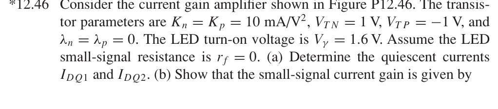
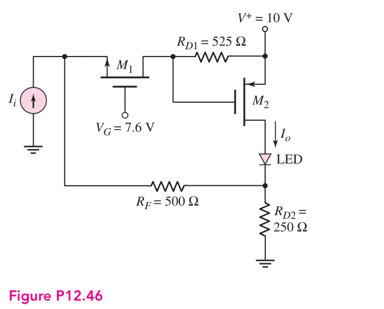
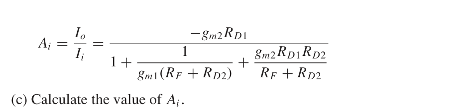
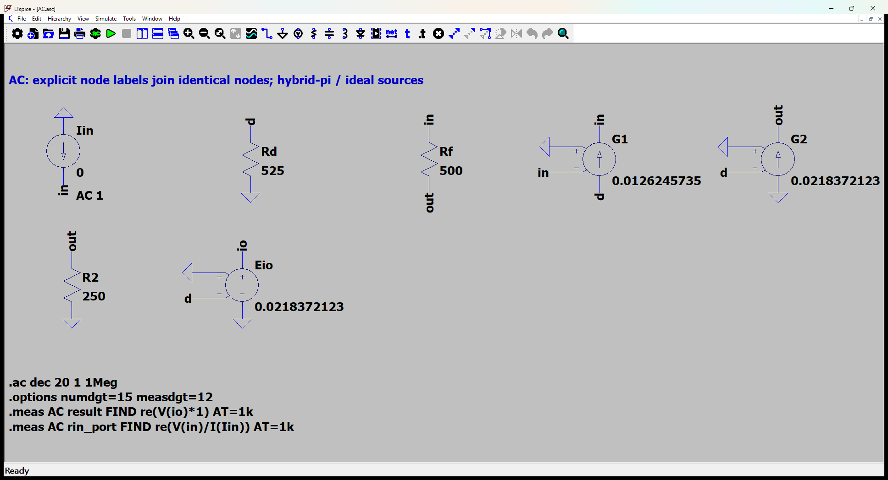
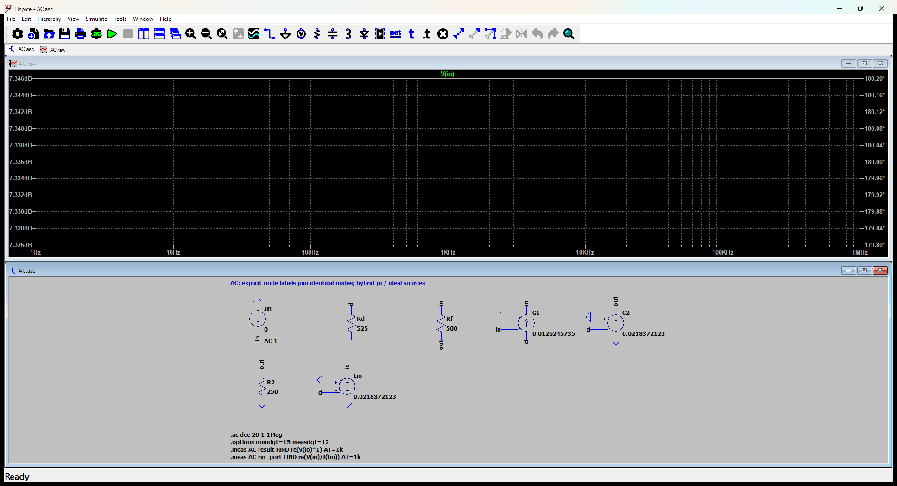

# 12.46 — 共栅 MOS 与 PMOS 的电流反馈

[41 题完成清单](status-12-20-60.md) · [本题文件包](../../assets/downloads/ch12-20-60/p12-46.zip)

## 教材题目与引用图

来源：用户提供的 `electrobook-(4th ed).pdf`，页序号从 1 起。

## 按教材模型展开推导

### (a) 静态电流 → 栅源电压 → 方程闭合

以 $I_1=I_{DQ1}$、$I_2=I_{DQ2}$ 表示正向大小，输入信号直流为零。

$$
\begin{aligned}
(I_1,I_2)&\leftarrow\begin{cases}
I_2=K_p(R_{D1}I_1-|V_{TP}|)^2,\\
V_G-V_{TN}-\sqrt{I_1/K_n}=R_FI_1+R_{D2}(I_1+I_2),
\end{cases}\\
V_{D1}&=10-R_{D1}I_1,\quad V_{S1}=7.6-1-\sqrt{I_1/K_n}.
\end{aligned}
$$

取满足 $R_{D1}I_1>|V_{TP}|$ 的导通根，代入题定电阻及 $K_n=K_p=10\,\mathrm{mA/V^2}$，得到 $I_1=3.984496412\,\mathrm{mA}$、$I_2=11.92159606\,\mathrm{mA}$。$V_{S1}=5.96877105$ V、LED 下端约3.97652 V；逐管检查 $V_{DS1}\ge V_{GS1}-V_{TN}$、$V_{SD2}\ge V_{SG2}-|V_{TP}|$ 均成立。

### (b) 所求电流增益 → 三个节点 KCL → 消元

令 $v_s,v_d,v_o$ 为 M1 源、M1 漏及 LED 下端的小信号电压，LED 的 $r_f=0$：

$$
\begin{aligned}
i_i&=g_{m1}v_s+(v_s-v_o)/R_F,\\
v_d&=g_{m1}R_{D1}v_s,\qquad i_o=-g_{m2}v_d,\\
v_o/R_{D2}&=i_o+(v_s-v_o)/R_F.
\end{aligned}
$$

从第三式解 $v_o$，代回第一式，再用第二式回代，得到

$$\boxed{\frac{i_o}{i_i}=
\frac{-g_{m2}R_{D1}}{1+\dfrac1{g_{m1}(R_F+R_{D2})}+\dfrac{g_{m2}R_{D1}R_{D2}}{R_F+R_{D2}}}}.$$

### (c) 向上代入

$g_{mj}=2\sqrt{K_jI_j}$；代入 (a) 的电流得到 $A_i=-2.326820099\,\mathrm{A/A}$，负号与原图的输入、输出箭头一致。

### 从依赖量展开到可代入的节点方程

Ii 是零均值小信号；DC 输入电流为零。LED 使用题给1.6 V压降及零增量电阻；输出电流方向为PMOS流向LED。Eio为不加载主电路的电流读数转换，增益为器件gm，不是预设闭环答案。

测量节点 `io` 的电压定义为输出电流乘以1 Ω：$v_{read}=(1\,\Omega)i_o$。E源仅提供不加载原电路的读数转换，日志中的电压数值据此还原为电流；该转换不预设闭环增益。

为了逐节点核对，下面直接列出与原理图同名的全部节点 KCL。先由这些方程确定输出节点及输入电流，再向上组成所求比值。$i_V$ 是独立／受控电压源由正端流向负端的电流，所有理想直流电源在交流中接地，理想恒流偏置在交流中开路。

$$
\begin{aligned}
\frac{v_{\mathrm{d}}}{\mathrm{Rd}}+\mathrm{G1}-v_{\mathrm{in}}&=0\quad(v_{\mathrm{d}}\text{ 节点})\\[5pt]
-\mathrm{Iin}+\frac{(v_{\mathrm{in}}-v_{\mathrm{out}})}{\mathrm{Rf}}-\mathrm{G1}-v_{\mathrm{in}}&=0\quad(v_{\mathrm{in}}\text{ 节点})\\[5pt]
i_{\mathrm{Eio}}&=0\quad(v_{\mathrm{io}}\text{ 节点})
\end{aligned}
$$

$$
\begin{aligned}
-\frac{(v_{\mathrm{in}}-v_{\mathrm{out}})}{\mathrm{Rf}}-\mathrm{G2}-v_{\mathrm{d}}+\frac{v_{\mathrm{out}}}{\mathrm{R2}}&=0\quad(v_{\mathrm{out}}\text{ 节点})
\end{aligned}
$$

$$
\begin{aligned}
v_{\mathrm{io}}&=\mathrm{Eio}-v_{\mathrm{d}}
\end{aligned}
$$

本组方程中的已知量如下。G 的系数为器件跨导（S），E 为开环电压增益或不加载电路的测量转换；不是题目闭环答案。1 V／1 A 是线性响应归一化，不是允许的大信号幅度。

|元件|连接节点（顺序同网表）|参数（SI 单位）|
|---|---|---:|
|`Iin`|`0 → in`|1|
|`Rd`|`d → 0`|525|
|`Rf`|`in → out`|500|
|`G1`|`d → in → 0 → in`|0.0126245735174|
|`G2`|`0 → out → 0 → d`|0.0218372123305|
|`R2`|`out → 0`|250|
|`Eio`|`io → 0 → 0 → d`|0.0218372123305|

### 向上代入得到结果

将上述已知参数代入 KCL（线性方程组数值求解），再取目标端口量。计算脚本为仓库中的 `scripts/ch12_models.py`，与 LTspice 引擎独立。

主结果：**-2.326820099 A/A**。

信号源端口电阻：16.07642914 Ω。

## 实际 LTspice 电路与频响截图

以下为 **LTspice 26.1.1 for Windows 实际窗口截图**，下方是教材小信号等效原理图，上方是引擎生成的 AC 曲线。同名节点标签表示电气相连。

未加入题目没有给出的结电容；因此 1 Hz–1 MHz 的平坦曲线只验证本页中频／理想等效模型，不代表实际器件带宽。对比值在 **1 kHz、同一套 $g_m,r_\pi$、同一端口定义**下提取。原日志的 AC 测量以 dB 和相位显示，数值表按 $x=10^{d/20}\cos\phi$ 换回线性值；180° 对应负号。

<section class="p1240-result-panel">
<h3>LTspice 原始运行日志</h3>

AC.log
<pre class="p1240-log"><code>LTspice 26.1.1 for Windows
Circuit: C:\Users\tongs\Documents\GitHub\zhihu-physics-notes\docs\assets\downloads\ch12-20-60\p12-46\AC.net
Start Time: Tue Sep 22 10:01:27 2026
Options:numdgt=15 measdgt=12
solver = Normal
Maximum thread count: 16
tnom = 27
temp = 27
method = trap
.OP point found by inspection.
.OP point found by inspection.
Total elapsed time: 0.052 seconds.
Total iterations: 0

Files loaded:
C:\Users\tongs\Documents\GitHub\zhihu-physics-notes\docs\assets\downloads\ch12-20-60\p12-46\AC.net

result: re(V(io)*1)=(7.33525612793dB,180°) at 1000
rin_port: re(V(in)/I(Iin))=(24.1237918311dB,0°) at 1000
</code></pre>

DeviceDC.log
<pre class="p1240-log"><code>LTspice 26.1.1 for Windows
Circuit: C:\Users\tongs\Documents\GitHub\zhihu-physics-notes\docs\assets\downloads\ch12-20-60\p12-46\DeviceDC.cir
Start Time: Tue Sep 22 09:56:05 2026
Options:numdgt=15 measdgt=12 reltol=1e-9 abstol=1e-14 vntol=1e-10
solver = Normal
Maximum thread count: 16
tnom = 27
temp = 27
method = trap
abstol = 1e-14
reltol = 1e-09
volttol = 1e-10
Instance &quot;M1&quot;: Length shorter than recommended for a level 1 MOSFET.
Instance &quot;M1&quot;: Width narrower than recommended for a level 1 MOSFET.
Instance &quot;M2&quot;: Length shorter than recommended for a level 1 MOSFET.
Instance &quot;M2&quot;: Width narrower than recommended for a level 1 MOSFET.
Total elapsed time: 0.016 seconds.
Total iterations: 11

Files loaded:
C:\Users\tongs\Documents\GitHub\zhihu-physics-notes\docs\assets\downloads\ch12-20-60\p12-46\DeviceDC.cir

id1: Id(M1)=0.00398449641192 at 10
id2: (-Id(M2))=0.0119215960622 at 10
vout: V(out)=3.97652311852 at 10
vs1: V(s)=5.96877132448 at 10
</code></pre>

</section>
<section class="p1240-result-panel">
<h3>教材计算与实际仿真</h3>

<table><thead><tr><th>物理量</th><th>教材近似计算</th><th>实际仿真</th><th>单位</th><th>相对误差</th><th>原因／定义</th></tr></thead><tbody><tr><td>主结果</td><td>-2.326820099</td><td>-2.326820098</td><td>A/A</td><td>-3.4314e-08%</td><td>相同教材等效模型；数值舍入</td></tr><tr><td>输入测试端口电阻</td><td>16.07642914</td><td>16.07642917</td><td>Ω</td><td>+2.4306e-07%</td><td>相同端口；包含源电阻时的换算见上文</td></tr><tr><td>id1（器件DC）</td><td>0.003984496412</td><td>0.003984496412</td><td>A</td><td>-1.2838e-08%</td><td>单列器件模型：偏置近似、26mV与27°C热电压差异</td></tr><tr><td>id2（器件DC）</td><td>0.01192159606</td><td>0.01192159606</td><td>A</td><td>+2.5019e-08%</td><td>单列器件模型：偏置近似、26mV与27°C热电压差异</td></tr><tr><td>VO（器件DC）</td><td>3.976523118</td><td>3.976523119</td><td>V</td><td>+1.5284e-08%</td><td>同一电源；器件模型与教材近似</td></tr></tbody></table>

计算来自上文节点方程，不以日志数值回填手算列。相对误差为 (仿真−计算)/计算；手算为零时只列绝对误差。同模型吻合验证代数与接线，不证明忽略寄生参数的近似适用于任意实物。

</section>

### 单列：非线性器件直流检查

`DeviceDC.cir` 使用 LEVEL=1 MOS 或题给 IS 的 BJT 器件，在27°C实际运行。它与上面的教材近似偏置不同，**没有用新工作点悄悄替换上方 AC 对比的参数**。MOS 差异来自分压器负载／差分对非平衡；BJT 差异还包含26 mV近似与27°C实际热电压的区别。

|日志量|实际值（SI）|
|---|---:|
|`id1`|0.00398449641192|
|`id2`|0.0119215960622|
|`vout`|3.97652311852|
|`vs1`|5.96877132448|
## 下载与复现

[本题完整文件包](../../assets/downloads/ch12-20-60/p12-46.zip) · [12.20–12.60 全部成果包](../../assets/downloads/ch12-20-60.zip)

- [AC.asc](../../assets/downloads/ch12-20-60/p12-46/AC.asc)
- [AC.cir](../../assets/downloads/ch12-20-60/p12-46/AC.cir)
- [AC.log](../../assets/downloads/ch12-20-60/p12-46/AC.log)
- [AC.plt](../../assets/downloads/ch12-20-60/p12-46/AC.plt)
- [AC.raw](../../assets/downloads/ch12-20-60/p12-46/AC.raw)
- [DeviceDC.cir](../../assets/downloads/ch12-20-60/p12-46/DeviceDC.cir)
- [DeviceDC.log](../../assets/downloads/ch12-20-60/p12-46/DeviceDC.log)
- [DeviceDC.raw](../../assets/downloads/ch12-20-60/p12-46/DeviceDC.raw)

完整解压后用 LTspice 打开 `AC.asc`，运行并按 **Ctrl+L** 查看本机新生成的日志。`AC.plt` 为波形选择配置；`Rout.asc`（如有）单独测试输出电阻，`DC.cir`（如有）验证教材固定 VBE 偏置。模型与参数直接写在文件中，不依赖外部器件库。
