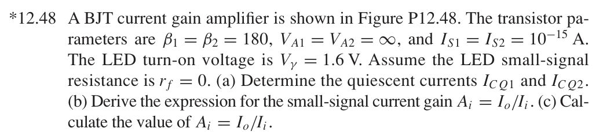
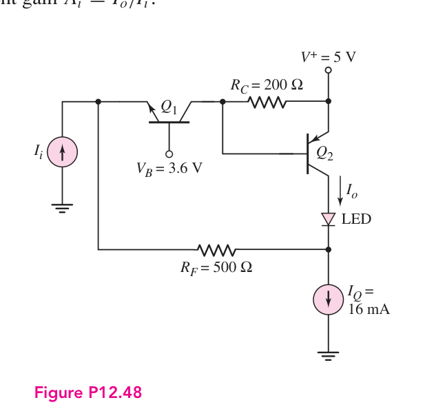
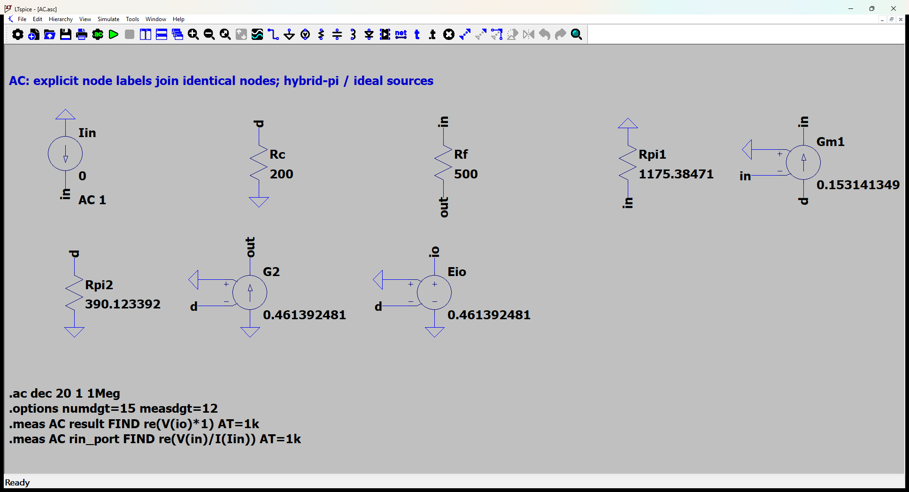
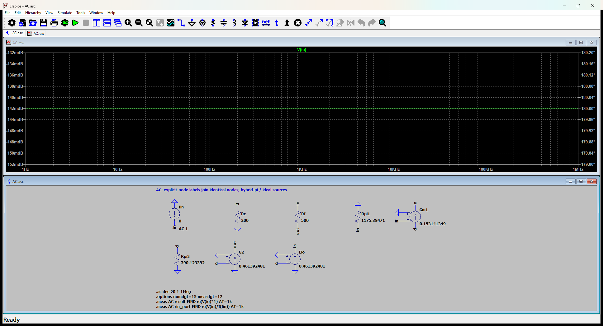

# 12.48 — 共基极 BJT 与 PNP 电流反馈

[41 题完成清单](status-12-20-60.md) · [本题文件包](../../assets/downloads/ch12-20-60/p12-48.zip)

## 教材题目与引用图

来源：用户提供的 `electrobook-(4th ed).pdf`，页序号从 1 起。

## 按教材模型展开推导

### (a) 静态电流 → 指数模型及 KCL → 题给 IS

本题明确给出 $I_S=10^{-15}\,\mathrm A$，没有给定固定0.7 V压降，故采用 $V_{BE}=V_T\ln(I_C/I_S)$，$V_T=26$ mV。

$$
\begin{aligned}
I_{C2}&=16\,\mathrm{mA}-(1+1/180)I_{C1},\\
V_{EB2}&=200(I_{C1}-I_{C2}/180)
=V_T\ln(I_{C2}/I_S),\\
V_{E1}&=3.6-V_T\ln(I_{C1}/I_S).
\end{aligned}
$$

向上解正电流根：$I_{C1}=3.981675066\,\mathrm{mA}$、$I_{C2}=11.99620452\,\mathrm{mA}$。注意 PNP 基极电流注入 RC 节点，因此第一式中的 $I_{C2}/180$ 必须是减号。

### (b) 增益 → 两级电流关系 → 基极电流修正

$$
\begin{aligned}
A_i&\leftarrow-\frac{G}{1+1/\beta_1+G},\\
G=\frac{i_{c2}}{i_{c1}}&\leftarrow\frac{g_{m2}R_C}{1+g_{m2}R_C/\beta_2},\\
i_i+(1+1/\beta_1)i_{c1}+i_{c2}&=0,\qquad
 g_{m2}\leftarrow I_{C2}/V_T.
\end{aligned}
$$

### (c) 向上代入

代入 $R_C=200\,\Omega$、$\beta_1=\beta_2=180$ 及 (a) 电流，得 $A_i=-0.9837839112\,\mathrm{A/A}$。LED 直流压降1.6 V只参与合规电压和正向放大区检查，零增量电阻使其不进入小信号增益。

### 从依赖量展开到可代入的节点方程

使用题给 IS=10^-15 A，而非强制 VBE=0.7 V。DC 联立指数方程；VT=26mV。

测量节点 `io` 的电压定义为输出电流乘以1 Ω：$v_{read}=(1\,\Omega)i_o$。E源仅提供不加载原电路的读数转换，日志中的电压数值据此还原为电流；该转换不预设闭环增益。

未知的 $g_m,r_\pi$ 先由静态电流展开：$g_{mj}=I_{Cj}/V_T$、$r_{\pi j}=\beta/g_{mj}$，$V_T=26$ mV；$r_o=\infty$。向上代入如下，单位明确列出。

|管号|$I_C$ (mA)|$g_m$ (mS)|$r_\pi$ (Ω)|
|---|---:|---:|---:|
|Q1|3.981675066|153.1413487|1175.384712|
|Q2|11.99620452|461.3924814|390.1233922|

为了逐节点核对，下面直接列出与原理图同名的全部节点 KCL。先由这些方程确定输出节点及输入电流，再向上组成所求比值。$i_V$ 是独立／受控电压源由正端流向负端的电流，所有理想直流电源在交流中接地，理想恒流偏置在交流中开路。

$$
\begin{aligned}
\frac{v_{\mathrm{d}}}{\mathrm{Rc}}+\mathrm{Gm1}-v_{\mathrm{in}}+\frac{v_{\mathrm{d}}}{\mathrm{Rpi2}}&=0\quad(v_{\mathrm{d}}\text{ 节点})\\[5pt]
-\mathrm{Iin}+\frac{(v_{\mathrm{in}}-v_{\mathrm{out}})}{\mathrm{Rf}}-\frac{-v_{\mathrm{in}}}{\mathrm{Rpi1}}-\mathrm{Gm1}-v_{\mathrm{in}}&=0\quad(v_{\mathrm{in}}\text{ 节点})\\[5pt]
i_{\mathrm{Eio}}&=0\quad(v_{\mathrm{io}}\text{ 节点})
\end{aligned}
$$

$$
\begin{aligned}
-\frac{(v_{\mathrm{in}}-v_{\mathrm{out}})}{\mathrm{Rf}}-\mathrm{G2}-v_{\mathrm{d}}&=0\quad(v_{\mathrm{out}}\text{ 节点})
\end{aligned}
$$

$$
\begin{aligned}
v_{\mathrm{io}}&=\mathrm{Eio}-v_{\mathrm{d}}
\end{aligned}
$$

本组方程中的已知量如下。G 的系数为器件跨导（S），E 为开环电压增益或不加载电路的测量转换；不是题目闭环答案。1 V／1 A 是线性响应归一化，不是允许的大信号幅度。

|元件|连接节点（顺序同网表）|参数（SI 单位）|
|---|---|---:|
|`Iin`|`0 → in`|1|
|`Rc`|`d → 0`|200|
|`Rf`|`in → out`|500|
|`Rpi1`|`0 → in`|1175.38471183|
|`Gm1`|`d → in → 0 → in`|0.153141348691|
|`Rpi2`|`d → 0`|390.123392225|
|`G2`|`0 → out → 0 → d`|0.461392481423|
|`Eio`|`io → 0 → 0 → d`|0.461392481423|

### 向上代入得到结果

将上述已知参数代入 KCL（线性方程组数值求解），再取目标端口量。计算脚本为仓库中的 `scripts/ch12_models.py`，与 LTspice 引擎独立。

主结果：**-0.9837839112 A/A**。

信号源端口电阻：0.105304657 Ω。

## 实际 LTspice 电路与频响截图

以下为 **LTspice 26.1.1 for Windows 实际窗口截图**，下方是教材小信号等效原理图，上方是引擎生成的 AC 曲线。同名节点标签表示电气相连。

未加入题目没有给出的结电容；因此 1 Hz–1 MHz 的平坦曲线只验证本页中频／理想等效模型，不代表实际器件带宽。对比值在 **1 kHz、同一套 $g_m,r_\pi$、同一端口定义**下提取。原日志的 AC 测量以 dB 和相位显示，数值表按 $x=10^{d/20}\cos\phi$ 换回线性值；180° 对应负号。

<section class="p1240-result-panel">
<h3>LTspice 原始运行日志</h3>

AC.log
<pre class="p1240-log"><code>LTspice 26.1.1 for Windows
Circuit: C:\Users\tongs\Documents\GitHub\zhihu-physics-notes\docs\assets\downloads\ch12-20-60\p12-48\AC.net
Start Time: Tue Sep 22 10:01:42 2026
Options:numdgt=15 measdgt=12
solver = Normal
Maximum thread count: 16
tnom = 27
temp = 27
method = trap
.OP point found by inspection.
.OP point found by inspection.
Total elapsed time: 0.047 seconds.
Total iterations: 0

Files loaded:
C:\Users\tongs\Documents\GitHub\zhihu-physics-notes\docs\assets\downloads\ch12-20-60\p12-48\AC.net

result: re(V(io)*1)=(-0.142005683919dB,180°) at 1000
rin_port: re(V(in)/I(Iin))=(-19.5510484535dB,0°) at 1000
</code></pre>

DeviceDC.log
<pre class="p1240-log"><code>LTspice 26.1.1 for Windows
Circuit: C:\Users\tongs\Documents\GitHub\zhihu-physics-notes\docs\assets\downloads\ch12-20-60\p12-48\DeviceDC.cir
Start Time: Tue Sep 22 09:56:08 2026
Options:numdgt=15 measdgt=12 reltol=1e-9 abstol=1e-14 vntol=1e-10
solver = Normal
Maximum thread count: 16
tnom = 27
temp = 27
method = trap
abstol = 1e-14
reltol = 1e-09
volttol = 1e-10
Total elapsed time: 0.013 seconds.
Total iterations: 12

Files loaded:
C:\Users\tongs\Documents\GitHub\zhihu-physics-notes\docs\assets\downloads\ch12-20-60\p12-48\DeviceDC.cir

ic1: Ic(Q1)=0.0039616684011 at 5
ic2: (-Ic(Q2))=0.0120163223299 at 5
vout: V(out)=0.857878722857 at 5
</code></pre>

</section>
<section class="p1240-result-panel">
<h3>教材计算与实际仿真</h3>

<table><thead><tr><th>物理量</th><th>教材近似计算</th><th>实际仿真</th><th>单位</th><th>相对误差</th><th>原因／定义</th></tr></thead><tbody><tr><td>主结果</td><td>-0.9837839112</td><td>-0.9837839111</td><td>A/A</td><td>-1.8007e-09%</td><td>相同教材等效模型；数值舍入</td></tr><tr><td>输入测试端口电阻</td><td>0.105304657</td><td>0.1053046569</td><td>Ω</td><td>-9.2627e-08%</td><td>相同端口；包含源电阻时的换算见上文</td></tr><tr><td>ic1（器件DC）</td><td>0.003981675066</td><td>0.003961668401</td><td>A</td><td>-0.50247%</td><td>单列器件模型：偏置近似、26mV与27°C热电压差异</td></tr><tr><td>ic2（器件DC）</td><td>0.01199620452</td><td>0.01201632233</td><td>A</td><td>+0.1677%</td><td>单列器件模型：偏置近似、26mV与27°C热电压差异</td></tr><tr><td>VO（器件DC）</td><td>0.8437714418</td><td>0.8578787229</td><td>V</td><td>+1.6719%</td><td>同一电源；器件模型与教材近似</td></tr></tbody></table>

计算来自上文节点方程，不以日志数值回填手算列。相对误差为 (仿真−计算)/计算；手算为零时只列绝对误差。同模型吻合验证代数与接线，不证明忽略寄生参数的近似适用于任意实物。

</section>

### 单列：非线性器件直流检查

`DeviceDC.cir` 使用 LEVEL=1 MOS 或题给 IS 的 BJT 器件，在27°C实际运行。它与上面的教材近似偏置不同，**没有用新工作点悄悄替换上方 AC 对比的参数**。MOS 差异来自分压器负载／差分对非平衡；BJT 差异还包含26 mV近似与27°C实际热电压的区别。

|日志量|实际值（SI）|
|---|---:|
|`ic1`|0.0039616684011|
|`ic2`|0.0120163223299|
|`vout`|0.857878722857|
## 下载与复现

[本题完整文件包](../../assets/downloads/ch12-20-60/p12-48.zip) · [12.20–12.60 全部成果包](../../assets/downloads/ch12-20-60.zip)

- [AC.asc](../../assets/downloads/ch12-20-60/p12-48/AC.asc)
- [AC.cir](../../assets/downloads/ch12-20-60/p12-48/AC.cir)
- [AC.log](../../assets/downloads/ch12-20-60/p12-48/AC.log)
- [AC.plt](../../assets/downloads/ch12-20-60/p12-48/AC.plt)
- [AC.raw](../../assets/downloads/ch12-20-60/p12-48/AC.raw)
- [DeviceDC.cir](../../assets/downloads/ch12-20-60/p12-48/DeviceDC.cir)
- [DeviceDC.log](../../assets/downloads/ch12-20-60/p12-48/DeviceDC.log)
- [DeviceDC.raw](../../assets/downloads/ch12-20-60/p12-48/DeviceDC.raw)

完整解压后用 LTspice 打开 `AC.asc`，运行并按 **Ctrl+L** 查看本机新生成的日志。`AC.plt` 为波形选择配置；`Rout.asc`（如有）单独测试输出电阻，`DC.cir`（如有）验证教材固定 VBE 偏置。模型与参数直接写在文件中，不依赖外部器件库。
