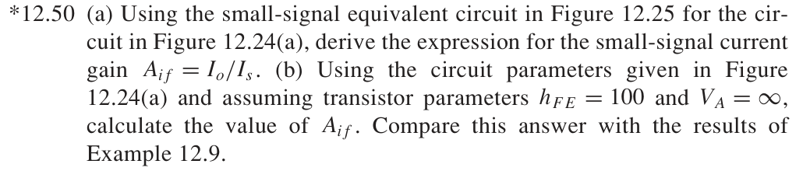
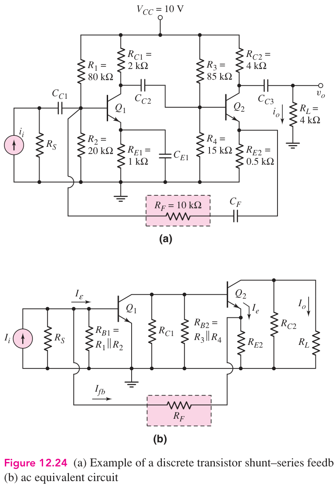
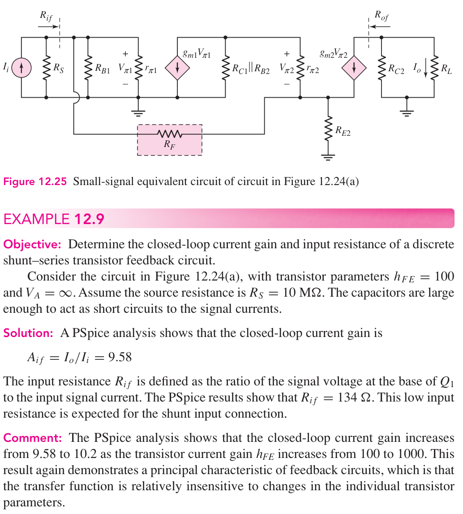
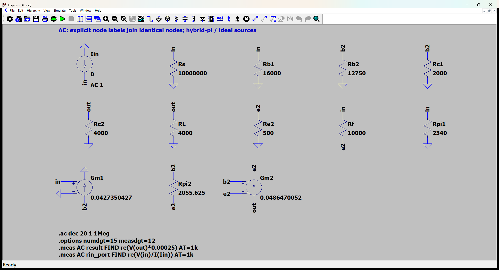
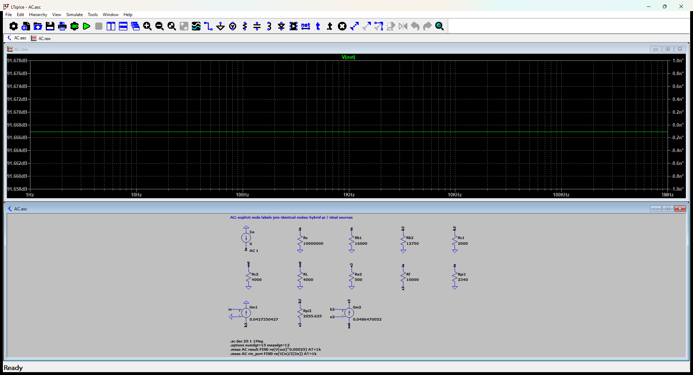

# 12.50 — 图 12.25 的节点方程与电流增益

[41 题完成清单](status-12-20-60.md) · [本题文件包](../../assets/downloads/ch12-20-60/p12-50.zip)

## 教材题目与引用图

来源：用户提供的 `electrobook-(4th ed).pdf`，页序号从 1 起。

## 按教材模型展开推导

### (a) 电流增益 → 三节点消元 → 反馈网络

令 $G_B=1/R_S+1/R_{B1}+1/r_{\pi1}$、$G_C=1/R_{C1}+1/R_{B2}$、$g_\pi=1/r_{\pi2}$、$g_F=1/R_F$。目标向下展开为

$$
\begin{aligned}
A_{if}&\leftarrow -g_{m2}(R_{C2}\parallel R_L)(v_2-v_e)/(R_L i_s),\\
0&=g_{m1}v_1+(G_C+g_\pi)v_2-g_\pi v_e,\\
0&=-g_Fv_1-(g_\pi+g_{m2})v_2+(g_F+1/R_{E2}+g_\pi+g_{m2})v_e,\\
i_s&=(G_B+g_F)v_1-g_Fv_e.
\end{aligned}
$$

取 $H=g_F+1/R_{E2}+g_\pi+g_{m2}$、$B=G_C+g_\pi$，先消去 $v_2$：

$$
\begin{aligned}
q=\frac{v_e}{v_1}&=\frac{g_F-(g_\pi+g_{m2})g_{m1}/B}{H-(g_\pi+g_{m2})g_\pi/B},\\
p=\frac{v_2}{v_1}&=(g_\pi q-g_{m1})/B,\\
\boxed{A_{if}}&=\boxed{-\frac{g_{m2}(R_{C2}\parallel R_L)(p-q)}{R_L(G_B+g_F-g_Fq)}}.
\end{aligned}
$$

### (b) 向上代入与例题比较

两个偏置分压器分别化为 $(V_{TH},R_{TH})=(2\,\mathrm V,16k)$ 和 $(1.5\,\mathrm V,12.75k)$。$I_E=(V_{TH}-0.7)/(R_E+R_{TH}/101)$，因此 $I_{C1}=1.1111111$ mA、$I_{C2}=1.2648221$ mA。代入上式及 Example12.9 的 $R_S=10$ MΩ 得 $A_{if}=9.578209346$，按三位有效数字即教材例题的9.58。例题的旧 PSpice 结果只作引用对照，下面 LTspice 日志才是本次实际运行。

### 从依赖量展开到可代入的节点方程

RS=10 MΩ来自题目要求比较的Example12.9；原图12.24未写数值。教材例题PSpice参考值9.58不是本次运行值。

未知的 $g_m,r_\pi$ 先由静态电流展开：$g_{mj}=I_{Cj}/V_T$、$r_{\pi j}=\beta/g_{mj}$，$V_T=26$ mV；$r_o=\infty$。向上代入如下，单位明确列出。

|管号|$I_C$ (mA)|$g_m$ (mS)|$r_\pi$ (Ω)|
|---|---:|---:|---:|
|Q1|1.111111111|42.73504274|2340|
|Q2|1.264822134|48.64700517|2055.625|

直流节点值由上面的固定 $V_{BE}$ 与电流 KCL 得到；表中 **不是**指数晶体管模型的输出。所有下表节点名与 `DC.cir` 一致，电压相对地：

|节点|直流电压 (V)|
|---|---:|
|`b1`|1.822222222|
|`b2`|1.338735178|
|`c1`|7.777777778|
|`e1`|1.122222222|
|`e2`|0.6387351779|
|`out`|4.940711462|
|`vcc`|10|

DC 网表的每管用 `Vbe` 维持 0.7 V、用 F 源实现 $I_C=\beta I_B$；这是教材分段近似的独立电路实现，不预设待求电流。

为了逐节点核对，下面直接列出与原理图同名的全部节点 KCL。先由这些方程确定输出节点及输入电流，再向上组成所求比值。$i_V$ 是独立／受控电压源由正端流向负端的电流，所有理想直流电源在交流中接地，理想恒流偏置在交流中开路。

$$
\begin{aligned}
\frac{v_{\mathrm{b2}}}{\mathrm{Rb2}}+\frac{v_{\mathrm{b2}}}{\mathrm{Rc1}}+\mathrm{Gm1}v_{\mathrm{in}}+\frac{(v_{\mathrm{b2}}-v_{\mathrm{e2}})}{\mathrm{Rpi2}}&=0\quad(v_{\mathrm{b2}}\text{ 节点})\\[5pt]
\frac{v_{\mathrm{e2}}}{\mathrm{Re2}}-\frac{(v_{\mathrm{in}}-v_{\mathrm{e2}})}{\mathrm{Rf}}-\frac{(v_{\mathrm{b2}}-v_{\mathrm{e2}})}{\mathrm{Rpi2}}-\mathrm{Gm2}(v_{\mathrm{b2}}-v_{\mathrm{e2}})&=0\quad(v_{\mathrm{e2}}\text{ 节点})\\[5pt]
-\mathrm{Iin}+\frac{v_{\mathrm{in}}}{\mathrm{Rs}}+\frac{v_{\mathrm{in}}}{\mathrm{Rb1}}+\frac{(v_{\mathrm{in}}-v_{\mathrm{e2}})}{\mathrm{Rf}}+\frac{v_{\mathrm{in}}}{\mathrm{Rpi1}}&=0\quad(v_{\mathrm{in}}\text{ 节点})
\end{aligned}
$$

$$
\begin{aligned}
\frac{v_{\mathrm{out}}}{\mathrm{Rc2}}+\frac{v_{\mathrm{out}}}{\mathrm{RL}}+\mathrm{Gm2}(v_{\mathrm{b2}}-v_{\mathrm{e2}})&=0\quad(v_{\mathrm{out}}\text{ 节点})
\end{aligned}
$$

$$
\begin{aligned}

\end{aligned}
$$

本组方程中的已知量如下。G 的系数为器件跨导（S），E 为开环电压增益或不加载电路的测量转换；不是题目闭环答案。1 V／1 A 是线性响应归一化，不是允许的大信号幅度。

|元件|连接节点（顺序同网表）|参数（SI 单位）|
|---|---|---:|
|`Iin`|`0 → in`|1|
|`Rs`|`in → 0`|10000000|
|`Rb1`|`in → 0`|16000|
|`Rb2`|`b2 → 0`|12750|
|`Rc1`|`b2 → 0`|2000|
|`Rc2`|`out → 0`|4000|
|`RL`|`out → 0`|4000|
|`Re2`|`e2 → 0`|500|
|`Rf`|`in → e2`|10000|
|`Rpi1`|`in → 0`|2340|
|`Gm1`|`b2 → 0 → in → 0`|0.042735042735|
|`Rpi2`|`b2 → e2`|2055.625|
|`Gm2`|`out → e2 → b2 → e2`|0.0486470051687|

### 向上代入得到结果

将上述已知参数代入 KCL（线性方程组数值求解），再取目标端口量。计算脚本为仓库中的 `scripts/ch12_models.py`，与 LTspice 引擎独立。

主结果：**9.578209346 A/A**。

信号源端口电阻：134.4310063 Ω。去除外部并联源电阻后，放大器输入电阻为 134.4328135 Ω。

保持图中电阻与负载的输出测试电阻：2000 Ω。

## 实际 LTspice 电路与频响截图

以下为 **LTspice 26.1.1 for Windows 实际窗口截图**，下方是教材小信号等效原理图，上方是引擎生成的 AC 曲线。同名节点标签表示电气相连。

未加入题目没有给出的结电容；因此 1 Hz–1 MHz 的平坦曲线只验证本页中频／理想等效模型，不代表实际器件带宽。对比值在 **1 kHz、同一套 $g_m,r_\pi$、同一端口定义**下提取。原日志的 AC 测量以 dB 和相位显示，数值表按 $x=10^{d/20}\cos\phi$ 换回线性值；180° 对应负号。

<section class="p1240-result-panel">
<h3>LTspice 原始运行日志</h3>

AC.log
<pre class="p1240-log"><code>LTspice 26.1.1 for Windows
Circuit: C:\Users\tongs\Documents\GitHub\zhihu-physics-notes\docs\assets\downloads\ch12-20-60\p12-50\AC.net
Start Time: Tue Sep 22 10:01:52 2026
Options:numdgt=15 measdgt=12
solver = Normal
Maximum thread count: 16
tnom = 27
temp = 27
method = trap
.OP point found by inspection.
.OP point found by inspection.
Total elapsed time: 0.057 seconds.
Total iterations: 0

Files loaded:
C:\Users\tongs\Documents\GitHub\zhihu-physics-notes\docs\assets\downloads\ch12-20-60\p12-50\AC.net

result: re(V(out)*0.00025)=(19.6256864988dB,0°) at 1000
rin_port: re(V(in)/I(Iin))=(42.5699889964dB,0°) at 1000
</code></pre>

DC.log
<pre class="p1240-log"><code>LTspice 26.1.1 for Windows
Circuit: C:\Users\tongs\Documents\GitHub\zhihu-physics-notes\docs\assets\downloads\ch12-20-60\p12-50\DC.cir
Start Time: Tue Sep 22 09:56:11 2026
Options:numdgt=15 measdgt=12
solver = Normal
Maximum thread count: 16
tnom = 27
temp = 27
method = trap
Total elapsed time: 0.014 seconds.
Total iterations: 5

Files loaded:
C:\Users\tongs\Documents\GitHub\zhihu-physics-notes\docs\assets\downloads\ch12-20-60\p12-50\DC.cir

ic1: (I(Vbe1)*100)=0.00111111111111 at 10
ic2: (I(Vbe2)*100)=0.00126482213439 at 10
v_b1: V(b1)=1.82222222222 at 10
v_b2: V(b2)=1.33873517787 at 10
v_c1: V(c1)=7.77777777778 at 10
v_e1: V(e1)=1.12222222222 at 10
v_e2: V(e2)=0.638735177866 at 10
v_out: V(out)=4.94071146245 at 10
v_vcc: V(vcc)=10 at 10
</code></pre>

Rout.log
<pre class="p1240-log"><code>LTspice 26.1.1 for Windows
Circuit: C:\Users\tongs\Documents\GitHub\zhihu-physics-notes\docs\assets\downloads\ch12-20-60\p12-50\Rout.cir
Start Time: Tue Sep 22 09:56:11 2026
Options:numdgt=15 measdgt=12
solver = Normal
Maximum thread count: 16
tnom = 27
temp = 27
method = trap
.OP point found by inspection.
.OP point found by inspection.
Total elapsed time: 0.017 seconds.
Total iterations: 0

Files loaded:
C:\Users\tongs\Documents\GitHub\zhihu-physics-notes\docs\assets\downloads\ch12-20-60\p12-50\Rout.cir

rout_port: re(V(out))=(66.0205999133dB,0°) at 1000
</code></pre>

</section>
<section class="p1240-result-panel">
<h3>教材计算与实际仿真</h3>

<table><thead><tr><th>物理量</th><th>教材近似计算</th><th>实际仿真</th><th>单位</th><th>相对误差</th><th>原因／定义</th></tr></thead><tbody><tr><td>主结果</td><td>9.578209346</td><td>9.578209346</td><td>A/A</td><td>-5.8266e-09%</td><td>相同教材等效模型；数值舍入</td></tr><tr><td>输入测试端口电阻</td><td>134.4310063</td><td>134.4310064</td><td>Ω</td><td>+7.1617e-08%</td><td>相同端口；包含源电阻时的换算见上文</td></tr><tr><td>输出测试端口电阻</td><td>2000</td><td>2000</td><td>Ω</td><td>+2.346e-10%</td><td>保持原负载；放大器自身值另列</td></tr><tr><td>IC1</td><td>0.001111111111</td><td>0.001111111111</td><td>A</td><td>-9.9998e-11%</td><td>固定VBE、有限β的同一偏置模型</td></tr><tr><td>IC2</td><td>0.001264822134</td><td>0.001264822134</td><td>A</td><td>+2.0936e-10%</td><td>固定VBE、有限β的同一偏置模型</td></tr><tr><td>DC out</td><td>4.940711462</td><td>4.940711462</td><td>V</td><td>-1.1973e-11%</td><td>固定VBE近似；与AC扰动区分</td></tr></tbody></table>

计算来自上文节点方程，不以日志数值回填手算列。相对误差为 (仿真−计算)/计算；手算为零时只列绝对误差。同模型吻合验证代数与接线，不证明忽略寄生参数的近似适用于任意实物。

</section>

## 下载与复现

[本题完整文件包](../../assets/downloads/ch12-20-60/p12-50.zip) · [12.20–12.60 全部成果包](../../assets/downloads/ch12-20-60.zip)

- [AC.asc](../../assets/downloads/ch12-20-60/p12-50/AC.asc)
- [AC.cir](../../assets/downloads/ch12-20-60/p12-50/AC.cir)
- [AC.log](../../assets/downloads/ch12-20-60/p12-50/AC.log)
- [AC.plt](../../assets/downloads/ch12-20-60/p12-50/AC.plt)
- [AC.raw](../../assets/downloads/ch12-20-60/p12-50/AC.raw)
- [DC.cir](../../assets/downloads/ch12-20-60/p12-50/DC.cir)
- [DC.log](../../assets/downloads/ch12-20-60/p12-50/DC.log)
- [DC.raw](../../assets/downloads/ch12-20-60/p12-50/DC.raw)
- [Rout.asc](../../assets/downloads/ch12-20-60/p12-50/Rout.asc)
- [Rout.cir](../../assets/downloads/ch12-20-60/p12-50/Rout.cir)
- [Rout.log](../../assets/downloads/ch12-20-60/p12-50/Rout.log)
- [Rout.raw](../../assets/downloads/ch12-20-60/p12-50/Rout.raw)

完整解压后用 LTspice 打开 `AC.asc`，运行并按 **Ctrl+L** 查看本机新生成的日志。`AC.plt` 为波形选择配置；`Rout.asc`（如有）单独测试输出电阻，`DC.cir`（如有）验证教材固定 VBE 偏置。模型与参数直接写在文件中，不依赖外部器件库。
