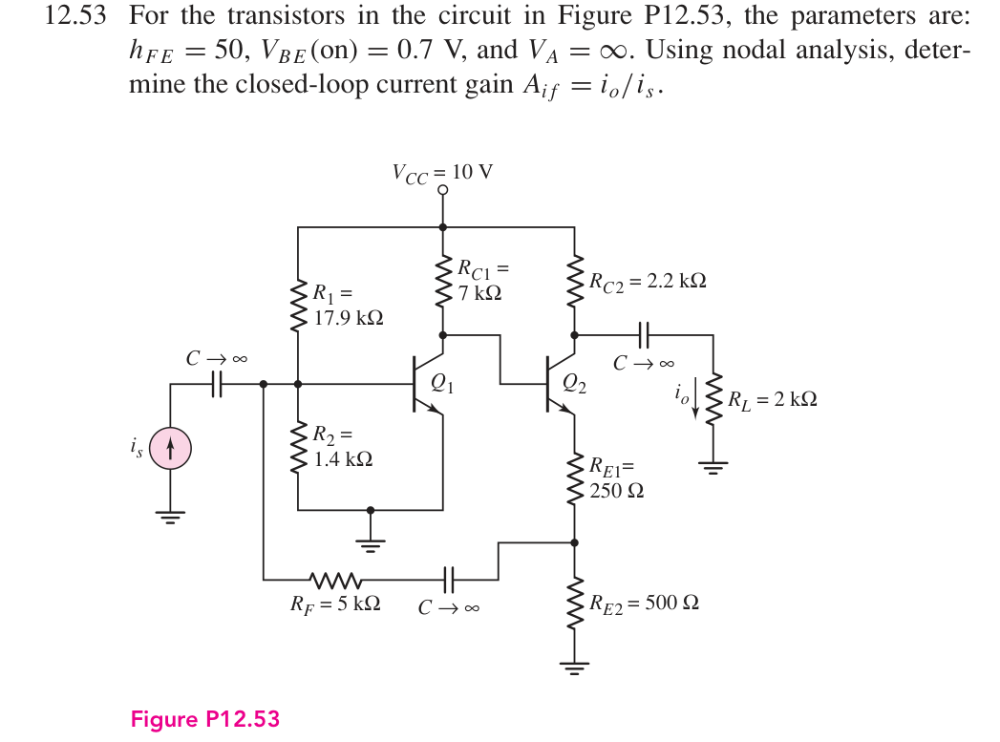
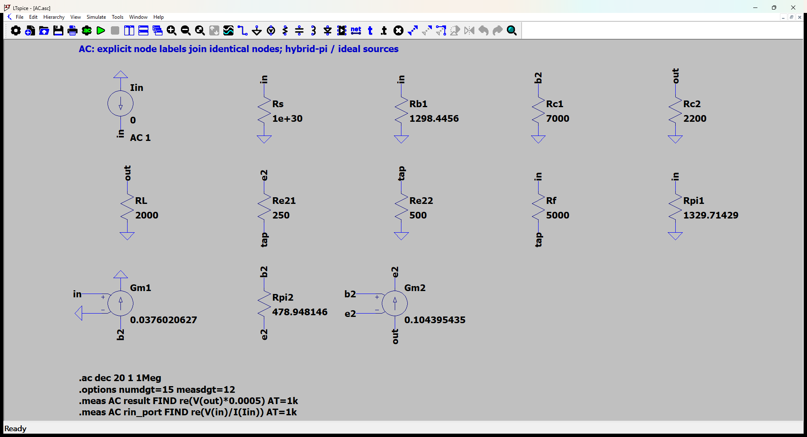
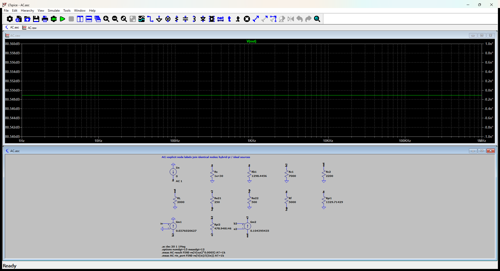

# 12.53 — 发射极分段取样的电流反馈

[41 题完成清单](status-12-20-60.md) · [本题文件包](../../assets/downloads/ch12-20-60/p12-53.zip)

## 教材题目与引用图

来源：用户提供的 `electrobook-(4th ed).pdf`，页序号从 1 起。

## 按教材模型展开推导

### 增益 → 分段反馈节点 → 工作点

$$
\begin{aligned}
A_{if}&\leftarrow\frac{-g_{m2}(v_{b2}-v_{e2})(R_{C2}\parallel R_L)}{R_Li_s},\\
I_{C1}&\leftarrow50\left(\frac{10-0.7}{17.9k}-\frac{0.7}{1.4k}\right),\\
I_{E2}&\leftarrow\frac{10-7kI_{C1}-0.7}{250+500+7k/51},\quad I_{C2}=50I_{E2}/51,\\
(g_{mj},r_{\pi j})&\leftarrow(I_{Cj}/V_T,50V_T/I_{Cj}).
\end{aligned}
$$

向上求得 $I_{C1}=0.9776536313$ mA、$I_{C2}=2.714281305$ mA，再用四节点 KCL 得 $A_{if}=5.326188867$。反馈连接在 250 Ω 与500 Ω之间的抽头；只用总发射极电阻750 Ω而把 RF 接到顶端会得到另一个电路。

### 从依赖量展开到可代入的节点方程

反馈取自250 Ω与500 Ω中点，不能直接接Q2发射极；输出电流是2 kΩ负载中的电流。

未知的 $g_m,r_\pi$ 先由静态电流展开：$g_{mj}=I_{Cj}/V_T$、$r_{\pi j}=\beta/g_{mj}$，$V_T=26$ mV；$r_o=\infty$。向上代入如下，单位明确列出。

|管号|$I_C$ (mA)|$g_m$ (mS)|$r_\pi$ (Ω)|
|---|---:|---:|---:|
|Q1|0.9776536313|37.60206274|1329.714286|
|Q2|2.714281305|104.3954348|478.9481465|

直流节点值由上面的固定 $V_{BE}$ 与电流 KCL 得到；表中 **不是**指数晶体管模型的输出。所有下表节点名与 `DC.cir` 一致，电压相对地：

|节点|直流电压 (V)|
|---|---:|
|`b1`|0.7|
|`b2`|2.776425198|
|`e2`|2.076425198|
|`out`|4.028581129|
|`tap`|1.384283466|
|`vcc`|10|

DC 网表的每管用 `Vbe` 维持 0.7 V、用 F 源实现 $I_C=\beta I_B$；这是教材分段近似的独立电路实现，不预设待求电流。

为了逐节点核对，下面直接列出与原理图同名的全部节点 KCL。先由这些方程确定输出节点及输入电流，再向上组成所求比值。$i_V$ 是独立／受控电压源由正端流向负端的电流，所有理想直流电源在交流中接地，理想恒流偏置在交流中开路。

$$
\begin{aligned}
\frac{v_{\mathrm{b2}}}{\mathrm{Rc1}}+\mathrm{Gm1}v_{\mathrm{in}}+\frac{(v_{\mathrm{b2}}-v_{\mathrm{e2}})}{\mathrm{Rpi2}}&=0\quad(v_{\mathrm{b2}}\text{ 节点})\\[5pt]
\frac{(v_{\mathrm{e2}}-v_{\mathrm{tap}})}{\mathrm{Re21}}-\frac{(v_{\mathrm{b2}}-v_{\mathrm{e2}})}{\mathrm{Rpi2}}-\mathrm{Gm2}(v_{\mathrm{b2}}-v_{\mathrm{e2}})&=0\quad(v_{\mathrm{e2}}\text{ 节点})\\[5pt]
-\mathrm{Iin}+\frac{v_{\mathrm{in}}}{\mathrm{Rs}}+\frac{v_{\mathrm{in}}}{\mathrm{Rb1}}+\frac{(v_{\mathrm{in}}-v_{\mathrm{tap}})}{\mathrm{Rf}}+\frac{v_{\mathrm{in}}}{\mathrm{Rpi1}}&=0\quad(v_{\mathrm{in}}\text{ 节点})
\end{aligned}
$$

$$
\begin{aligned}
\frac{v_{\mathrm{out}}}{\mathrm{Rc2}}+\frac{v_{\mathrm{out}}}{\mathrm{RL}}+\mathrm{Gm2}(v_{\mathrm{b2}}-v_{\mathrm{e2}})&=0\quad(v_{\mathrm{out}}\text{ 节点})\\[5pt]
-\frac{(v_{\mathrm{e2}}-v_{\mathrm{tap}})}{\mathrm{Re21}}+\frac{v_{\mathrm{tap}}}{\mathrm{Re22}}-\frac{(v_{\mathrm{in}}-v_{\mathrm{tap}})}{\mathrm{Rf}}&=0\quad(v_{\mathrm{tap}}\text{ 节点})
\end{aligned}
$$

$$
\begin{aligned}

\end{aligned}
$$

本组方程中的已知量如下。G 的系数为器件跨导（S），E 为开环电压增益或不加载电路的测量转换；不是题目闭环答案。1 V／1 A 是线性响应归一化，不是允许的大信号幅度。

|元件|连接节点（顺序同网表）|参数（SI 单位）|
|---|---|---:|
|`Iin`|`0 → in`|1|
|`Rs`|`in → 0`|1e+30|
|`Rb1`|`in → 0`|1298.44559585|
|`Rc1`|`b2 → 0`|7000|
|`Rc2`|`out → 0`|2200|
|`RL`|`out → 0`|2000|
|`Re21`|`e2 → tap`|250|
|`Re22`|`tap → 0`|500|
|`Rf`|`in → tap`|5000|
|`Rpi1`|`in → 0`|1329.71428571|
|`Gm1`|`b2 → 0 → in → 0`|0.0376020627417|
|`Rpi2`|`b2 → e2`|478.948146463|
|`Gm2`|`out → e2 → b2 → e2`|0.104395434807|

### 向上代入得到结果

将上述已知参数代入 KCL（线性方程组数值求解），再取目标端口量。计算脚本为仓库中的 `scripts/ch12_models.py`，与 LTspice 引擎独立。

主结果：**5.326188867 A/A**。

信号源端口电阻：33.52825413 Ω。

保持图中电阻与负载的输出测试电阻：1047.619048 Ω。

## 实际 LTspice 电路与频响截图

以下为 **LTspice 26.1.1 for Windows 实际窗口截图**，下方是教材小信号等效原理图，上方是引擎生成的 AC 曲线。同名节点标签表示电气相连。

未加入题目没有给出的结电容；因此 1 Hz–1 MHz 的平坦曲线只验证本页中频／理想等效模型，不代表实际器件带宽。对比值在 **1 kHz、同一套 $g_m,r_\pi$、同一端口定义**下提取。原日志的 AC 测量以 dB 和相位显示，数值表按 $x=10^{d/20}\cos\phi$ 换回线性值；180° 对应负号。

<section class="p1240-result-panel">
<h3>LTspice 原始运行日志</h3>

AC.log
<pre class="p1240-log"><code>LTspice 26.1.1 for Windows
Circuit: C:\Users\tongs\Documents\GitHub\zhihu-physics-notes\docs\assets\downloads\ch12-20-60\p12-53\AC.net
Start Time: Tue Sep 22 10:02:08 2026
Options:numdgt=15 measdgt=12
solver = Normal
Maximum thread count: 16
tnom = 27
temp = 27
method = trap
.OP point found by inspection.
.OP point found by inspection.
Total elapsed time: 0.051 seconds.
Total iterations: 0

Files loaded:
C:\Users\tongs\Documents\GitHub\zhihu-physics-notes\docs\assets\downloads\ch12-20-60\p12-53\AC.net

result: re(V(out)*0.0005)=(14.5283312507dB,0°) at 1000
rin_port: re(V(in)/I(Iin))=(30.5082188008dB,0°) at 1000
</code></pre>

DC.log
<pre class="p1240-log"><code>LTspice 26.1.1 for Windows
Circuit: C:\Users\tongs\Documents\GitHub\zhihu-physics-notes\docs\assets\downloads\ch12-20-60\p12-53\DC.cir
Start Time: Tue Sep 22 09:56:16 2026
Options:numdgt=15 measdgt=12
solver = Normal
Maximum thread count: 16
tnom = 27
temp = 27
method = trap
Total elapsed time: 0.016 seconds.
Total iterations: 5

Files loaded:
C:\Users\tongs\Documents\GitHub\zhihu-physics-notes\docs\assets\downloads\ch12-20-60\p12-53\DC.cir

ic1: (I(Vbe1)*50)=0.000977653631285 at 10
ic2: (I(Vbe2)*50)=0.00271428130498 at 10
v_b1: V(b1)=0.7 at 10
v_b2: V(b2)=2.77642519831 at 10
v_e2: V(e2)=2.07642519831 at 10
v_out: V(out)=4.02858112905 at 10
v_tap: V(tap)=1.38428346554 at 10
v_vcc: V(vcc)=10 at 10
</code></pre>

Rout.log
<pre class="p1240-log"><code>LTspice 26.1.1 for Windows
Circuit: C:\Users\tongs\Documents\GitHub\zhihu-physics-notes\docs\assets\downloads\ch12-20-60\p12-53\Rout.cir
Start Time: Tue Sep 22 09:56:17 2026
Options:numdgt=15 measdgt=12
solver = Normal
Maximum thread count: 16
tnom = 27
temp = 27
method = trap
.OP point found by inspection.
.OP point found by inspection.
Total elapsed time: 0.017 seconds.
Total iterations: 0

Files loaded:
C:\Users\tongs\Documents\GitHub\zhihu-physics-notes\docs\assets\downloads\ch12-20-60\p12-53\Rout.cir

rout_port: re(V(out))=(60.4040677218dB,0°) at 1000
</code></pre>

</section>
<section class="p1240-result-panel">
<h3>教材计算与实际仿真</h3>

<table><thead><tr><th>物理量</th><th>教材近似计算</th><th>实际仿真</th><th>单位</th><th>相对误差</th><th>原因／定义</th></tr></thead><tbody><tr><td>主结果</td><td>5.326188867</td><td>5.326188868</td><td>A/A</td><td>+1.2475e-08%</td><td>相同教材等效模型；数值舍入</td></tr><tr><td>输入测试端口电阻</td><td>33.52825413</td><td>33.52825416</td><td>Ω</td><td>+1.0556e-07%</td><td>相同端口；包含源电阻时的换算见上文</td></tr><tr><td>输出测试端口电阻</td><td>1047.619048</td><td>1047.619048</td><td>Ω</td><td>+3.9442e-10%</td><td>保持原负载；放大器自身值另列</td></tr><tr><td>IC1</td><td>0.0009776536313</td><td>0.0009776536313</td><td>A</td><td>+8.5835e-12%</td><td>固定VBE、有限β的同一偏置模型</td></tr><tr><td>IC2</td><td>0.002714281305</td><td>0.002714281305</td><td>A</td><td>+5.3414e-11%</td><td>固定VBE、有限β的同一偏置模型</td></tr><tr><td>DC out</td><td>4.028581129</td><td>4.028581129</td><td>V</td><td>+6.9756e-11%</td><td>固定VBE近似；与AC扰动区分</td></tr></tbody></table>

计算来自上文节点方程，不以日志数值回填手算列。相对误差为 (仿真−计算)/计算；手算为零时只列绝对误差。同模型吻合验证代数与接线，不证明忽略寄生参数的近似适用于任意实物。

</section>

## 下载与复现

[本题完整文件包](../../assets/downloads/ch12-20-60/p12-53.zip) · [12.20–12.60 全部成果包](../../assets/downloads/ch12-20-60.zip)

- [AC.asc](../../assets/downloads/ch12-20-60/p12-53/AC.asc)
- [AC.cir](../../assets/downloads/ch12-20-60/p12-53/AC.cir)
- [AC.log](../../assets/downloads/ch12-20-60/p12-53/AC.log)
- [AC.plt](../../assets/downloads/ch12-20-60/p12-53/AC.plt)
- [AC.raw](../../assets/downloads/ch12-20-60/p12-53/AC.raw)
- [DC.cir](../../assets/downloads/ch12-20-60/p12-53/DC.cir)
- [DC.log](../../assets/downloads/ch12-20-60/p12-53/DC.log)
- [DC.raw](../../assets/downloads/ch12-20-60/p12-53/DC.raw)
- [Rout.asc](../../assets/downloads/ch12-20-60/p12-53/Rout.asc)
- [Rout.cir](../../assets/downloads/ch12-20-60/p12-53/Rout.cir)
- [Rout.log](../../assets/downloads/ch12-20-60/p12-53/Rout.log)
- [Rout.raw](../../assets/downloads/ch12-20-60/p12-53/Rout.raw)

完整解压后用 LTspice 打开 `AC.asc`，运行并按 **Ctrl+L** 查看本机新生成的日志。`AC.plt` 为波形选择配置；`Rout.asc`（如有）单独测试输出电阻，`DC.cir`（如有）验证教材固定 VBE 偏置。模型与参数直接写在文件中，不依赖外部器件库。
