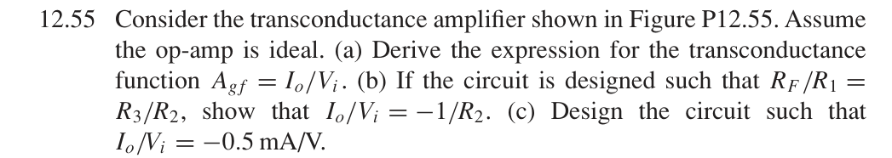
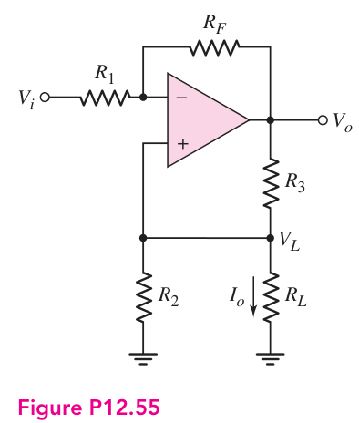
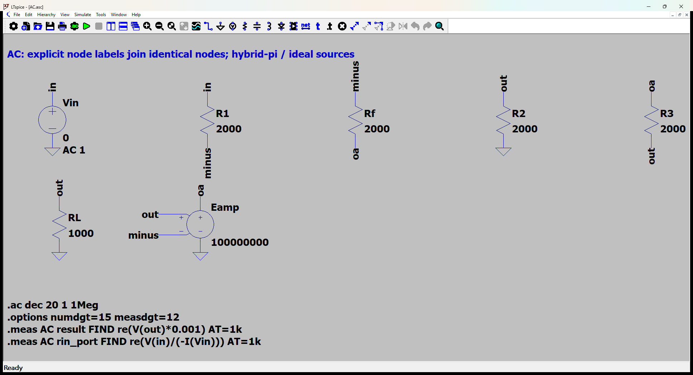
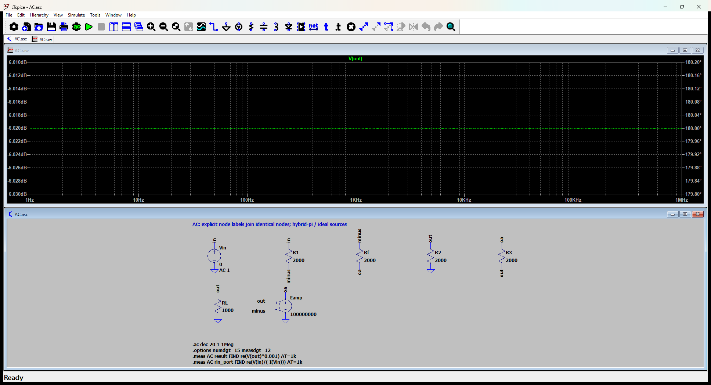

# 12.55 — 平衡电桥式跨导源

[41 题完成清单](status-12-20-60.md) · [本题文件包](../../assets/downloads/ch12-20-60/p12-55.zip)

## 教材题目与引用图

来源：用户提供的 `electrobook-(4th ed).pdf`，页序号从 1 起。

## 按教材模型展开推导

### (a) 跨导 → 虚短节点和负载KCL → 电阻

令 $k=R_F/R_1$，理想运放有 $v_-=v_+=V_L$：

$$
\begin{aligned}
I_o/V_i&\leftarrow V_L/(R_LV_i),\\
(V_L-V_i)/R_1+(V_L-V_o)/R_F&=0
\Rightarrow V_o=(1+k)V_L-kV_i,\\
I_o&=(V_o-V_L)/R_3-V_L/R_2,\quad V_L=I_oR_L,\\
\boxed{A_{gf}}&=\boxed{-\frac{k}{R_3+R_L(R_3/R_2-k)}}.
\end{aligned}
$$

### (b) 匹配条件向上代入

若 $k=R_3/R_2$，分母中的负载项严格消去，$I_o/V_i=-k/R_3=-1/R_2$。不匹配时增益依赖负载，不能只使用虚短就宣称理想电流源。

### (c) 设计向上代入

$-1/R_2=-0.5$ mA/V，故 $R_2=2$ kΩ。选择 $R_1=R_F=R_3=2$ kΩ 满足匹配。验证示例选 $R_L=1$ kΩ，运放开环增益取 $10^8$，所以数值结果与理想值有极小差异；该负载和有限增益是明确的验证工况，不是题目新增条件。

### 从依赖量展开到可代入的节点方程

设计选R1=RF=R2=R3=2 kΩ。RL=1 kΩ仅为数值验证工况，题目未限定RL。运放使用1e8开环增益近似理想运放。

为了逐节点核对，下面直接列出与原理图同名的全部节点 KCL。先由这些方程确定输出节点及输入电流，再向上组成所求比值。$i_V$ 是独立／受控电压源由正端流向负端的电流，所有理想直流电源在交流中接地，理想恒流偏置在交流中开路。

$$
\begin{aligned}
i_{\mathrm{Vin}}+\frac{(v_{\mathrm{in}}-v_{\mathrm{minus}})}{\mathrm{R1}}&=0\quad(v_{\mathrm{in}}\text{ 节点})\\[5pt]
-\frac{(v_{\mathrm{in}}-v_{\mathrm{minus}})}{\mathrm{R1}}+\frac{(v_{\mathrm{minus}}-v_{\mathrm{oa}})}{\mathrm{Rf}}&=0\quad(v_{\mathrm{minus}}\text{ 节点})\\[5pt]
-\frac{(v_{\mathrm{minus}}-v_{\mathrm{oa}})}{\mathrm{Rf}}+\frac{(v_{\mathrm{oa}}-v_{\mathrm{out}})}{\mathrm{R3}}+i_{\mathrm{Eamp}}&=0\quad(v_{\mathrm{oa}}\text{ 节点})
\end{aligned}
$$

$$
\begin{aligned}
\frac{v_{\mathrm{out}}}{\mathrm{R2}}-\frac{(v_{\mathrm{oa}}-v_{\mathrm{out}})}{\mathrm{R3}}+\frac{v_{\mathrm{out}}}{\mathrm{RL}}&=0\quad(v_{\mathrm{out}}\text{ 节点})
\end{aligned}
$$

$$
\begin{aligned}
v_{\mathrm{in}}&=\mathrm{Vin}\\[4pt]
v_{\mathrm{oa}}&=\mathrm{Eamp}(v_{\mathrm{out}}-v_{\mathrm{minus}})
\end{aligned}
$$

本组方程中的已知量如下。G 的系数为器件跨导（S），E 为开环电压增益或不加载电路的测量转换；不是题目闭环答案。1 V／1 A 是线性响应归一化，不是允许的大信号幅度。

|元件|连接节点（顺序同网表）|参数（SI 单位）|
|---|---|---:|
|`Vin`|`in → 0`|1|
|`R1`|`in → minus`|2000|
|`Rf`|`minus → oa`|2000|
|`R2`|`out → 0`|2000|
|`R3`|`oa → out`|2000|
|`RL`|`out → 0`|1000|
|`Eamp`|`oa → 0 → out → minus`|100000000|

### 向上代入得到结果

将上述已知参数代入 KCL（线性方程组数值求解），再取目标端口量。计算脚本为仓库中的 `scripts/ch12_models.py`，与 LTspice 引擎独立。

主结果：**-0.0005 A/V**。

信号源端口电阻：1333.333369 Ω。

## 实际 LTspice 电路与频响截图

以下为 **LTspice 26.1.1 for Windows 实际窗口截图**，下方是教材小信号等效原理图，上方是引擎生成的 AC 曲线。同名节点标签表示电气相连。

未加入题目没有给出的结电容；因此 1 Hz–1 MHz 的平坦曲线只验证本页中频／理想等效模型，不代表实际器件带宽。对比值在 **1 kHz、同一套 $g_m,r_\pi$、同一端口定义**下提取。原日志的 AC 测量以 dB 和相位显示，数值表按 $x=10^{d/20}\cos\phi$ 换回线性值；180° 对应负号。

<section class="p1240-result-panel">
<h3>LTspice 原始运行日志</h3>

AC.log
<pre class="p1240-log"><code>LTspice 26.1.1 for Windows
Circuit: C:\Users\tongs\Documents\GitHub\zhihu-physics-notes\docs\assets\downloads\ch12-20-60\p12-55\AC.net
Start Time: Tue Sep 22 10:02:19 2026
Options:numdgt=15 measdgt=12
solver = Normal
Maximum thread count: 16
tnom = 27
temp = 27
method = trap
.OP point found by inspection.
.OP point found by inspection.
Total elapsed time: 0.067 seconds.
Total iterations: 0

Files loaded:
C:\Users\tongs\Documents\GitHub\zhihu-physics-notes\docs\assets\downloads\ch12-20-60\p12-55\AC.net

result: re(V(out)*0.001)=(-66.0206002312dB,180°) at 1000
rin_port: re(V(in)/(-I(Vin)))=(62.4987749539dB,0°) at 1000
</code></pre>

</section>
<section class="p1240-result-panel">
<h3>教材计算与实际仿真</h3>

<table><thead><tr><th>物理量</th><th>教材近似计算</th><th>实际仿真</th><th>单位</th><th>相对误差</th><th>原因／定义</th></tr></thead><tbody><tr><td>主结果</td><td>-0.0005</td><td>-0.0004999999817</td><td>A/V</td><td>-3.6602e-06%</td><td>有限运放开环增益10^8与理想极限的差异</td></tr><tr><td>输入测试端口电阻</td><td>1333.333369</td><td>1333.333367</td><td>Ω</td><td>-1.1386e-07%</td><td>相同端口；包含源电阻时的换算见上文</td></tr></tbody></table>

计算来自上文节点方程，不以日志数值回填手算列。相对误差为 (仿真−计算)/计算；手算为零时只列绝对误差。同模型吻合验证代数与接线，不证明忽略寄生参数的近似适用于任意实物。

</section>

## 下载与复现

[本题完整文件包](../../assets/downloads/ch12-20-60/p12-55.zip) · [12.20–12.60 全部成果包](../../assets/downloads/ch12-20-60.zip)

- [AC.asc](../../assets/downloads/ch12-20-60/p12-55/AC.asc)
- [AC.cir](../../assets/downloads/ch12-20-60/p12-55/AC.cir)
- [AC.log](../../assets/downloads/ch12-20-60/p12-55/AC.log)
- [AC.plt](../../assets/downloads/ch12-20-60/p12-55/AC.plt)
- [AC.raw](../../assets/downloads/ch12-20-60/p12-55/AC.raw)

完整解压后用 LTspice 打开 `AC.asc`，运行并按 **Ctrl+L** 查看本机新生成的日志。`AC.plt` 为波形选择配置；`Rout.asc`（如有）单独测试输出电阻，`DC.cir`（如有）验证教材固定 VBE 偏置。模型与参数直接写在文件中，不依赖外部器件库。
