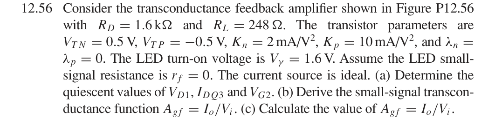
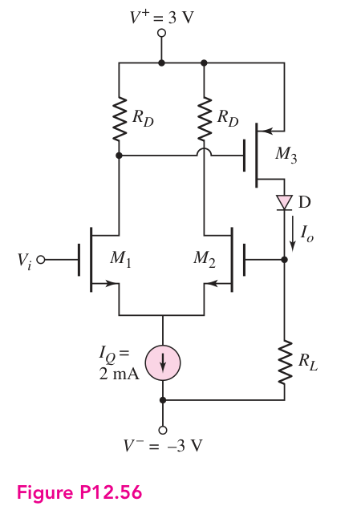
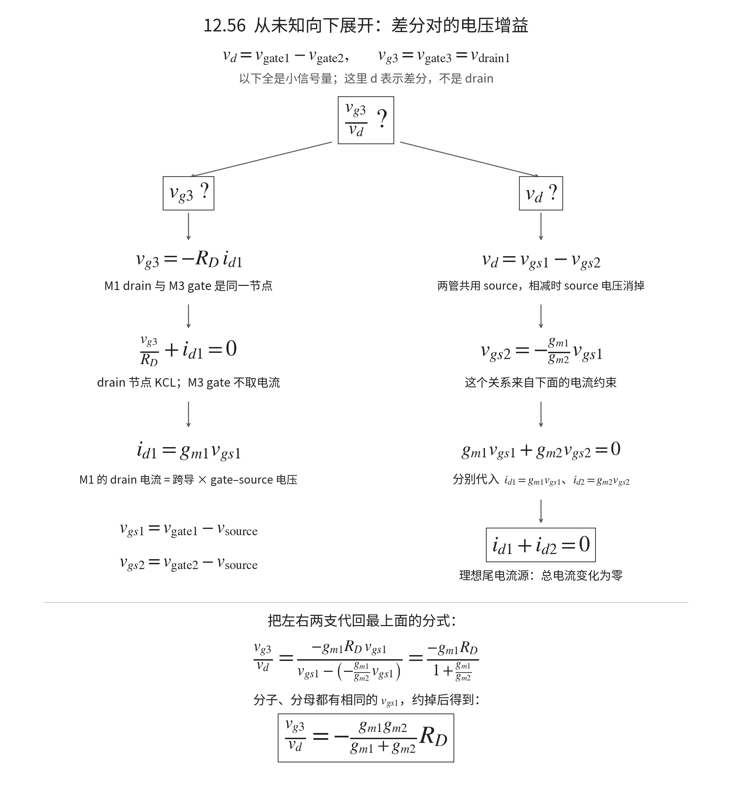
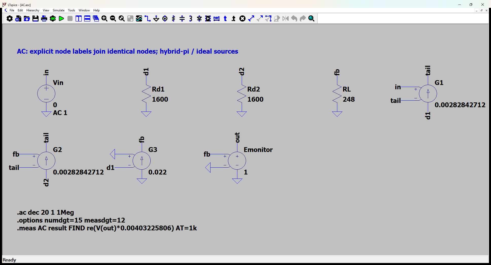
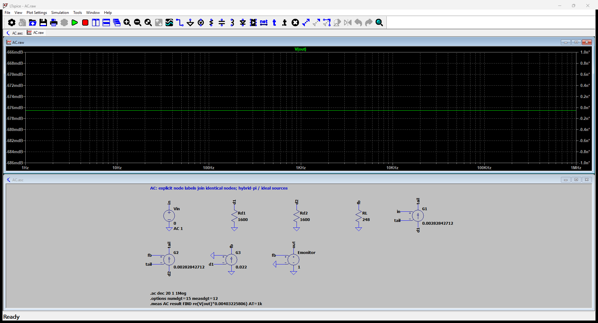

# 12.56 — MOS 差分跨导反馈与 LED

[41 题完成清单](status-12-20-60.md) · [本题文件包](../../assets/downloads/ch12-20-60/p12-56.zip) · [本页 Markdown 源码](../../assets/downloads/ch12-20-60/12-56.md.txt)

## 教材题目与引用图

来源：用户提供的 `electrobook-(4th ed).pdf`，页序号从 1 起。

## 解题顺序与符号

本题分为四部分：**直流工作点 → 三个跨导 → 开环 A 的两个分式 → 接回反馈得到闭环增益**。以下端子名称统一使用 **gate、source、drain**。

| 符号 | 在电路中的位置或含义 |
|---|---|
| $v_i=v_{\mathrm{gate1}}$ | M1 gate 对地的小信号电压 |
| $v_{g2}=v_{\mathrm{gate2}}$ | M2 gate 对地的小信号电压，也是反馈电压 |
| $v_{\mathrm{diff}}=v_i-v_{g2}$ | 两个 gate 之间的差分电压 |
| $v_s$ | M1、M2 公共 source 对地的小信号电压 |
| $v_{gs1},v_{gs2}$ | 各自的 gate 电压减去公共 source 电压 |
| $v_{g3}=v_{\mathrm{gate3}}=v_{\mathrm{drain1}}$ | M3 gate 与 M1 drain 相连的节点电压 |
| $i_o$ | 图中向下流过 LED 和 $R_L$ 的小信号输出电流 |

大写 $V,I$ 表示直流工作点，小写 $v,i$ 表示工作点附近的变化量。展开图沿用此前的 $v_d$，**图中的 $v_d$ 就是这里的 $v_{\mathrm{diff}}$，不是 drain 电压**。

## (a) 先算直流工作点

取输入的静态电压 $V_i=0$，使用本书的饱和区平方律约定：

$$
I_{Dn}=K_n(V_{GS}-V_{TN})^2,\qquad
I_{Dp}=K_p(V_{SG}-|V_{TP}|)^2.
$$

### 先用平衡近似得到教材数值

尾电流为 $I_Q=2\,\mathrm{mA}$。先假设两个 gate 的静态电压很接近，则：

$$
I_{D1}\simeq I_{D2}\simeq\frac{I_Q}{2}=1\,\mathrm{mA}.
$$

M1 drain 电压，同时也是 M3 gate 电压：

$$
\boxed{V_{D1}=V_{G3}\simeq3-R_DI_{D1}
=3-(1.6\,\mathrm{k}\Omega)(1\,\mathrm{mA})=1.4\,\mathrm V.}
$$

M3 是 PMOS，source 接 $+3\,\mathrm V$，所以：

$$
V_{SG3}=3-1.4=1.6\,\mathrm V,
$$

$$
\boxed{I_{DQ3}\simeq K_p(1.6-0.5)^2
=10(1.1)^2\,\mathrm{mA}=12.1\,\mathrm{mA}.}
$$

M2 gate 不取电流，因此输出电流全部流过 $R_L$。$R_L$ 下端为 $-3\,\mathrm V$，上端电压为：

$$
\boxed{V_{G2}\simeq-3+I_{DQ3}R_L
=-3+(12.1\,\mathrm{mA})(248\,\Omega)
=0.0008\,\mathrm V=0.8\,\mathrm{mV}.}
$$

这个值接近输入静态电压 $0\,\mathrm V$，支持最初的平衡近似。**$0.8\,\mathrm{mV}$ 是用平衡电流回代得到的近似值，不是严格非线性方程的解。**

工作区检查：M1、M2 的过驱动约为 $\sqrt{1/2}=0.7071\,\mathrm V$，公共 source 电压约为 $-1.2071\,\mathrm V$，两管的 $V_{DS}\simeq2.6071\,\mathrm V$，满足饱和条件。LED 直流压降为 $1.6\,\mathrm V$，故 M3 drain 电压约为 $1.6008\,\mathrm V$：

$$
V_{SD3}\simeq3-1.6008=1.3992\,\mathrm V
>
V_{SG3}-|V_{TP}|=1.1\,\mathrm V.
$$

M3 也处于饱和区。

### 需要严格工作点时怎样联立

将 $I_{D1}$ 作为唯一待求电流，依次写：

$$
\begin{aligned}
I_{D2}&=I_Q-I_{D1},\\
V_{D1}&=3-R_DI_{D1},\\
I_{DQ3}&=K_p(3-V_{D1}-|V_{TP}|)^2,\\
V_{G2}&=-3+I_{DQ3}R_L.
\end{aligned}
$$

M1、M2 共用 source，且阈值相同，所以还必须满足：

$$
V_{G2}-V_i
=V_{GS2}-V_{GS1}
=\sqrt{\frac{I_{D2}}{K_n}}-\sqrt{\frac{I_{D1}}{K_n}}.
$$

把前四式代入这一式即可求出严格工作点。本题约为 $I_{D1}=0.99991522\,\mathrm{mA}$、$I_{D2}=1.00008478\,\mathrm{mA}$、$I_{DQ3}=12.09701592\,\mathrm{mA}$、$V_{D1}=1.40013565\,\mathrm V$、$V_{G2}=0.05994869\,\mathrm{mV}$。下文与原有 AC 仿真的数值对比统一使用教材平衡近似。

## 小信号准备：由工作点求跨导

本书使用 $I_D=K V_{\mathrm{OV}}^2$，所以：

$$
g_m=\frac{\partial I_D}{\partial V_{\mathrm{OV}}}
=2K V_{\mathrm{OV}}=2\sqrt{K I_D}.
$$

代入上面的平衡近似：

$$
g_{m1}\simeq g_{m2}
=2\sqrt{K_nI_{D1}}
=2\sqrt{(2\,\mathrm{mA/V^2})(1\,\mathrm{mA})}
=2.828427125\,\mathrm{mS},
$$

$$
g_{m3}=2\sqrt{K_pI_{DQ3}}
=2\sqrt{(10\,\mathrm{mA/V^2})(12.1\,\mathrm{mA})}
=22\,\mathrm{mS}.
$$

| 原电路元件 | 小信号处理 |
|---|---|
| $+3\,\mathrm V$、$-3\,\mathrm V$ 理想直流电源 | 接交流地 |
| 理想尾电流源 $I_Q$ | 小信号电流为零，相当于开路 |
| LED，题给 $r_f=0$ | 小信号短路；直流仍保留 $1.6\,\mathrm V$ 压降 |
| 三个 MOS，题给 $\lambda=0$ | $r_o=\infty$ |

## (b) 先求反馈系数 F，再把开环 A 拆成两个分式

### 反馈系数为什么就是 RL

本题的反馈路径是 **输出电流经过 $R_L$ 产生电压，再送到 M2 gate**。M2 gate 不取电流，$R_L$ 下端在交流中接地，因此：

$$
v_f=v_{g2}=i_oR_L.
$$

于是：

$$
\boxed{F=\frac{v_f}{i_o}=R_L=248\,\Omega.}
$$

这里 $F$ 的单位为 $\Omega$，因为它是电压除以电流。本题没有单独标为 $R_F$ 的反馈电阻；产生反馈的是 $R_L$。

### 开环 A 只分成两个分式

前向跨导 $A$ 的输入是差分电压：

$$
v_{\mathrm{diff}}=v_i-v_{g2}.
$$

信号经过的节点是：

$$
v_{\mathrm{diff}}
\xrightarrow{\ M_1,M_2\ }
v_{g3}=v_{\mathrm{drain1}}
\xrightarrow{\ M_3\ }
i_o.
$$

所以：

$$
\boxed{
A=\frac{i_o}{v_{\mathrm{diff}}}
=
\underbrace{\frac{v_{g3}}{v_{\mathrm{diff}}}}_{\text{第一项：差分对}}
\underbrace{\frac{i_o}{v_{g3}}}_{\text{第二项：M3}}.
}
$$

$A$ 是相对于两个 gate 之间电压差的增益。求前向增益时保持已求出的直流工作点及 $g_m$；如在小信号模型中断开通往 M2 gate 的反馈连接，可将 M2 gate 接交流地，此时 $v_{\mathrm{diff}}=v_i$。

### 第一项：从未知向下展开

图中 $v_d=v_{\mathrm{diff}}$。从顶部的未知比值向下读：左边展开分子，右边展开分母，底部代回合并。点击图片可放大。

**第一步：两管共用 source，电压相减时 source 电压消掉。**

$$
v_{gs1}=v_{\mathrm{gate1}}-v_s,\qquad
v_{gs2}=v_{\mathrm{gate2}}-v_s.
$$

$$
v_{\mathrm{diff}}
=v_{\mathrm{gate1}}-v_{\mathrm{gate2}}
=v_{gs1}-v_{gs2}.
$$

**第二步：理想尾电流源固定总电流，所以两管电流的变化之和为零。**

$$
i_{d1}+i_{d2}=0.
$$

分别代入 $i_{d1}=g_{m1}v_{gs1}$ 和 $i_{d2}=g_{m2}v_{gs2}$：

$$
g_{m1}v_{gs1}+g_{m2}v_{gs2}=0,
$$

$$
v_{gs2}=-\frac{g_{m1}}{g_{m2}}v_{gs1}.
$$

**第三步：代回差分电压，求 M1 实际得到的 gate–source 电压。**

$$
v_{\mathrm{diff}}
=v_{gs1}-\left(-\frac{g_{m1}}{g_{m2}}v_{gs1}\right)
=\frac{g_{m1}+g_{m2}}{g_{m2}}v_{gs1}.
$$

$$
v_{gs1}
=\frac{g_{m2}}{g_{m1}+g_{m2}}v_{\mathrm{diff}}.
$$

$$
i_{d1}=g_{m1}v_{gs1}
=\frac{g_{m1}g_{m2}}{g_{m1}+g_{m2}}v_{\mathrm{diff}}.
$$

**第四步：在 M1 drain 节点列 KCL。**

M1 drain 连接 M3 gate，M3 gate 不取电流，$R_D$ 上端是交流地，所以：

$$
\frac{v_{g3}}{R_D}+i_{d1}=0.
$$

$$
v_{g3}=-R_Di_{d1}
=-\frac{g_{m1}g_{m2}}{g_{m1}+g_{m2}}R_Dv_{\mathrm{diff}}.
$$

两边除以差分电压：

$$
\boxed{
\frac{v_{g3}}{v_{\mathrm{diff}}}
=-\frac{g_{m1}g_{m2}}{g_{m1}+g_{m2}}R_D.
}
$$

若 $g_{m1}=g_{m2}=g_m$，则 $v_{gs1}=v_{\mathrm{diff}}/2$，这一项简化为：

$$
\boxed{\frac{v_{g3}}{v_{\mathrm{diff}}}=-\frac{g_mR_D}{2}.}
$$

这里的 $1/2$ 来自差分对公共 source 的运动：M1 的 gate–source 电压只占两 gate 电压差的一半。

### 第二项：M3 把 gate 电压变为输出电流

M3 是 PMOS，source 接交流地，所以它的 source–gate 电压是：

$$
v_{sg3}=v_{\mathrm{source3}}-v_{\mathrm{gate3}}
=0-v_{g3}=-v_{g3}.
$$

按图中向下的输出电流方向：

$$
i_o=g_{m3}v_{sg3}=-g_{m3}v_{g3}.
$$

于是：

$$
\boxed{\frac{i_o}{v_{g3}}=-g_{m3}.}
$$

### 两个分式相乘，再接回反馈

$$
\boxed{
A=\left(-\frac{g_{m1}g_{m2}}{g_{m1}+g_{m2}}R_D\right)(-g_{m3})
=\frac{g_{m1}g_{m2}}{g_{m1}+g_{m2}}R_Dg_{m3}.
}
$$

两管跨导相等时：

$$
A=\frac{g_mR_Dg_{m3}}{2}.
$$

从定义 $i_o=A v_{\mathrm{diff}}$ 出发，代入反馈电压：

$$
i_o=A(v_i-v_{g2})=A(v_i-i_oR_L).
$$

移项并提取 $i_o$：

$$
i_o+AR_Li_o=Av_i,\qquad
i_o(1+AR_L)=Av_i.
$$

因此：

$$
\boxed{
A_{gf}=\frac{i_o}{v_i}
=\frac{A}{1+AR_L}
=\frac{
\dfrac{g_{m1}g_{m2}}{g_{m1}+g_{m2}}R_Dg_{m3}
}{
1+\dfrac{g_{m1}g_{m2}}{g_{m1}+g_{m2}}R_Dg_{m3}R_L
}.
}
$$

在题给理想尾电流源、$r_o=\infty$ 和 $r_f=0$ 的小信号模型中，上面的不等跨导公式成立；只有把 $g_{m1},g_{m2}$ 取相等时，才使用平衡工作点近似。

## (c) 代入数值

使用 (a) 的平衡近似参数：

$$
\frac{v_{g3}}{v_{\mathrm{diff}}}
=-\frac{(2.828427125\,\mathrm{mS})(1.6\,\mathrm{k}\Omega)}{2}
=-2.262741700.
$$

$$
\frac{i_o}{v_{g3}}=-22\,\mathrm{mA/V}.
$$

$$
A=(-2.262741700)(-22\,\mathrm{mA/V})
=49.780317396\,\mathrm{mA/V}.
$$

在闭环公式中将 $A$ 换成 $\mathrm{A/V}$：

$$
AF=AR_L=(0.049780317396)(248)=12.345518714.
$$

$$
\boxed{
A_{gf}
=\frac{0.049780317396}{1+12.345518714}
=0.003730114839\,\mathrm{A/V}
\simeq3.7301\,\mathrm{mA/V}.
}
$$

只用反馈电阻做强反馈估算，会得到 $1/F=1/R_L=4.0323\,\mathrm{mA/V}$；本题环路增益有限，应使用上面的闭环公式得到 $3.7301\,\mathrm{mA/V}$。

## 用完整节点方程核对

小信号模型有四个待求节点电压：公共 source 的 $v_s$、M1 drain／M3 gate 的 $v_{g3}$、M2 drain 的 $v_{\mathrm{drain2}}$、反馈节点的 $v_{g2}$。

$$
\begin{aligned}
g_{m1}(v_i-v_s)+g_{m2}(v_{g2}-v_s)&=0
&&\text{（公共 source）},\\[4pt]
\frac{v_{g3}}{R_D}+g_{m1}(v_i-v_s)&=0
&&\text{（M1 drain）},\\[4pt]
\frac{v_{\mathrm{drain2}}}{R_D}+g_{m2}(v_{g2}-v_s)&=0
&&\text{（M2 drain）},\\[4pt]
\frac{v_{g2}}{R_L}+g_{m3}v_{g3}&=0
&&\text{（反馈节点）}.
\end{aligned}
$$

最后用 $i_o=v_{g2}/R_L$ 得到目标比值。第四式中的 $g_{m3}v_{g3}$ 是电流项；必须把跨导与电压相乘。

下表将符号与现有 SPICE 文件对应，方便对照原日志。独立输入取 AC 1 V 只是线性响应归一化，不表示允许输入 1 V 的大信号。

| SPICE 元件 | 连接／作用 | 参数（SI 单位） |
|---|---|---:|
| Vin | in → 0，即 $v_i$ | AC 1 |
| Rd1 | d1 → 0，d1 即 $v_{g3}$ | 1600 |
| Rd2 | d2 → 0 | 1600 |
| RL | fb → 0，fb 即 $v_{g2}$ | 248 |
| G1 | d1 → tail，控制电压 in − tail | 0.00282842712475 |
| G2 | d2 → tail，控制电压 fb − tail | 0.00282842712475 |
| G3 | 0 → fb，控制电压 0 − d1 | 0.022 |
| Emonitor | out → 0，复制 fb 电压用于测量 | 1 |

将这些参数代入节点方程，同样得到 **$0.003730114839\,\mathrm{A/V}$**。

## 实际 LTspice 电路与频响截图

以下为 **LTspice 26.1.1 for Windows 实际窗口截图**，下方是教材小信号等效原理图，上方是引擎生成的 AC 曲线。同名节点标签表示电气相连。

未加入题目没有给出的结电容；因此 1 Hz–1 MHz 的平坦曲线只验证本页中频／理想等效模型，不代表实际器件带宽。对比值在 **1 kHz、同一套 $g_m$、同一端口定义**下提取。原日志的 AC 测量以 dB 和相位显示，数值表按 $x=10^{d/20}\cos\phi$ 换回线性值；180° 对应负号。

<section class="p1240-result-panel">
<h3>LTspice 原始运行日志</h3>

AC.log
<pre class="p1240-log"><code>LTspice 26.1.1 for Windows
Circuit: C:\Users\tongs\Documents\GitHub\zhihu-physics-notes\docs\assets\downloads\ch12-20-60\p12-56\AC.net
Start Time: Tue Sep 22 10:02:24 2026
Options:numdgt=15 measdgt=12
solver = Normal
Maximum thread count: 16
tnom = 27
temp = 27
method = trap
ERROR: Node tail is floating and connected to current source G1

.OP point found by inspection.
.OP point found by inspection.
Total elapsed time: 0.084 seconds.
Total iterations: 0

Files loaded:
C:\Users\tongs\Documents\GitHub\zhihu-physics-notes\docs\assets\downloads\ch12-20-60\p12-56\AC.net

result: re(V(out)*0.00403225806)=(-48.5655559571dB,0°) at 1000
</code></pre>

DeviceDC.log
<pre class="p1240-log"><code>LTspice 26.1.1 for Windows
Circuit: C:\Users\tongs\Documents\GitHub\zhihu-physics-notes\docs\assets\downloads\ch12-20-60\p12-56\DeviceDC.cir
Start Time: Tue Sep 22 09:56:21 2026
Options:numdgt=15 measdgt=12 reltol=1e-9 abstol=1e-14 vntol=1e-10
solver = Normal
Maximum thread count: 16
tnom = 27
temp = 27
method = trap
abstol = 1e-14
reltol = 1e-09
volttol = 1e-10
Instance &quot;M1&quot;: Length shorter than recommended for a level 1 MOSFET.
Instance &quot;M1&quot;: Width narrower than recommended for a level 1 MOSFET.
Instance &quot;M2&quot;: Length shorter than recommended for a level 1 MOSFET.
Instance &quot;M2&quot;: Width narrower than recommended for a level 1 MOSFET.
Instance &quot;M3&quot;: Length shorter than recommended for a level 1 MOSFET.
Instance &quot;M3&quot;: Width narrower than recommended for a level 1 MOSFET.
Total elapsed time: 0.021 seconds.
Total iterations: 13

Files loaded:
C:\Users\tongs\Documents\GitHub\zhihu-physics-notes\docs\assets\downloads\ch12-20-60\p12-56\DeviceDC.cir

id1: Id(M1)=0.000999915219753 at 3
id2: Id(M2)=0.00100008478025 at 3
id3: (-Id(M3))=0.0120970159221 at 3
vd1: V(d1)=1.40013564839 at 3
vg2: V(fb)=5.9948687807e-05 at 3
</code></pre>

</section>
<section class="p1240-result-panel">
<h3>教材计算与实际仿真</h3>

<table><thead><tr><th>物理量</th><th>教材近似计算</th><th>实际仿真</th><th>单位</th><th>相对误差</th><th>原因／定义</th></tr></thead><tbody><tr><td>主结果</td><td>0.003730114839</td><td>0.003730114835</td><td>A/V</td><td>-1.2441e-07%</td><td>相同教材等效模型；数值舍入</td></tr><tr><td>id1（器件DC）</td><td>0.001</td><td>0.0009999152198</td><td>A</td><td>-0.008478%</td><td>平衡差分对近似与严格平方律工作点</td></tr><tr><td>id2（器件DC）</td><td>0.001</td><td>0.00100008478</td><td>A</td><td>+0.008478%</td><td>平衡差分对近似与严格平方律工作点</td></tr><tr><td>id3（器件DC）</td><td>0.0121</td><td>0.01209701592</td><td>A</td><td>-0.024662%</td><td>平衡差分对近似与严格平方律工作点</td></tr><tr><td>VD1（器件DC）</td><td>1.4</td><td>1.400135648</td><td>V</td><td>+0.0096892%</td><td>平衡差分对近似与精确平方律</td></tr><tr><td>VG2（器件DC）</td><td>0.0008</td><td>5.994868781e-05</td><td>V</td><td>-92.506%</td><td>平衡电流回代估算不是严格非线性解</td></tr></tbody></table>

计算来自上文节点方程，不以日志数值回填手算列。相对误差为 (仿真−计算)/计算；手算为零时只列绝对误差。同模型吻合验证代数与接线，不证明忽略寄生参数的近似适用于任意实物。

</section>

### 单列：非线性器件直流检查

`DeviceDC.cir` 使用 LEVEL=1 MOS 模型，在 27°C 实际运行。它允许两支差分电流略有不同；与平衡近似的差异来自直流方程的自洽求解。上方 AC 对比保持原来的平衡近似跨导，便于在同一参数下比较手算和仿真。

|日志量|实际值（SI）|
|---|---:|
|`id1`|0.000999915219753|
|`id2`|0.00100008478025|
|`id3`|0.0120970159221|
|`vd1`|1.40013564839|
|`vg2`|5.9948687807e-05|
## 下载与复现

[本题完整文件包](../../assets/downloads/ch12-20-60/p12-56.zip) · [12.20–12.60 全部成果包](../../assets/downloads/ch12-20-60.zip)

- [AC.asc](../../assets/downloads/ch12-20-60/p12-56/AC.asc)
- [AC.cir](../../assets/downloads/ch12-20-60/p12-56/AC.cir)
- [AC.log](../../assets/downloads/ch12-20-60/p12-56/AC.log)
- [AC.plt](../../assets/downloads/ch12-20-60/p12-56/AC.plt)
- [AC.raw](../../assets/downloads/ch12-20-60/p12-56/AC.raw)
- [DeviceDC.cir](../../assets/downloads/ch12-20-60/p12-56/DeviceDC.cir)
- [DeviceDC.log](../../assets/downloads/ch12-20-60/p12-56/DeviceDC.log)
- [DeviceDC.raw](../../assets/downloads/ch12-20-60/p12-56/DeviceDC.raw)

完整解压后用 LTspice 打开 `AC.asc`，运行并按 **Ctrl+L** 查看本机新生成的日志。`AC.plt` 为波形选择配置；`Rout.asc`（如有）单独测试输出电阻，`DC.cir`（如有）验证教材固定 VBE 偏置。模型与参数直接写在文件中，不依赖外部器件库。
