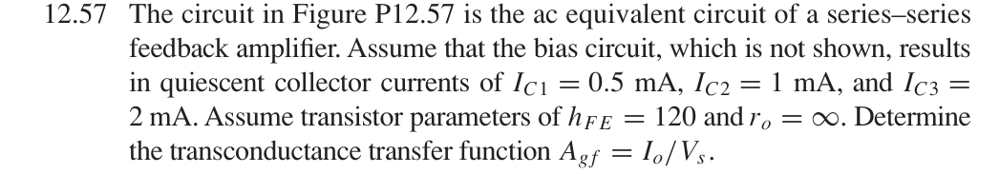
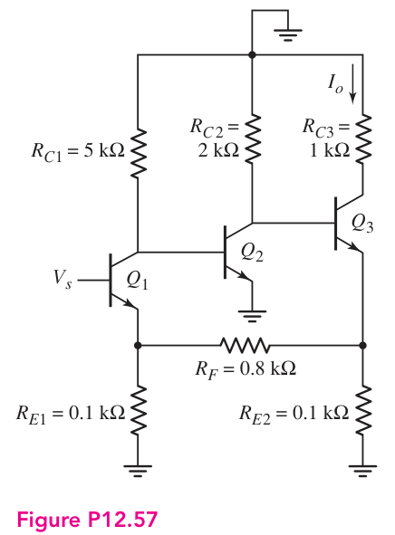
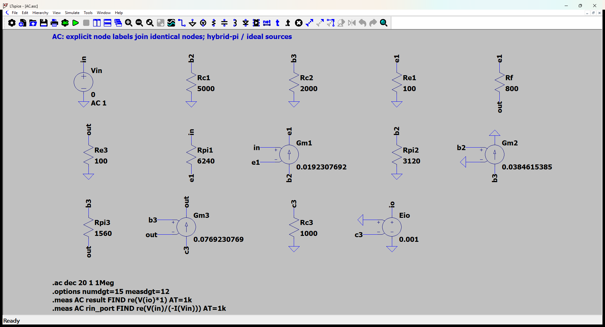
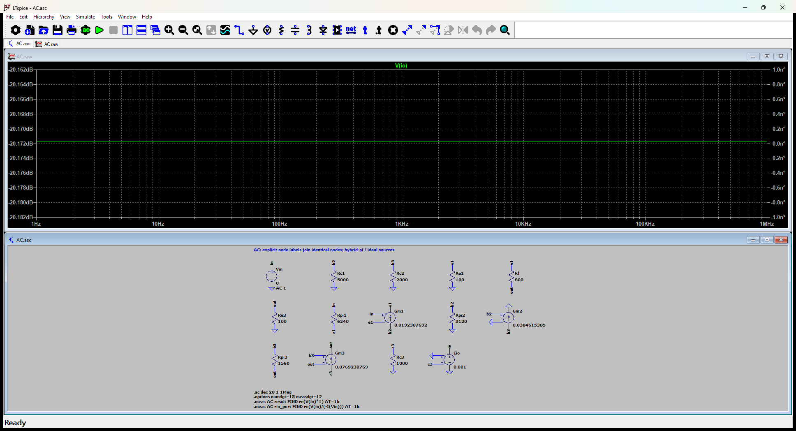

# 12.57 — 三级串联–串联跨导反馈

[41 题完成清单](status-12-20-60.md) · [本题文件包](../../assets/downloads/ch12-20-60/p12-57.zip)

## 教材题目与引用图

来源：用户提供的 `electrobook-(4th ed).pdf`，页序号从 1 起。

## Middlebrook EET：把反馈电阻作为额外元件

本题可以用 Middlebrook 额外元件定理（Extra Element Theorem，EET）。选 $R_F=800\,\Omega$ 为额外元件，移去它就是让原来连接它的两个端点断开，不是短接。两个 $100\,\Omega$ 发射极电阻仍保留。

记左端 $a$ 为 Q1 发射极，右端 $b$ 为 Q3 发射极。它们分别对应下方网表的 `e1`、`out`；题图的 $R_{E2}$ 在网表中命名为 `Re3`。输出始终是图中向下流过 $R_{C3}$ 的集电极电流：

$$
I_o=i_{c3}=-\frac{v_{c3}}{R_{C3}}.
$$

采用额外元件开路时的参考跨导 $H_0$，最终有

$$
\boxed{
A_{gf}=\frac{I_o}{V_s}
=H_0\frac{1+Z_n/R_F}{1+Z_d/R_F}
}.
$$

|待求量|$R_F$ 的状态|输入源的条件|求什么|
|---|---|---|---|
|$H_0$|移去、断开|保留 $V_s$|$I_o/V_s$|
|$Z_d$|移去，接测试源|$V_s=0$，理想电压源短路|断口测试电压／电流|
|$Z_n$|移去，接测试源|调整 $V_s$，使 $I_o=0$|同一断口测试电压／电流|

求 $Z_n$ 时的“输出为零”是两个激励相互抵消的条件，不是将输出端短接或断开。所有受控源始终保留。

### 1. 由静态电流得到小信号参数

取 $V_T=26\,\mathrm{mV}$、$\beta=120$、$r_o=\infty$：

$$
g_{mj}=\frac{I_{Cj}}{V_T},
\qquad
r_{\pi j}=\frac{\beta}{g_{mj}}.
$$

|晶体管|$I_C$ (mA)|$g_m$ (mS)|$r_\pi$ (Ω)|
|---|---:|---:|---:|
|Q1|0.5|19.230769|6240|
|Q2|1|38.461538|3120|
|Q3|2|76.923077|1560|

以下计算保留有限的 $\beta$，因此输出集电极电流与发射极电流之间使用

$$
I_o=\alpha i_{e3},
\qquad
\alpha=\frac{\beta}{\beta+1}=\frac{120}{121}.
$$

### 2. 把前两级化成 Q3 基极处的戴维南等效

令 $v_{\pi1}=V_s-v_a$。由于 Q2 发射极接地，第一级集电极负载是 $R_{C1}\parallel r_{\pi2}$：

$$
v_{b2}=-g_{m1}(R_{C1}\parallel r_{\pi2})v_{\pi1}.
$$

暂时断开 Q3 基极负载来求戴维南开路电压：

$$
V_{\mathrm{th}}=-g_{m2}R_{C2}v_{b2}=Kv_{\pi1},
$$

$$
K=g_{m1}(R_{C1}\parallel r_{\pi2})g_{m2}R_{C2}
=2841.9856006.
$$

两个共射级分别反相，所以 $K$ 为正。由于 $r_o=\infty$，该戴维南等效的串联电阻为 $R_{C2}=2000\,\Omega$。

定义两个折算到发射极侧的电阻：

$$
r_1=\frac{r_{\pi1}}{\beta+1}=51.57024793\,\Omega,
\qquad
r_3=\frac{r_{\pi3}+R_{C2}}{\beta+1}
=29.42148760\,\Omega.
$$

这里 $r_3$ 包含前级的 $R_{C2}$，不是 Q3 单独的本征发射极电阻。由
$V_{\mathrm{th}}-v_b=i_{b3}(R_{C2}+r_{\pi3})$、
$i_{e3}=(\beta+1)i_{b3}$ 得到

$$
\boxed{
i_{e1}=\frac{V_s-v_a}{r_1},
\qquad
i_{e3}=\frac{K(V_s-v_a)-v_b}{r_3}
}.
$$

下面用这两个关系分别计算 $H_0,Z_d,Z_n$。

### 3. 计算 $H_0$：反馈电阻断开

左边 Q1 的发射极电流全部经过 $R_{E1}$：

$$
v_{\pi1}=V_s\frac{r_1}{r_1+R_{E1}}.
$$

右边 Q3 的发射极电流全部经过 $R_{E2}$，所以

$$
v_b=i_{e3}R_{E2},
\qquad
i_{e3}=\frac{Kv_{\pi1}}{r_3+R_{E2}}.
$$

因此

$$
\begin{aligned}
H_0
&=\frac{I_o}{V_s}\\
&=\alpha\frac{K}{r_3+R_{E2}}
\frac{r_1}{r_1+R_{E1}}\\
&=\boxed{7.409631669\,\mathrm{A/V}}.
\end{aligned}
$$

这是移去 $R_F$ 后的线性小信号跨导；数值大不表示可以给实物施加 1 V 而仍维持小信号工作。

### 4. 计算 $Z_d$：输入源置零

在原 $R_F$ 的两端接测试电流源，方向为从 $b$ 流向 $a$，即向 $a$ 注入 $i_t$、从 $b$ 抽走 $i_t$。定义

$$
Z_d=\frac{v_a-v_b}{i_t}.
$$

令 $V_s=0$。左端有

$$
\frac{v_a}{R_{E1}}=-\frac{v_a}{r_1}+i_t,
$$

$$
v_a=R_a i_t,
\qquad
R_a=R_{E1}\parallel r_1=34.02399128\,\Omega.
$$

右端的 KCL 为

$$
\frac{v_b}{R_{E2}}
=\frac{-Kv_a-v_b}{r_3}-i_t.
$$

定义 $R_b=R_{E2}\parallel r_3=22.73307791\,\Omega$，整理得

$$
v_b=-R_b\left(\frac{K}{r_3}v_a+i_t\right).
$$

代入 $v_a=R_a i_t$：

$$
\begin{aligned}
Z_d
&=\frac{v_a-v_b}{i_t}\\
&=R_a+R_b+\frac{K R_aR_b}{r_3}\\
&=\boxed{74770.54307\,\Omega}.
\end{aligned}
$$

不能只把断口两侧的对地电阻相加：左端电压还会经过 Q1、Q2、Q3 放大并改变右端电压，第三项就是这部分贡献。

### 5. 计算 $Z_n$：调整输入，使输出为零

测试源方向与上一步相同，但现在不令 $V_s=0$，而是调整它使 $I_o=0$。

因为 $I_o=\alpha i_{e3}$，有 $i_{e3}=0$。右端 KCL 立刻给出

$$
\frac{v_b}{R_{E2}}=-i_t
\quad\Rightarrow\quad
v_b=-R_{E2}i_t.
$$

由 Q3 的关系又有

$$
0=\frac{K(V_s-v_a)-v_b}{r_3}
\quad\Rightarrow\quad
v_{\pi1}=V_s-v_a
=\frac{v_b}{K}
=-\frac{R_{E2}}{K}i_t.
$$

左端 KCL：

$$
\frac{v_a}{R_{E1}}
=i_t+\frac{v_{\pi1}}{r_1}
=i_t-\frac{R_{E2}}{Kr_1}i_t.
$$

因此

$$
\begin{aligned}
Z_n
&=\frac{v_a-v_b}{i_t}\\
&=R_{E1}+R_{E2}
-\frac{R_{E1}R_{E2}}{Kr_1}\\
&=\boxed{199.9317694\,\Omega}.
\end{aligned}
$$

由于 $K$ 很大，修正项只有约 $0.06823\,\Omega$，所以本题中 $Z_n\approx R_{E1}+R_{E2}=200\,\Omega$。

### 6. 接回 $R_F$，得到最终跨导

$$
\begin{aligned}
A_{gf}
&=H_0\frac{1+Z_n/R_F}{1+Z_d/R_F}\\[3pt]
&=7.409631669
\frac{1+199.9317694/800}
     {1+74770.54307/800}\,\mathrm{A/V}\\[3pt]
&=\boxed{+0.09804251505\,\mathrm{A/V}}\\
&=\boxed{+98.04251505\,\mathrm{mA/V}}.
\end{aligned}
$$

正号对应题图向下的 $I_o$ 方向。这与下方独立节点法和原有 LTspice 仿真一致。

本题在 $r_o=\infty$ 的模型中，$R_{C3}$ 决定输出集电极电压 $v_{c3}=-I_oR_{C3}$，不影响所求跨导。接回 $R_F$ 后，Q3 发射极电流在 $R_{E2}$ 与 $R_F$ 之间分流，不能用 $v_b/R_{E2}$ 代替 $I_o$。

## 按教材模型展开推导

### 跨导 → 输出集电极电流 → 三级节点方程 → 给定静态电流

$$
\begin{aligned}
A_{gf}&\leftarrow i_o/v_s\leftarrow g_{m3}(v_{b3}-v_{e3})/v_s,\\
(g_{mj},r_{\pi j})&\leftarrow(I_{Cj}/V_T,120V_T/I_{Cj}),\\
(I_{C1},I_{C2},I_{C3})&=(0.5,1,2)\,\mathrm{mA}.
\end{aligned}
$$

输出箭头是 $R_{C3}$ 中的集电极电流，故也可用 $i_o=-v_{c3}/1k$ 检查。Q3发射极电流在100 Ω和反馈RF之间分流，不能用 $v_{e3}/100$ 代替 $i_o$。给定三管电流后，不需要也不能杜撰未画出的偏置电路。代入下列KCL，得 $A_{gf}=98.04251505$ mA/V。

### 从依赖量展开到可代入的节点方程

Io为RC3向下的电流，等于−v(c3)/RC3；不是发射极电流。偏置由题目给定，不重造未提供的偏置电路。

测量节点 `io` 的电压定义为输出电流乘以1 Ω：$v_{read}=(1\,\Omega)i_o$。E源仅提供不加载原电路的读数转换，日志中的电压数值据此还原为电流；该转换不预设闭环增益。

未知的 $g_m,r_\pi$ 先由静态电流展开：$g_{mj}=I_{Cj}/V_T$、$r_{\pi j}=\beta/g_{mj}$，$V_T=26$ mV；$r_o=\infty$。向上代入如下，单位明确列出。

|管号|$I_C$ (mA)|$g_m$ (mS)|$r_\pi$ (Ω)|
|---|---:|---:|---:|
|Q1|0.5|19.23076923|6240|
|Q2|1|38.46153846|3120|
|Q3|2|76.92307692|1560|

为了逐节点核对，下面直接列出与原理图同名的全部节点 KCL。先由这些方程确定输出节点及输入电流，再向上组成所求比值。$i_V$ 是独立／受控电压源由正端流向负端的电流，所有理想直流电源在交流中接地，理想恒流偏置在交流中开路。

$$
\begin{aligned}
\frac{v_{\mathrm{b2}}}{\mathrm{Rc1}}+\mathrm{Gm1}(v_{\mathrm{in}}-v_{\mathrm{e1}})+\frac{v_{\mathrm{b2}}}{\mathrm{Rpi2}}&=0\quad(v_{\mathrm{b2}}\text{ 节点})\\[5pt]
\frac{v_{\mathrm{b3}}}{\mathrm{Rc2}}+\mathrm{Gm2}v_{\mathrm{b2}}+\frac{(v_{\mathrm{b3}}-v_{\mathrm{out}})}{\mathrm{Rpi3}}&=0\quad(v_{\mathrm{b3}}\text{ 节点})\\[5pt]
\mathrm{Gm3}(v_{\mathrm{b3}}-v_{\mathrm{out}})+\frac{v_{\mathrm{c3}}}{\mathrm{Rc3}}&=0\quad(v_{\mathrm{c3}}\text{ 节点})
\end{aligned}
$$

$$
\begin{aligned}
\frac{v_{\mathrm{e1}}}{\mathrm{Re1}}+\frac{(v_{\mathrm{e1}}-v_{\mathrm{out}})}{\mathrm{Rf}}-\frac{(v_{\mathrm{in}}-v_{\mathrm{e1}})}{\mathrm{Rpi1}}-\mathrm{Gm1}(v_{\mathrm{in}}-v_{\mathrm{e1}})&=0\quad(v_{\mathrm{e1}}\text{ 节点})\\[5pt]
i_{\mathrm{Vin}}+\frac{(v_{\mathrm{in}}-v_{\mathrm{e1}})}{\mathrm{Rpi1}}&=0\quad(v_{\mathrm{in}}\text{ 节点})\\[5pt]
i_{\mathrm{Eio}}&=0\quad(v_{\mathrm{io}}\text{ 节点})
\end{aligned}
$$

$$
\begin{aligned}
-\frac{(v_{\mathrm{e1}}-v_{\mathrm{out}})}{\mathrm{Rf}}+\frac{v_{\mathrm{out}}}{\mathrm{Re3}}-\frac{(v_{\mathrm{b3}}-v_{\mathrm{out}})}{\mathrm{Rpi3}}-\mathrm{Gm3}(v_{\mathrm{b3}}-v_{\mathrm{out}})&=0\quad(v_{\mathrm{out}}\text{ 节点})
\end{aligned}
$$

$$
\begin{aligned}
v_{\mathrm{in}}&=\mathrm{Vin}\\[4pt]
v_{\mathrm{io}}&=-0.001\,v_{\mathrm{c3}}=(1\,\Omega)i_o
\end{aligned}
$$

本组方程中的已知量如下。G 的系数为器件跨导（S），E 为开环电压增益或不加载电路的测量转换；不是题目闭环答案。1 V／1 A 是线性响应归一化，不是允许的大信号幅度。

|元件|连接节点（顺序同网表）|参数（SI 单位）|
|---|---|---:|
|`Vin`|`in → 0`|1|
|`Rc1`|`b2 → 0`|5000|
|`Rc2`|`b3 → 0`|2000|
|`Re1`|`e1 → 0`|100|
|`Rf`|`e1 → out`|800|
|`Re3`|`out → 0`|100|
|`Rpi1`|`in → e1`|6240|
|`Gm1`|`b2 → e1 → in → e1`|0.0192307692308|
|`Rpi2`|`b2 → 0`|3120|
|`Gm2`|`b3 → 0 → b2 → 0`|0.0384615384615|
|`Rpi3`|`b3 → out`|1560|
|`Gm3`|`c3 → out → b3 → out`|0.0769230769231|
|`Rc3`|`c3 → 0`|1000|
|`Eio`|`io → 0 → 0 → c3`|0.001|

### 向上代入得到结果

将上述已知参数代入 KCL（线性方程组数值求解），再取目标端口量。计算脚本为仓库中的 `scripts/ch12_models.py`，与 LTspice 引擎独立。

主结果：**0.09804251505 A/V**。

信号源端口电阻：1502020.241 Ω。

## 实际 LTspice 电路与频响截图

以下为 **LTspice 26.1.1 for Windows 实际窗口截图**，下方是教材小信号等效原理图，上方是引擎生成的 AC 曲线。同名节点标签表示电气相连。

未加入题目没有给出的结电容；因此 1 Hz–1 MHz 的平坦曲线只验证本页中频／理想等效模型，不代表实际器件带宽。对比值在 **1 kHz、同一套 $g_m,r_\pi$、同一端口定义**下提取。原日志的 AC 测量以 dB 和相位显示，数值表按 $x=10^{d/20}\cos\phi$ 换回线性值；180° 对应负号。

<section class="p1240-result-panel">
<h3>LTspice 原始运行日志</h3>

AC.log
<pre class="p1240-log"><code>LTspice 26.1.1 for Windows
Circuit: C:\Users\tongs\Documents\GitHub\zhihu-physics-notes\docs\assets\downloads\ch12-20-60\p12-57\AC.net
Start Time: Tue Sep 22 10:02:34 2026
Options:numdgt=15 measdgt=12
solver = Normal
Maximum thread count: 16
tnom = 27
temp = 27
method = trap
.OP point found by inspection.
.OP point found by inspection.
Total elapsed time: 0.070 seconds.
Total iterations: 0

Files loaded:
C:\Users\tongs\Documents\GitHub\zhihu-physics-notes\docs\assets\downloads\ch12-20-60\p12-57\AC.net

result: re(V(io)*1)=(-20.1717111295dB,0°) at 1000
rin_port: re(V(in)/(-I(Vin)))=(123.533515697dB,0°) at 1000
</code></pre>

</section>
<section class="p1240-result-panel">
<h3>教材计算与实际仿真</h3>

<table><thead><tr><th>物理量</th><th>教材近似计算</th><th>实际仿真</th><th>单位</th><th>相对误差</th><th>原因／定义</th></tr></thead><tbody><tr><td>主结果</td><td>0.09804251505</td><td>0.09804251505</td><td>A/V</td><td>+6.7915e-10%</td><td>相同教材等效模型；数值舍入</td></tr><tr><td>输入测试端口电阻</td><td>1502020.241</td><td>1502020.24</td><td>Ω</td><td>-6.2713e-08%</td><td>相同端口；包含源电阻时的换算见上文</td></tr></tbody></table>

计算来自上文节点方程，不以日志数值回填手算列。相对误差为 (仿真−计算)/计算；手算为零时只列绝对误差。同模型吻合验证代数与接线，不证明忽略寄生参数的近似适用于任意实物。

</section>

## 下载与复现

[本题完整文件包](../../assets/downloads/ch12-20-60/p12-57.zip) · [12.20–12.60 全部成果包](../../assets/downloads/ch12-20-60.zip)

- [AC.asc](../../assets/downloads/ch12-20-60/p12-57/AC.asc)
- [AC.cir](../../assets/downloads/ch12-20-60/p12-57/AC.cir)
- [AC.log](../../assets/downloads/ch12-20-60/p12-57/AC.log)
- [AC.plt](../../assets/downloads/ch12-20-60/p12-57/AC.plt)
- [AC.raw](../../assets/downloads/ch12-20-60/p12-57/AC.raw)

完整解压后用 LTspice 打开 `AC.asc`，运行并按 **Ctrl+L** 查看本机新生成的日志。`AC.plt` 为波形选择配置；`Rout.asc`（如有）单独测试输出电阻，`DC.cir`（如有）验证教材固定 VBE 偏置。模型与参数直接写在文件中，不依赖外部器件库。
