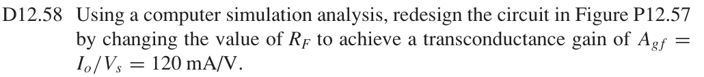
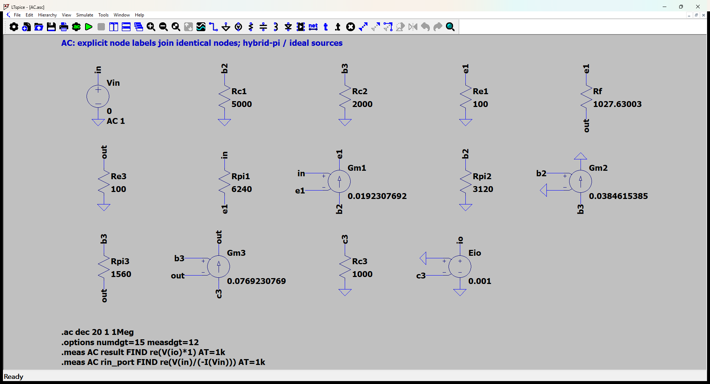
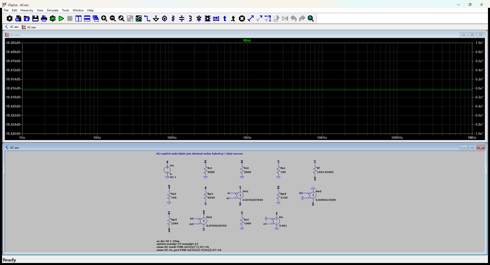

# 12.58 — 设计 RF 使跨导达到 120 mA/V

[41 题完成清单](status-12-20-60.md) · [本题文件包](../../assets/downloads/ch12-20-60/p12-58.zip)

## 教材题目与引用图

来源：用户提供的 `electrobook-(4th ed).pdf`，页序号从 1 起。




## 按教材模型展开推导


### 设计 RF → 指定跨导 → 12.57节点方程

$$
\begin{aligned}
R_F&\leftarrow A_{gf}(R_F)-0.120=0,\\
A_{gf}(R_F)&\leftarrow g_{m3}(v_{b3}-v_{e3})/v_s,\\
(v_{b3},v_{e3})&\leftarrow\text{含未知 }1/R_F\text{ 的KCL},\\
(g_{mj},r_{\pi j})&\leftarrow\text{12.57给定电流和}\ \beta=120.
\end{aligned}
$$

保持电阻、工作点、晶体管参数不变，仅解设计变量 $R_F$，得 $R_F=1027.63002816\,\Omega$。下方独立LTspice测量确认 $I_o/V_s=0.120$ A/V；这是题目授权的电阻设计，并非修改器件参数使固定题目的答案吻合。

### 从依赖量展开到可代入的节点方程

唯一设计变量为RF；保持题给三管静态电流和β不变。必须用实际SPICE测量确认计算选值。

测量节点 `io` 的电压定义为输出电流乘以1 Ω：$v_{read}=(1\,\Omega)i_o$。E源仅提供不加载原电路的读数转换，日志中的电压数值据此还原为电流；该转换不预设闭环增益。

未知的 $g_m,r_\pi$ 先由静态电流展开：$g_{mj}=I_{Cj}/V_T$、$r_{\pi j}=\beta/g_{mj}$，$V_T=26$ mV；$r_o=\infty$。向上代入如下，单位明确列出。

|管号|$I_C$ (mA)|$g_m$ (mS)|$r_\pi$ (Ω)|
|---|---:|---:|---:|
|Q1|0.5|19.23076923|6240|
|Q2|1|38.46153846|3120|
|Q3|2|76.92307692|1560|

为了逐节点核对，下面直接列出与原理图同名的全部节点 KCL。先由这些方程确定输出节点及输入电流，再向上组成所求比值。$i_V$ 是独立／受控电压源由正端流向负端的电流，所有理想直流电源在交流中接地，理想恒流偏置在交流中开路。

$$
\begin{aligned}
\frac{v_{\mathrm{b2}}}{\mathrm{Rc1}}+\mathrm{Gm1}(v_{\mathrm{in}}-v_{\mathrm{e1}})+\frac{v_{\mathrm{b2}}}{\mathrm{Rpi2}}&=0\quad(v_{\mathrm{b2}}\text{ 节点})\\[5pt]
\frac{v_{\mathrm{b3}}}{\mathrm{Rc2}}+\mathrm{Gm2}v_{\mathrm{b2}}+\frac{(v_{\mathrm{b3}}-v_{\mathrm{out}})}{\mathrm{Rpi3}}&=0\quad(v_{\mathrm{b3}}\text{ 节点})\\[5pt]
\mathrm{Gm3}(v_{\mathrm{b3}}-v_{\mathrm{out}})+\frac{v_{\mathrm{c3}}}{\mathrm{Rc3}}&=0\quad(v_{\mathrm{c3}}\text{ 节点})
\end{aligned}
$$

$$
\begin{aligned}
\frac{v_{\mathrm{e1}}}{\mathrm{Re1}}+\frac{(v_{\mathrm{e1}}-v_{\mathrm{out}})}{\mathrm{Rf}}-\frac{(v_{\mathrm{in}}-v_{\mathrm{e1}})}{\mathrm{Rpi1}}-\mathrm{Gm1}(v_{\mathrm{in}}-v_{\mathrm{e1}})&=0\quad(v_{\mathrm{e1}}\text{ 节点})\\[5pt]
i_{\mathrm{Vin}}+\frac{(v_{\mathrm{in}}-v_{\mathrm{e1}})}{\mathrm{Rpi1}}&=0\quad(v_{\mathrm{in}}\text{ 节点})\\[5pt]
i_{\mathrm{Eio}}&=0\quad(v_{\mathrm{io}}\text{ 节点})
\end{aligned}
$$

$$
\begin{aligned}
-\frac{(v_{\mathrm{e1}}-v_{\mathrm{out}})}{\mathrm{Rf}}+\frac{v_{\mathrm{out}}}{\mathrm{Re3}}-\frac{(v_{\mathrm{b3}}-v_{\mathrm{out}})}{\mathrm{Rpi3}}-\mathrm{Gm3}(v_{\mathrm{b3}}-v_{\mathrm{out}})&=0\quad(v_{\mathrm{out}}\text{ 节点})
\end{aligned}
$$

$$
\begin{aligned}
v_{\mathrm{in}}&=\mathrm{Vin}\\[4pt]
v_{\mathrm{io}}&=\mathrm{Eio}-v_{\mathrm{c3}}
\end{aligned}
$$

本组方程中的已知量如下。G 的系数为器件跨导（S），E 为开环电压增益或不加载电路的测量转换；不是题目闭环答案。1 V／1 A 是线性响应归一化，不是允许的大信号幅度。

|元件|连接节点（顺序同网表）|参数（SI 单位）|
|---|---|---:|
|`Vin`|`in → 0`|1|
|`Rc1`|`b2 → 0`|5000|
|`Rc2`|`b3 → 0`|2000|
|`Re1`|`e1 → 0`|100|
|`Rf`|`e1 → out`|1027.63002816|
|`Re3`|`out → 0`|100|
|`Rpi1`|`in → e1`|6240|
|`Gm1`|`b2 → e1 → in → e1`|0.0192307692308|
|`Rpi2`|`b2 → 0`|3120|
|`Gm2`|`b3 → 0 → b2 → 0`|0.0384615384615|
|`Rpi3`|`b3 → out`|1560|
|`Gm3`|`c3 → out → b3 → out`|0.0769230769231|
|`Rc3`|`c3 → 0`|1000|
|`Eio`|`io → 0 → 0 → c3`|0.001|

### 向上代入得到结果

将上述已知参数代入 KCL（线性方程组数值求解），再取目标端口量。计算脚本为仓库中的 `scripts/ch12_models.py`，与 LTspice 引擎独立。

主结果：**0.12 A/V**。

信号源端口电阻：1208434.526 Ω。

设计数值（电阻单位 Ω，其余按变量定义）：

```json
{
  "RF": 1027.6300281579997
}
```

## 实际 LTspice 电路与频响截图

以下为 **LTspice 26.1.1 for Windows 实际窗口截图**，下方是教材小信号等效原理图，上方是引擎生成的 AC 曲线。同名节点标签表示电气相连。





未加入题目没有给出的结电容；因此 1 Hz–1 MHz 的平坦曲线只验证本页中频／理想等效模型，不代表实际器件带宽。对比值在 **1 kHz、同一套 $g_m,r_\pi$、同一端口定义**下提取。原日志的 AC 测量以 dB 和相位显示，数值表按 $x=10^{d/20}\cos\phi$ 换回线性值；180° 对应负号。

<div class="p1240-results-grid">
<section class="p1240-result-panel">
<h3>LTspice 原始运行日志</h3>
<details open><summary>AC.log</summary><pre class="p1240-log"><code>LTspice 26.1.1 for Windows
Circuit: C:\Users\tongs\Documents\GitHub\zhihu-physics-notes\docs\assets\downloads\ch12-20-60\p12-58\AC.net
Start Time: Tue Sep 22 10:02:39 2026
Options:numdgt=15 measdgt=12
solver = Normal
Maximum thread count: 16
tnom = 27
temp = 27
method = trap
.OP point found by inspection.
.OP point found by inspection.
Total elapsed time: 0.053 seconds.
Total iterations: 0

Files loaded:
C:\Users\tongs\Documents\GitHub\zhihu-physics-notes\docs\assets\downloads\ch12-20-60\p12-58\AC.net

result: re(V(io)*1)=(-18.4163750662dB,0°) at 1000
rin_port: re(V(in)/(-I(Vin)))=(121.644462478dB,0°) at 1000
</code></pre></details>
</section>
<section class="p1240-result-panel">
<h3>教材计算与实际仿真</h3>
<div class="p1240-table-scroll"><table><thead><tr><th>物理量</th><th>教材近似计算</th><th>实际仿真</th><th>单位</th><th>相对误差</th><th>原因／定义</th></tr></thead><tbody><tr><td>主结果</td><td>0.12</td><td>0.1200000002</td><td>A/V</td><td>+1.4791e-07%</td><td>相同教材等效模型；数值舍入</td></tr><tr><td>输入测试端口电阻</td><td>1208434.526</td><td>1208434.523</td><td>Ω</td><td>-2.2051e-07%</td><td>相同端口；包含源电阻时的换算见上文</td></tr></tbody></table></div>
<p>计算来自上文节点方程，不以日志数值回填手算列。相对误差为 (仿真−计算)/计算；手算为零时只列绝对误差。同模型吻合验证代数与接线，不证明忽略寄生参数的近似适用于任意实物。</p>
</section>
</div>

## 下载与复现

[本题完整文件包](../../assets/downloads/ch12-20-60/p12-58.zip) · [12.20–12.60 全部成果包](../../assets/downloads/ch12-20-60.zip)

- [AC.asc](../../assets/downloads/ch12-20-60/p12-58/AC.asc)
- [AC.cir](../../assets/downloads/ch12-20-60/p12-58/AC.cir)
- [AC.log](../../assets/downloads/ch12-20-60/p12-58/AC.log)
- [AC.plt](../../assets/downloads/ch12-20-60/p12-58/AC.plt)
- [AC.raw](../../assets/downloads/ch12-20-60/p12-58/AC.raw)

完整解压后用 LTspice 打开 `AC.asc`，运行并按 **Ctrl+L** 查看本机新生成的日志。`AC.plt` 为波形选择配置；`Rout.asc`（如有）单独测试输出电阻，`DC.cir`（如有）验证教材固定 VBE 偏置。模型与参数直接写在文件中，不依赖外部器件库。
