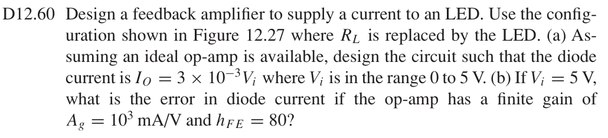
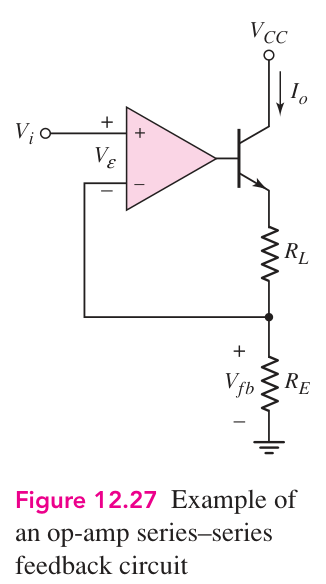
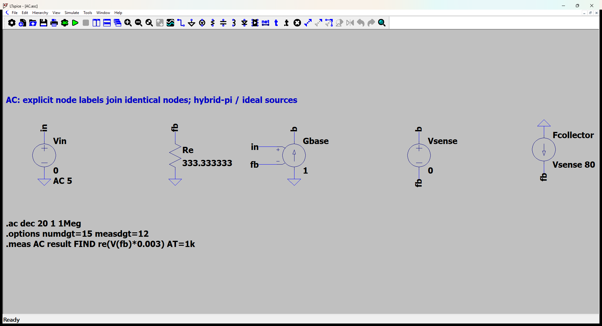
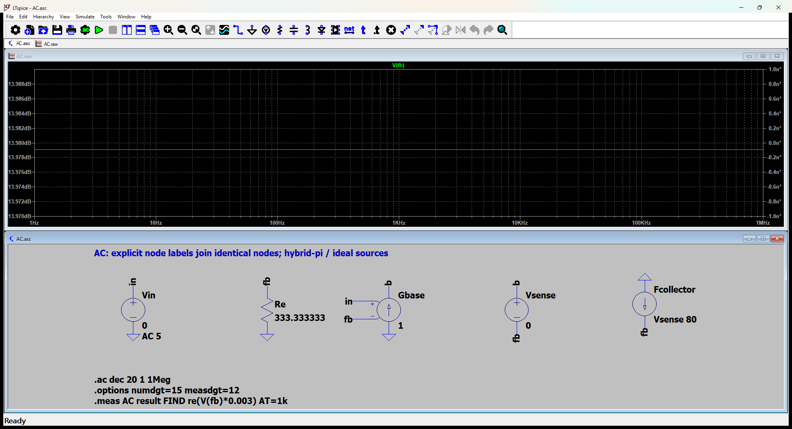

# 12.60 — 线性 LED 电流源的设计及有限增益误差

[41 题完成清单](status-12-20-60.md) · [本题文件包](../../assets/downloads/ch12-20-60/p12-60.zip)

## 教材题目与引用图

来源：用户提供的 `electrobook-(4th ed).pdf`，页序号从 1 起。

## 按教材模型展开推导

### (a) 电流斜率 → 检测电阻 → 理想虚短

LED替换图12.27中的 $R_L$，位于发射极与检测电阻之间。反馈取自 $R_E$ 上端，因此

$$
\begin{aligned}
R_E&\leftarrow V_i/I_{LED}\leftarrow1/(3\times10^{-3})
=\boxed{333.3333333\,\Omega},\\
I_{LED}&=V_i/R_E=0\text{ 至 }15\,\mathrm{mA}.
\end{aligned}
$$

这是理想运放且晶体管有足够顺从电压时的关系。需要 $V_{CC}$ 高于 $V_i+V_{LED}+V_{CE,\min}$，并保证运放能输出足够基极电压；题目未给LED压降或电源，因此保留符号条件。

### (b) 教材近似：电流误差 → 有限跨导 → 基极电流

题给运放跨导 $g_a=10^3$ mA/V = 1 A/V。先按本节教材的 $I_E\simeq I_C=\beta I_B$ 近似：

$$
\begin{aligned}
I_{LED}&\simeq\beta g_a(V_i-I_{LED}R_E),\\
I_{LED}&\simeq\frac{\beta g_a V_i}{1+\beta g_aR_E},\\
\beta&=80,\quad V_i=5\,\mathrm V,\quad R_E=1000/3\,\Omega,\\
I_{LED}&\simeq14.999437521\,\mathrm{mA},\\
\Delta I&\simeq-0.56247891\,\mu\mathrm A,\quad
\Delta I/(15\,\mathrm{mA})\simeq-0.0037498594\%.
\end{aligned}
$$

### 单列：保留基极电流

LED位于发射极串联支路，其实际电流是 $(\beta+1)I_B$。更精确的同一工作点模型只需把上式 β 改为 β+1：

$$
\begin{aligned}
I_{LED}&=\frac{(\beta+1)g_aV_i}{1+(\beta+1)g_aR_E}=14.999444465\,\mathrm{mA},\\
\Delta I&=-0.55553498\,\mu\mathrm A,\qquad
\Delta I/(15\,\mathrm{mA})=-0.0037035665\%.
\end{aligned}
$$

SPICE保留发射极的基极电流贡献，以开环跨导1 S和集电极／基极电流比80验证闭合方程；没有预置LED输出电流。下表主手算列使用先列的教材近似，差异来自 β 与 β+1 的区分。

### 从依赖量展开到可代入的节点方程

LED在发射极串联支路；其电流为(β+1)倍基极电流。题给Ag=1000mA/V是运放输出到基极的跨导1S。增量LED压降不影响下方RE电流反馈；实际电源必须有足够顺从电压。

为了逐节点核对，下面直接列出与原理图同名的全部节点 KCL。先由这些方程确定输出节点及输入电流，再向上组成所求比值。$i_V$ 是独立／受控电压源由正端流向负端的电流，所有理想直流电源在交流中接地，理想恒流偏置在交流中开路。

$$
\begin{aligned}
-\mathrm{Gbase}(v_{\mathrm{in}}-v_{\mathrm{fb}})+i_{\mathrm{Vsense}}&=0\quad(v_{\mathrm{b}}\text{ 节点})\\[5pt]
\frac{v_{\mathrm{fb}}}{\mathrm{Re}}-i_{\mathrm{Vsense}}-\mathrm{Fcollector}i_{\mathrm{Vsense}}&=0\quad(v_{\mathrm{fb}}\text{ 节点})\\[5pt]
i_{\mathrm{Vin}}&=0\quad(v_{\mathrm{in}}\text{ 节点})
\end{aligned}
$$

$$
\begin{aligned}
v_{\mathrm{in}}&=\mathrm{Vin}\\[4pt]
(v_{\mathrm{b}}-v_{\mathrm{fb}})&=\mathrm{Vsense}
\end{aligned}
$$

本组方程中的已知量如下。G 的系数为器件跨导（S），E 为开环电压增益或不加载电路的测量转换；不是题目闭环答案。1 V／1 A 是线性响应归一化，不是允许的大信号幅度。

|元件|连接节点（顺序同网表）|参数（SI 单位）|
|---|---|---:|
|`Vin`|`in → 0`|5|
|`Re`|`fb → 0`|333.333333333|
|`Gbase`|`0 → b → in → fb`|1|
|`Vsense`|`b → fb`|0|
|`Fcollector`|`0 → fb → Vsense`|80|

### 向上代入得到结果

将上述已知参数代入 KCL（线性方程组数值求解），再取目标端口量。计算脚本为仓库中的 `scripts/ch12_models.py`，与 LTspice 引擎独立。

主结果：**0.01499943752 A**。

## 实际 LTspice 电路与频响截图

以下为 **LTspice 26.1.1 for Windows 实际窗口截图**，下方是教材小信号等效原理图，上方是引擎生成的 AC 曲线。同名节点标签表示电气相连。

未加入题目没有给出的结电容；因此 1 Hz–1 MHz 的平坦曲线只验证本页中频／理想等效模型，不代表实际器件带宽。对比值在 **1 kHz、同一套 $g_m,r_\pi$、同一端口定义**下提取。原日志的 AC 测量以 dB 和相位显示，数值表按 $x=10^{d/20}\cos\phi$ 换回线性值；180° 对应负号。

<section class="p1240-result-panel">
<h3>LTspice 原始运行日志</h3>

AC.log
<pre class="p1240-log"><code>LTspice 26.1.1 for Windows
Circuit: C:\Users\tongs\Documents\GitHub\zhihu-physics-notes\docs\assets\downloads\ch12-20-60\p12-60\AC.net
Start Time: Tue Sep 22 10:02:50 2026
Options:numdgt=15 measdgt=12
solver = Normal
Maximum thread count: 16
tnom = 27
temp = 27
method = trap
.OP point found by inspection.
.OP point found by inspection.
Total elapsed time: 0.061 seconds.
Total iterations: 0

Files loaded:
C:\Users\tongs\Documents\GitHub\zhihu-physics-notes\docs\assets\downloads\ch12-20-60\p12-60\AC.net

result: re(V(fb)*0.003)=(-36.4784965125dB,0°) at 1000
</code></pre>

</section>
<section class="p1240-result-panel">
<h3>教材计算与实际仿真</h3>

<table><thead><tr><th>物理量</th><th>教材近似计算</th><th>实际仿真</th><th>单位</th><th>相对误差</th><th>原因／定义</th></tr></thead><tbody><tr><td>主结果</td><td>0.01499943752</td><td>0.01499944447</td><td>A</td><td>+4.6295e-05%</td><td>保留基极电流：β与β+1的差异</td></tr></tbody></table>

计算来自上文节点方程，不以日志数值回填手算列。相对误差为 (仿真−计算)/计算；手算为零时只列绝对误差。同模型吻合验证代数与接线，不证明忽略寄生参数的近似适用于任意实物。

</section>

## 下载与复现

[本题完整文件包](../../assets/downloads/ch12-20-60/p12-60.zip) · [12.20–12.60 全部成果包](../../assets/downloads/ch12-20-60.zip)

- [AC.asc](../../assets/downloads/ch12-20-60/p12-60/AC.asc)
- [AC.cir](../../assets/downloads/ch12-20-60/p12-60/AC.cir)
- [AC.log](../../assets/downloads/ch12-20-60/p12-60/AC.log)
- [AC.plt](../../assets/downloads/ch12-20-60/p12-60/AC.plt)
- [AC.raw](../../assets/downloads/ch12-20-60/p12-60/AC.raw)

完整解压后用 LTspice 打开 `AC.asc`，运行并按 **Ctrl+L** 查看本机新生成的日志。`AC.plt` 为波形选择配置；`Rout.asc`（如有）单独测试输出电阻，`DC.cir`（如有）验证教材固定 VBE 偏置。模型与参数直接写在文件中，不依赖外部器件库。
