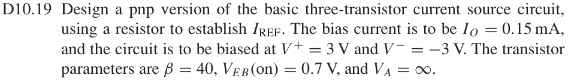
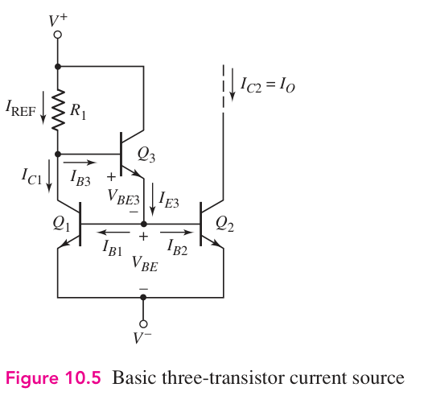

# D10.19 — PNP 三晶体管电流源设计

来源：Donald A. Neamen, *Microelectronics: Circuit Analysis and Design*, 4th ed.，教材页 740（PDF 第 763 页）。

## 完整题目

Design a pnp version of the basic three-transistor current source circuit, using a resistor to establish IREF. The bias current is to be IO = 0.15 mA, and the circuit is to be biased at V+ = 3 V and V−= −3 V. The transistor parameters are β = 40, VEB(on) = 0.7 V, and VA = ∞.

## 原题截图

## 对应电路图：Figure 10.5

图片来源：教材页 693（PDF 第 716 页）。 原图为 NPN 电路；本题要求设计其 PNP 版本，以下推导和连接表给出极性翻转后的电路。

## 解答与推导

已知 $I_O=0.15\,\mathrm{mA}$、$V^+=+3\,\mathrm V$、$V^-=-3\,\mathrm V$、$\beta=40$、$V_{EB}(\mathrm{on})=0.7\,\mathrm V$、$V_A=\infty$。

已按教材图 10.5 核对基本三管电流镜的连接。题目要求其 PNP 版本：将原图 NPN 管、电源极性和电流方向相应翻转；以下连接表给出具体 PNP 设计。

## 1. PNP 电路怎样连接

将 NPN 基本三管电流镜的极性翻转。输出是向负载提供电流的 PNP 电流源，$I_O$ 定义为流出 $Q_2$ 集电极的电流幅值。

| 元件 | 连接 |
|---|---|
| $Q_1$、$Q_2$ | 匹配的 PNP；两管发射极接 $+3\,\mathrm V$；基极相连，记为节点 $B$ |
| $Q_2$ 集电极 | 接输出负载 |
| $Q_3$ | PNP；发射极接 $B$，集电极接 $-3\,\mathrm V$ |
| $Q_1$ 集电极与 $Q_3$ 基极 | 相连，记为节点 $X$ |
| $R_1$ | 从 $X$ 接至 $-3\,\mathrm V$，建立 $I_{\mathrm{REF}}$ |

$Q_1,Q_2$ 的 $V_{EB}$ 相等且匹配，所以 $I_{C1}=I_{C2}=I_O$。计算使用电流幅值；PNP 的基极电流流出基极。

## 2. 从未知展开到已知

$$
\begin{gathered}
\boxed{R_1\;?}\\[4pt]
\downarrow\\[4pt]
R_1=\frac{V_X-V^-}{I_{\mathrm{REF}}}\\[4pt]
\downarrow\\[4pt]
V_X=V^+-V_{EB1}-V_{EB3},\qquad
I_{\mathrm{REF}}=I_O+I_{B3}\\[4pt]
\downarrow\\[4pt]
I_{B3}=\frac{I_{E3}}{\beta+1},\qquad
I_{E3}=I_{B1}+I_{B2}=\frac{2I_O}{\beta}\\[4pt]
\downarrow\\[4pt]
\boxed{I_O,\ \beta,\ V^+,\ V^-,\ V_{EB1},\ V_{EB3}\text{ 均已知}}
\end{gathered}
$$

第三管承担两只镜像管的基极电流，电阻支路只需额外提供第三管自己的基极电流。

$$
\boxed{I_{\mathrm{REF}}=I_O\left(1+\frac{2}{\beta(\beta+1)}\right)}.
$$

$$
\boxed{R_1=\frac{V^+-V^--V_{EB1}-V_{EB3}}
{I_O\left(1+\frac{2}{\beta(\beta+1)}\right)}}.
$$

## 3. 代入计算

$$
V_B=3-0.7=2.3\,\mathrm V,\qquad V_X=2.3-0.7=1.6\,\mathrm V.
$$

$$
I_{B1}=I_{B2}=\frac{150}{40}=3.75\,\mu\mathrm A,
\quad I_{E3}=7.50\,\mu\mathrm A,
\quad I_{B3}=\frac{7.50}{41}=0.182927\,\mu\mathrm A.
$$

$$
\boxed{I_{\mathrm{REF}}=150.182927\,\mu\mathrm A},\qquad
\boxed{R_1=\frac{1.6-(-3)}{150.182927\times10^{-6}}
=30.6293\,\mathrm{k}\Omega}.
$$

这是题目固定 $V_{EB}$ 模型下的设计值。若直接忽略基极电流，得到 $30.6667\,\mathrm{k}\Omega$。实际选用电阻后应按选定阻值重新计算电流。输出管必须保持放大区；上述模型下输出电压宜低于其基极电压 $2.3\,\mathrm V$。
