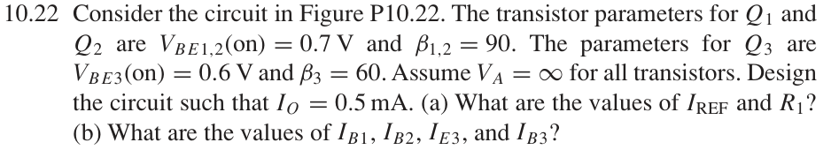
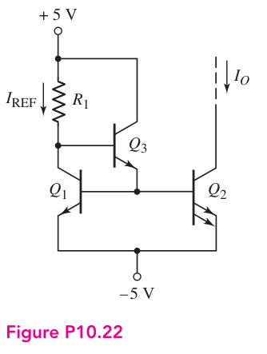

# 10.22 — 带基极电流补偿的比例电流镜

来源：Donald A. Neamen, *Microelectronics: Circuit Analysis and Design*, 4th ed.，教材页 740（PDF 第 763 页）。

## 完整题目

Consider the circuit in Figure P10.22. The transistor parameters for Q1 and Q2 are VBE1,2(on) = 0.7 V and β1,2 = 90. The parameters for Q3 are VBE3(on) = 0.6 V and β3 = 60. Assume VA = ∞ for all transistors. Design the circuit such that IO = 0.5 mA.

(a) What are the values of IREF and R1?

(b) What are the values of IB1, IB2, IE3, and IB3?

## 原题截图

## 对应电路图：Figure P10.22

图片来源：教材页 740（PDF 第 763 页）。 解题采用本题题干给定的参数；其他题引用同一拓扑时数值可能不同。

## 解答与推导

已知 $I_O=0.5\,\mathrm{mA}$，$\beta_1=\beta_2=90$，$\beta_3=60$，$V_{BE1}=V_{BE2}=0.7\,\mathrm V$，$V_{BE3}=0.6\,\mathrm V$，电源为 $+5\,\mathrm V$ 与 $-5\,\mathrm V$，$V_A=\infty$。

**图中 $Q_2$ 有两个相连的单位发射极，面积是 $Q_1$ 的两倍。因此 $I_{C2}=2I_{C1}$；不是两管电流相等，也不是 $\beta$ 翻倍。**

## (a) 从待求电阻向下展开

$$
\begin{gathered}
\boxed{R_1\;?}\\[4pt]
\downarrow\\[4pt]
R_1=\frac{V^+-V_{B3}}{I_{\mathrm{REF}}}\\[8pt]
\begin{array}{cc}
\downarrow&\downarrow\\[4pt]
V_{B3}=V_{E3}+V_{BE3}&I_{\mathrm{REF}}=I_{C1}+I_{B3}\\[6pt]
\downarrow&\downarrow\\[4pt]
V_{E3}=V_{B1}=V^-+V_{BE1}&I_{B3}=\dfrac{I_{E3}}{\beta_3+1}\\[6pt]
\downarrow&\downarrow\\[4pt]
\boxed{V^-=-5\,\mathrm V,\ V_{BE1}=0.7\,\mathrm V}&I_{E3}=I_{B1}+I_{B2}\\[6pt]
&\downarrow\\[4pt]
&I_{B1}=\dfrac{I_{C1}}{\beta_1},\quad I_{B2}=\dfrac{I_{C2}}{\beta_2}\\[8pt]
&\downarrow\\[4pt]
&I_{C1}=I_O/2,\quad I_{C2}=I_O\\[6pt]
&\downarrow\\[4pt]
&\boxed{I_O=0.5\,\mathrm{mA},\ \beta_1=\beta_2=90}
\end{array}
\end{gathered}
$$

其余叶节点为已知量 $V^+=5\,\mathrm V$、$V_{BE3}=0.6\,\mathrm V$、$\beta_3=60$。

## 展开到只剩已知量

$$
I_{\mathrm{REF}}=\frac{I_O}{2}
+\frac{\frac{I_O}{2\beta_1}+\frac{I_O}{\beta_2}}{\beta_3+1}.
$$

$$
\boxed{R_1=
\frac{V^+-V^- -V_{BE1}-V_{BE3}}
{\displaystyle\frac{I_O}{2}+\frac{\frac{I_O}{2\beta_1}+\frac{I_O}{\beta_2}}{\beta_3+1}}}
$$

$$
V_{B3}=-5+0.7+0.6=-3.7\,\mathrm V,
\qquad V_{R_1}=5-(-3.7)=8.7\,\mathrm V.
$$

$$
\boxed{I_{\mathrm{REF}}=0.2501366\,\mathrm{mA}},
\qquad
\boxed{R_1=34.78\,\mathrm{k}\Omega}.
$$

## (b) 其余未知电流

同一依赖树中的关系直接给出：

$$
\begin{aligned}
I_{B1}&=\frac{I_O}{2\beta_1}=\boxed{2.7778\,\mu\mathrm A},\\
I_{B2}&=\frac{I_O}{\beta_2}=\boxed{5.5556\,\mu\mathrm A},\\
I_{E3}&=I_{B1}+I_{B2}=\boxed{8.3333\,\mu\mathrm A},\\
I_{B3}&=\frac{I_{E3}}{\beta_3+1}=\boxed{0.1366\,\mu\mathrm A}.
\end{aligned}
$$

两个节点的电流检查：$I_{E3}=I_{B1}+I_{B2}$，$I_{\mathrm{REF}}=I_{C1}+I_{B3}$。
