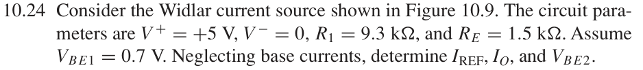
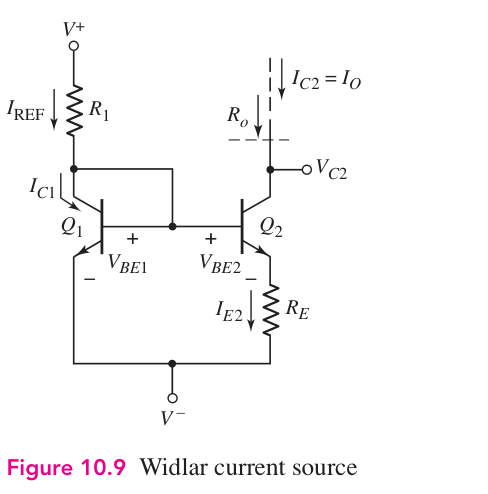

# 10.24 — Widlar 电流源

来源：Donald A. Neamen, *Microelectronics: Circuit Analysis and Design*, 4th ed.，教材页 740（PDF 第 763 页）。

## 完整题目

Consider the Widlar current source shown in Figure 10.9. The circuit parameters are V+ = +5 V, V−= 0, R1 = 9.3 kΩ, and RE = 1.5 kΩ. Assume VBE1 = 0.7 V. Neglecting base currents, determine IREF, IO, and VBE2.

## 原题截图

## 对应电路图：Figure 10.9

图片来源：教材页 699（PDF 第 722 页）。 解题采用本题题干给定的参数；其他题引用同一拓扑时数值可能不同。

## 解答与推导

**已按教材图 10.9 核对：$R_1$ 从 $V^+$ 接到二极管连接的 $Q_1$，$Q_1$ 发射极接 $V^-$；$Q_2$ 基极接 $Q_1$ 基极，$Q_2$ 发射极经 $R_E$ 接 $V^-$。两管匹配，采用忽略 Early 效应的指数模型。**

已知 $V^+=5\,\mathrm V$、$V^-=0$、$R_1=9.3\,\mathrm{k}\Omega$、$R_E=1.5\,\mathrm{k}\Omega$、$V_{BE1}=0.7\,\mathrm V$，忽略基极电流。主计算取 $V_T=26\,\mathrm{mV}$。

## 从未知向下展开

$$
\begin{gathered}
\boxed{V_{BE2}\;?}\\[4pt]
\downarrow\\[4pt]
V_{BE2}=V_{BE1}-I_OR_E\\[4pt]
\downarrow\\[4pt]
\boxed{I_O\;?}\\[4pt]
\downarrow\\[4pt]
I_OR_E=V_T\ln\!\left(\frac{I_{\mathrm{REF}}}{I_O}\right)\\[4pt]
\downarrow\\[4pt]
\boxed{I_{\mathrm{REF}}\;?}=\frac{V^+-V^- -V_{BE1}}{R_1}\\[4pt]
\downarrow\\[4pt]
\boxed{V^+=5\,\mathrm V,\ V^-=0,\ V_{BE1}=0.7\,\mathrm V,\ R_1=9.3\,\mathrm{k}\Omega}\\[4pt]
\boxed{R_E=1.5\,\mathrm{k}\Omega,\quad V_T=26\,\mathrm{mV}}
\end{gathered}
$$

## 中间的隐式方程从哪里来

同一基极电位，$Q_2$ 发射极比 $Q_1$ 高 $I_OR_E$，所以

$$
V_{BE1}-V_{BE2}=I_OR_E.
$$

匹配晶体管的指数模型给出

$$
\frac{I_{\mathrm{REF}}}{I_O}
=\frac{I_Se^{V_{BE1}/V_T}}{I_Se^{V_{BE2}/V_T}}
=e^{(V_{BE1}-V_{BE2})/V_T}.
$$

联立即得到依赖图中的方程。它包含待求量 $I_O$，因此这一层需要解方程，不能直接当作已知量代入。

## 展开成显式形式

令 $W_0(z)e^{W_0(z)}=z$，则

$$
\boxed{I_O=\frac{V_T}{R_E}
W_0\!\left(\frac{R_E}{V_T}\frac{V^+-V^- -V_{BE1}}{R_1}\right)}.
$$

不用 Lambert W 也可以在 $0<I_O<I_{\mathrm{REF}}$ 内用二分法求解。函数 $f(I)=IR_E-V_T\ln(I_{\mathrm{REF}}/I)$ 满足 $f'(I)=R_E+V_T/I>0$，因此正根唯一。

## 向上代入

$$
\boxed{I_{\mathrm{REF}}=\frac{4.3}{9300}\,\mathrm A=0.462366\,\mathrm{mA}}
$$

$$
1500I_O=0.026\ln\!\left(\frac{0.000462366}{I_O}\right)
\quad (I_O\text{ 用 A}).
$$

$$
\boxed{I_O=41.7010\,\mu\mathrm A},
\qquad
\boxed{V_{BE2}=0.7-1500I_O=0.637448\,\mathrm V}.
$$

若教材采用 $V_T=25\,\mathrm{mV}$，则 $I_O=40.5597\,\mu\mathrm A$、$V_{BE2}=0.639160\,\mathrm V$；参考电流不变。
