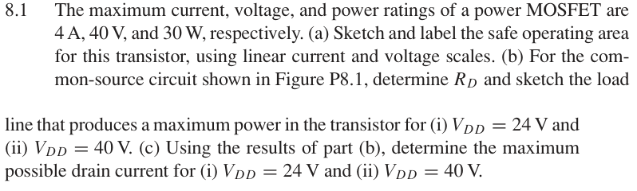

# 8.1 — 功率 MOSFET 安全工作区

来源：Donald A. Neamen, *Microelectronics: Circuit Analysis and Design*, 4th ed.，教材页 604, 605（PDF 第 627, 628 页）。

## 题目

The maximum current, voltage, and power ratings of a power MOSFET are 4 A, 40 V, and 30 W, respectively.

(a) Sketch and label the safe operating area for this transistor, using linear current and voltage scales.

(b) For the common-source circuit shown in Figure P8.1, determine RD and sketch the load line that produces a maximum power in the transistor for (i) VDD = 24 V and (ii) VDD = 40 V.

(c) Using the results of part

(b), determine the maximum possible drain current for (i) VDD = 24 V and (ii) VDD = 40 V.

## 原题截图

## 对应图片：Figure P8.1

图片来源：教材页 605（PDF 第 628 页）。 该图上的参数是原图标注；解题时应采用本题题干给定的参数。

[返回第 8 章目录](index.md)
