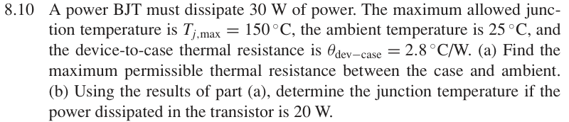

# 8.10 — BJT 热设计

## 相关计算器

<a href="../../../tools/chapter8-calculators.html#thermal" target="_blank" rel="noopener" style="display:inline-block;margin:0.2rem 0.35rem 0.2rem 0;padding:0.5rem 0.7rem;border:1px solid #2563eb;border-radius:0.5rem;text-decoration:none;font-weight:600;">BJT thermal design ↗</a>

来源：Donald A. Neamen, *Microelectronics: Circuit Analysis and Design*, 4th ed.，教材页 606（PDF 第 629 页）。

<!-- instantiated-calculator -->
## 代入本题数值的计算器

### (a) 30 W 设计

<iframe src="../../../tools/chapter8-calculators.html?compact=1&tab=thermal&tTjmax=150&tTa=25&tPd=30&tJC=2.8&tCS=0&tSA=1.36667" title="Problem 8.10 calculator — (a) 30 W 设计" style="width:100%;min-height:560px;border:1px solid #d1d5db;border-radius:12px;background:white;" loading="lazy"></iframe>

### (b) 20 W 检查

<iframe src="../../../tools/chapter8-calculators.html?compact=1&tab=thermal&tTjmax=150&tTa=25&tPd=20&tJC=2.8&tCS=0&tSA=1.36667" title="Problem 8.10 calculator — (b) 20 W 检查" style="width:100%;min-height:560px;border:1px solid #d1d5db;border-radius:12px;background:white;" loading="lazy"></iframe>

## 题目

A power BJT must dissipate 30 W of power. The maximum allowed junction temperature is Tj,max = 150 ◦C, the ambient temperature is 25 ◦C, and the device-to-case thermal resistance is θdev−case = 2.8 ◦C/W.

(a) Find the maximum permissible thermal resistance between the case and ambient.

(b) Using the results of part

(a), determine the junction temperature if the power dissipated in the transistor is 20 W.

## 原题截图

## 图片对应

本题没有引用教材中的电路图；要求自行绘制的图应根据题干条件作出。

[返回第 8 章目录](index.md)
