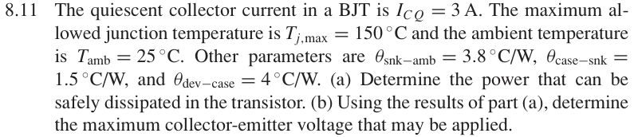

# 8.11 — 静态电流与热约束

## 相关计算器

<a href="../../../tools/chapter8-calculators.html#thermal" target="_blank" rel="noopener" style="display:inline-block;margin:0.2rem 0.35rem 0.2rem 0;padding:0.5rem 0.7rem;border:1px solid #2563eb;border-radius:0.5rem;text-decoration:none;font-weight:600;">Thermal constraint ↗</a>
<a href="../../../tools/chapter8-calculators.html#a" target="_blank" rel="noopener" style="display:inline-block;margin:0.2rem 0.35rem 0.2rem 0;padding:0.5rem 0.7rem;border:1px solid #2563eb;border-radius:0.5rem;text-decoration:none;font-weight:600;">Q-point / device power ↗</a>

来源：Donald A. Neamen, *Microelectronics: Circuit Analysis and Design*, 4th ed.，教材页 606（PDF 第 629 页）。

<!-- instantiated-calculator -->
## 代入本题数值的计算器

### 热限制 + 最大安全功耗

<iframe src="../../../tools/chapter8-calculators.html?compact=1&tab=thermal&tTjmax=150&tTa=25&tPd=13.4409&tJC=4&tCS=1.5&tSA=3.8" title="Problem 8.11 calculator — 热限制 + 最大安全功耗" style="width:100%;min-height:560px;border:1px solid #d1d5db;border-radius:12px;background:white;" loading="lazy"></iframe>

## 题目

The quiescent collector current in a BJT is ICQ = 3 A. The maximum allowed junction temperature is Tj,max = 150 ◦C and the ambient temperature is Tamb = 25 ◦C. Other parameters are θsnk−amb = 3.8 ◦C/W, θcase−snk = 1.5 ◦C/W, and θdev−case = 4 ◦C/W.

(a) Determine the power that can be safely dissipated in the transistor.

(b) Using the results of part

(a), determine the maximum collector-emitter voltage that may be applied.

## 原题截图

## 图片对应

本题没有引用教材中的电路图；要求自行绘制的图应根据题干条件作出。

[返回第 8 章目录](index.md)
