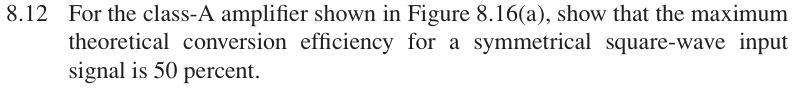
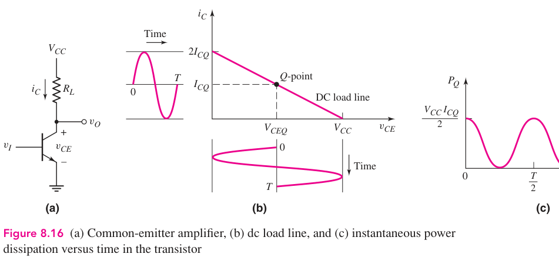

# 8.12 — class-A 方波效率

## 教材对应知识点

- **§8.3.1 Class-A Operation，教材 pp. 572–576**
- Class-A 导通角、负载功率与电源功率；对称方波时最大理论转换效率为 50%。

## 相关计算器

## 原题截图

## 对应图片：Figure 8.16

图片来源：教材页 573（PDF 第 596 页）。 这是章节正文中的图，图号没有 P 前缀。

[返回第 8 章目录](index.md)

<a href="../../../tools/chapter8-calculators.html#a" target="_blank" rel="noopener" style="display:inline-block;margin:0.2rem 0.35rem 0.2rem 0;padding:0.5rem 0.7rem;border:1px solid #2563eb;border-radius:0.5rem;text-decoration:none;font-weight:600;">Class-A power relations ↗</a>

来源：Donald A. Neamen, *Microelectronics: Circuit Analysis and Design*, 4th ed.，教材页 606（PDF 第 629 页）。

<!-- instantiated-calculator -->
## 代入本题数值的计算器

### 归一化最大对称方波（直接显示 50%）

<iframe src="../../../tools/chapter8-calculators.html?compact=1&tab=a&aWave=square&aVcc=2&aVq=1&aIq=1&aRl=1&fig=fig-8-16.webp" title="Problem 8.12 calculator — 归一化最大对称方波（直接显示 50%）" style="width:100%;min-height:560px;border:1px solid #d1d5db;border-radius:12px;background:white;" loading="lazy"></iframe>

## 题目

For the class-A amplifier shown in Figure 8.16(a), show that the maximum theoretical conversion efficiency for a symmetrical square-wave input signal is 50 percent.

