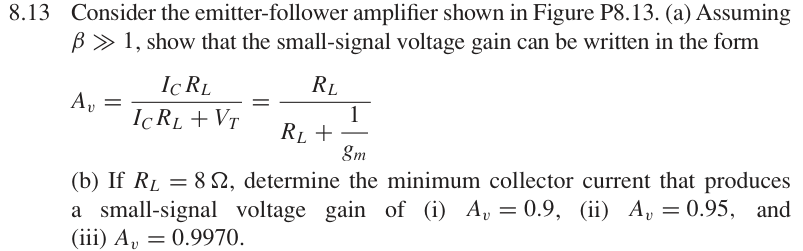
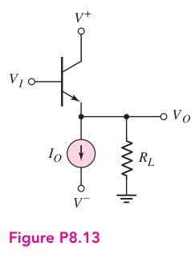

# 8.13 — 射极跟随器小信号增益

## 教材对应知识点

- **§8.3.1 Class-A Operation，教材 pp. 572–576；Chapter 6 §6.6 Emitter Follower，pp. 420–430**
- Emitter follower 小信号增益 \(A_v=\frac{g_mR_L}{1+g_mR_L}\)、\(g_m=I_C/V_T\)，以及由目标增益反推偏置电流。

## 相关计算器

## 原题截图

## 对应图片：Figure P8.13

图片来源：教材页 607（PDF 第 630 页）。 该图上的参数是原图标注；解题时应采用本题题干给定的参数。

[返回第 8 章目录](index.md)

<a href="../../../tools/chapter8-calculators.html#follower" target="_blank" rel="noopener" style="display:inline-block;margin:0.2rem 0.35rem 0.2rem 0;padding:0.5rem 0.7rem;border:1px solid #2563eb;border-radius:0.5rem;text-decoration:none;font-weight:600;">Emitter-follower gain / gm ↗</a>

来源：Donald A. Neamen, *Microelectronics: Circuit Analysis and Design*, 4th ed.，教材页 607（PDF 第 630 页）。

<!-- instantiated-calculator -->
## 代入本题数值的计算器

### (b)(i) 目标 Av=0.90

<iframe src="../../../tools/chapter8-calculators.html?compact=1&tab=follower&fMode=design&fRl=8&fAvTarget=0.9&fig=fig-P8-13.webp" title="Problem 8.13 calculator — (b)(i) 目标 Av=0.90" style="width:100%;min-height:560px;border:1px solid #d1d5db;border-radius:12px;background:white;" loading="lazy"></iframe>

### (b)(ii) 目标 Av=0.95

<iframe src="../../../tools/chapter8-calculators.html?compact=1&tab=follower&fMode=design&fRl=8&fAvTarget=0.95&fig=fig-P8-13.webp" title="Problem 8.13 calculator — (b)(ii) 目标 Av=0.95" style="width:100%;min-height:560px;border:1px solid #d1d5db;border-radius:12px;background:white;" loading="lazy"></iframe>

### (b)(iii) 目标 Av=0.997

<iframe src="../../../tools/chapter8-calculators.html?compact=1&tab=follower&fMode=design&fRl=8&fAvTarget=0.997&fig=fig-P8-13.webp" title="Problem 8.13 calculator — (b)(iii) 目标 Av=0.997" style="width:100%;min-height:560px;border:1px solid #d1d5db;border-radius:12px;background:white;" loading="lazy"></iframe>

## 题目

Consider the emitter-follower amplifier shown in Figure P8.13.

(a) Assuming $\beta\gg1$, show that the small-signal voltage gain can be written in the form

$$
A_v=\frac{I_C R_L}{I_C R_L+V_T}=\frac{R_L}{R_L+1/g_m}.
$$

(b) If $R_L=8\,\Omega$, determine the minimum collector current that produces a small-signal voltage gain of (i) $A_v=0.9$, (ii) $A_v=0.95$, and (iii) $A_v=0.9970$.

