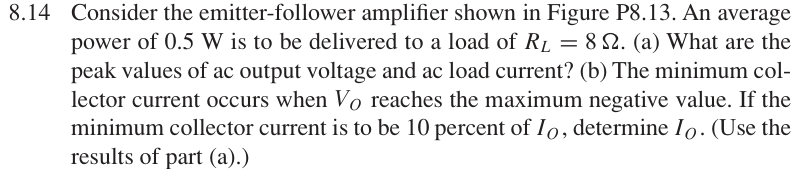

# 8.14 — 射极跟随器负载功率

## 相关计算器

<a href="../../../tools/chapter8-calculators.html#follower" target="_blank" rel="noopener" style="display:inline-block;margin:0.2rem 0.35rem 0.2rem 0;padding:0.5rem 0.7rem;border:1px solid #2563eb;border-radius:0.5rem;text-decoration:none;font-weight:600;">Follower current / gain ↗</a>
<a href="../../../tools/chapter8-calculators.html#a" target="_blank" rel="noopener" style="display:inline-block;margin:0.2rem 0.35rem 0.2rem 0;padding:0.5rem 0.7rem;border:1px solid #2563eb;border-radius:0.5rem;text-decoration:none;font-weight:600;">Load power ↗</a>

来源：Donald A. Neamen, *Microelectronics: Circuit Analysis and Design*, 4th ed.，教材页 607（PDF 第 630 页）。

## 题目

Consider the emitter-follower amplifier shown in Figure P8.13. An average power of 0.5 W is to be delivered to a load of RL = 8 Ω.

(a) What are the peak values of ac output voltage and ac load current?

(b) The minimum collector current occurs when VO reaches the maximum negative value. If the minimum collector current is to be 10 percent of IO, determine IO. (Use the results of part

(a).)

## 原题截图

## 对应图片：Figure P8.13

图片来源：教材页 607（PDF 第 630 页）。 该图上的参数是原图标注；解题时应采用本题题干给定的参数。

[返回第 8 章目录](index.md)
