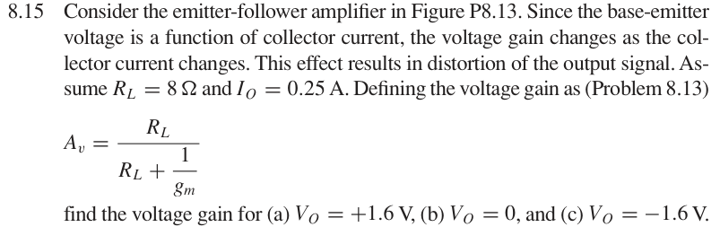

# 8.15 — 增益随偏置变化

## 相关计算器

<a href="../../../tools/chapter8-calculators.html#follower" target="_blank" rel="noopener" style="display:inline-block;margin:0.2rem 0.35rem 0.2rem 0;padding:0.5rem 0.7rem;border:1px solid #2563eb;border-radius:0.5rem;text-decoration:none;font-weight:600;">Gain vs. bias / gm ↗</a>

来源：Donald A. Neamen, *Microelectronics: Circuit Analysis and Design*, 4th ed.，教材页 607（PDF 第 630 页）。

## 题目

Consider the emitter-follower amplifier in Figure P8.13. Since the base-emitter voltage is a function of collector current, the voltage gain changes as the collector current changes. This effect results in distortion of the output signal. Assume $R_L=8\,\Omega$ and $I_O=0.25\,\mathrm A$. Defining the voltage gain as (Problem 8.13)

$$
A_v=\frac{R_L}{R_L+1/g_m},
$$

find the voltage gain for (a) $V_O=+1.6\,\mathrm V$, (b) $V_O=0$, and (c) $V_O=-1.6\,\mathrm V$.

## 原题截图

## 对应图片：Figure P8.13

图片来源：教材页 607（PDF 第 630 页）。 该图上的参数是原图标注；解题时应采用本题题干给定的参数。

[返回第 8 章目录](index.md)
