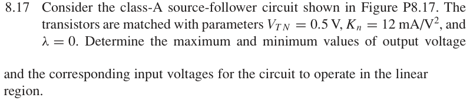
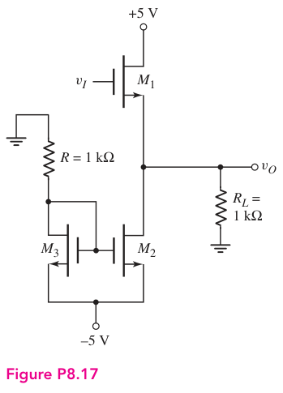

# 8.17 — class-A MOS 输出范围

## 相关计算器

<a href="../../../tools/chapter8-calculators.html#a" target="_blank" rel="noopener" style="display:inline-block;margin:0.2rem 0.35rem 0.2rem 0;padding:0.5rem 0.7rem;border:1px solid #2563eb;border-radius:0.5rem;text-decoration:none;font-weight:600;">Class-A MOS output swing ↗</a>

来源：Donald A. Neamen, *Microelectronics: Circuit Analysis and Design*, 4th ed.，教材页 607, 608（PDF 第 630, 631 页）。

## 题目

Consider the class-A source-follower circuit shown in Figure P8.17. The transistors are matched with parameters VTN = 0.5 V, Kn = 12 mA/V², and λ = 0. Determine the maximum and minimum values of output voltage and the corresponding input voltages for the circuit to operate in the linear region.

## 原题截图

## 对应图片：Figure P8.17

图片来源：教材页 607（PDF 第 630 页）。 该图上的参数是原图标注；解题时应采用本题题干给定的参数。

[返回第 8 章目录](index.md)
