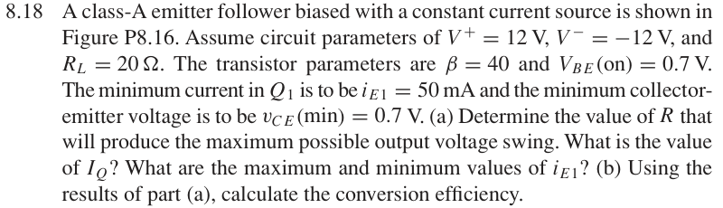
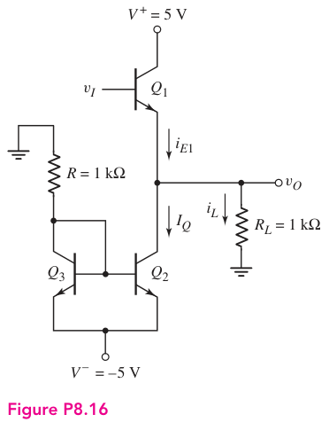

# 8.18 — class-A 最大摆幅设计

来源：Donald A. Neamen, *Microelectronics: Circuit Analysis and Design*, 4th ed.，教材页 608（PDF 第 631 页）。

## 题目

A class-A emitter follower biased with a constant current source is shown in Figure P8.16. Assume circuit parameters of V+ = 12 V, V−= −12 V, and RL = 20 Ω. The transistor parameters are β = 40 and VBE(on) = 0.7 V. The minimum current in Q1 is to be iE1 = 50 mA and the minimum collector- emitter voltage is to be vC E(min) = 0.7 V.

(a) Determine the value of R that will produce the maximum possible output voltage swing. What is the value of IQ? What are the maximum and minimum values of iE1?

(b) Using the results of part

(a), calculate the conversion efficiency.

## 原题截图

## 对应图片：Figure P8.16

图片来源：教材页 607（PDF 第 630 页）。 该图上的参数是原图标注；解题时应采用本题题干给定的参数。

## 已有部分推导

以下保留此前的电流、摆幅及功率推导。偏置电阻和完整效率尚未整理成最终解答。原图已补齐：$R$ 上端接地，$Q_2,Q_3$ 发射极接 $V^-$，两管基极相连，$Q_3$ 为二极管连接。

### 从未知展开到已知

对负载接地、输出节点另接向下恒流 $I_Q$ 的标准 NPN 射极跟随器，输出节点 KCL 为

$$
i_{E1}=I_Q+\frac{v_O}{R_L}.
$$

因此负峰值 $v_O=-V_p$ 对应最小发射极电流：

$$
\boxed{I_Q=i_{E1,\min}+\frac{V_p}{R_L}}.
$$

若 $Q_1$ 集电极直接接 $+12\,\mathrm V$，正向上限为

$$
v_{O,\max}=V^+-v_{CE1,\min}=12-0.7=11.3\,\mathrm V.
$$

在已恢复的 P8.16 中，$Q_2$ 发射极接负电源；若其在 $v_O=-11.3\,\mathrm V$ 时仍满足所需工作区，则以零为中心的候选最大对称摆幅为 $V_p=11.3\,\mathrm V$，相应

$$
\boxed{I_Q=0.050+\frac{11.3}{20}=0.615\,\mathrm A},
$$

$$
\boxed{i_{E1,\min}=0.050\,\mathrm A},\qquad
\boxed{i_{E1,\max}=0.615+\frac{11.3}{20}=1.180\,\mathrm A}.
$$

最大正弦负载功率为

$$
\boxed{P_L=\frac{V_p^2}{2R_L}=3.19225\,\mathrm W}.
$$

[返回第 8 章目录](index.md)
