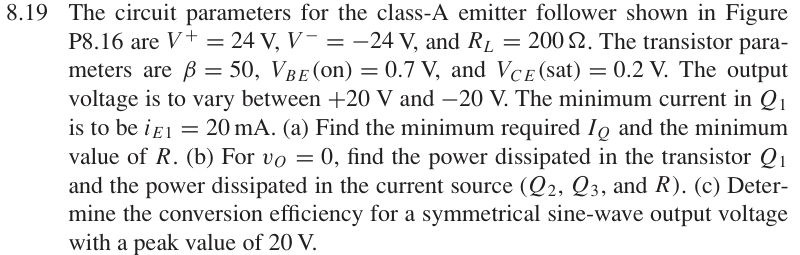

# 8.19 — class-A 偏置与效率

## 相关计算器

## 原题截图

## 对应图片：Figure P8.16

图片来源：教材页 607（PDF 第 630 页）。 该图上的参数是原图标注；解题时应采用本题题干给定的参数。

## 已有部分推导

以下保留此前的电流、摆幅及功率推导。偏置电阻和完整效率尚未整理成最终解答。原图已补齐：$R$ 上端接地，$Q_2,Q_3$ 发射极接 $V^-$，两管基极相连，$Q_3$ 为二极管连接。

### 从最小电流展开

对于输出负载接地、下方恒流支路吸收 $I_Q$ 的标准连接，

$$
i_{E1}=I_Q+\frac{v_O}{R_L}.
$$

负峰值决定所需的最小静态偏置电流：

$$
\boxed{I_{Q,\min}=i_{E1,\min}+\frac{20}{200}
=0.020+0.100=0.120\,\mathrm A}.
$$

在该偏置下

$$
\boxed{i_{E1}(-20\,\mathrm V)=20\,\mathrm{mA}},\qquad
\boxed{i_{E1}(+20\,\mathrm V)=220\,\mathrm{mA}}.
$$

正峰值时若 $Q_1$ 集电极接 $+24\,\mathrm V$，$v_{CE1}=24-20=4\,\mathrm V>0.2\,\mathrm V$；电流源的工作区可根据下方原图进一步检查。

### 已能计算的功率

在 $v_O=0$ 时，$i_{E1}=0.120\,\mathrm A$。保留有限 $\beta$：

$$
i_{C1}=\frac{\beta}{\beta+1}i_{E1}
=\frac{50}{51}(0.120)=0.117647\,\mathrm A.
$$

所以 $Q_1$ 的集电极—发射极功耗为

$$
\boxed{P_{CE1}=24(0.117647)=2.82353\,\mathrm W}.
$$

若计算晶体管所有端口输入的功率，还应加 $v_{BE1}i_{B1}=0.7(0.120/51)=1.64706\,\mathrm{mW}$。

峰值 $20\,\mathrm V$ 的正弦负载功率为

$$
\boxed{P_L=\frac{20^2}{2(200)}=1.000\,\mathrm W}.
$$

[返回第 8 章目录](index.md)

<a href="../../../tools/chapter8-calculators.html#a" target="_blank" rel="noopener" style="display:inline-block;margin:0.2rem 0.35rem 0.2rem 0;padding:0.5rem 0.7rem;border:1px solid #2563eb;border-radius:0.5rem;text-decoration:none;font-weight:600;">Class-A bias / efficiency ↗</a>

来源：Donald A. Neamen, *Microelectronics: Circuit Analysis and Design*, 4th ed.，教材页 608（PDF 第 631 页）。

<!-- instantiated-calculator -->
## 代入本题数值的计算器

### 20 V peak into 200 Ω

<iframe src="../../../tools/chapter8-calculators.html?compact=1&tab=load&lMode=voltage&lRl=200&lVp=20" title="Problem 8.19 calculator — 20 V peak into 200 Ω" style="width:100%;min-height:560px;border:1px solid #d1d5db;border-radius:12px;background:white;" loading="lazy"></iframe>

## 题目

The circuit parameters for the class-A emitter follower shown in Figure P8.16 are V+ = 24 V, V−= −24 V, and RL = 200 Ω. The transistor para- meters are β = 50, VBE(on) = 0.7 V, and VCE(sat) = 0.2 V. The output voltage is to vary between +20 V and −20 V. The minimum current in Q1 is to be iE1 = 20 mA.

(a) Find the minimum required IQ and the minimum value of R.

(b) For vO = 0, find the power dissipated in the transistor Q1 and the power dissipated in the current source (Q2, Q3, and R).

(c) Determine the conversion efficiency for a symmetrical sine-wave output voltage with a peak value of 20 V.

