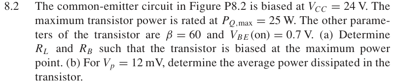
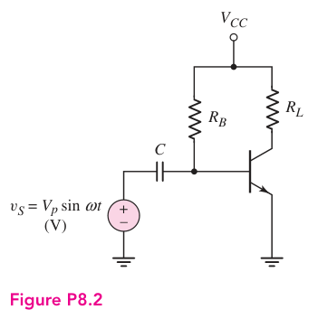

# 8.2 — 共射极最大功耗偏置

## 教材对应知识点

- **§8.2 Power Transistors，教材 pp. 562–564**
- BJT 的 SOA、DC load line、晶体管功耗 \(P_D=V_{CE}I_C\) 与最大功耗 Q-point。

## 相关计算器

## 原题截图

## 对应图片：Figure P8.2

图片来源：教材页 605（PDF 第 628 页）。 该图上的参数是原图标注；解题时应采用本题题干给定的参数。

[返回第 8 章目录](index.md)

<a href="../../../tools/chapter8-calculators.html#a" target="_blank" rel="noopener" style="display:inline-block;margin:0.2rem 0.35rem 0.2rem 0;padding:0.5rem 0.7rem;border:1px solid #2563eb;border-radius:0.5rem;text-decoration:none;font-weight:600;">Class-A Q-point / load-line ↗</a>

来源：Donald A. Neamen, *Microelectronics: Circuit Analysis and Design*, 4th ed.，教材页 605（PDF 第 628 页）。

<!-- instantiated-calculator -->
## 代入本题数值的计算器

### 最大功耗偏置点

<iframe src="../../../tools/chapter8-calculators.html?compact=1&tab=a&aVcc=24&aVq=12&aIq=2.08333&aRl=5.76&fig=fig-P8-2.webp" title="Problem 8.2 calculator — 最大功耗偏置点" style="width:100%;min-height:560px;border:1px solid #d1d5db;border-radius:12px;background:white;" loading="lazy"></iframe>

## 题目

The common-emitter circuit in Figure P8.2 is biased at VCC = 24 V. The maximum transistor power is rated at PQ,max = 25 W. The other parameters of the transistor are β = 60 and VBE(on) = 0.7 V.

(a) Determine RL and RB such that the transistor is biased at the maximum power point.

(b) For Vp = 12 mV, determine the average power dissipated in the transistor.

