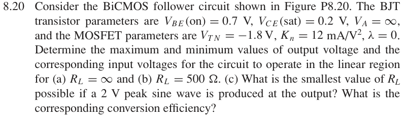
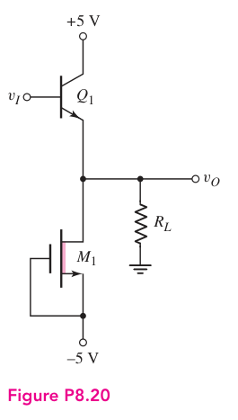

# 8.20 — BiCMOS 跟随器

## 相关计算器

<a href="../../../tools/chapter8-calculators.html#follower" target="_blank" rel="noopener" style="display:inline-block;margin:0.2rem 0.35rem 0.2rem 0;padding:0.5rem 0.7rem;border:1px solid #2563eb;border-radius:0.5rem;text-decoration:none;font-weight:600;">BiCMOS follower gain ↗</a>
<a href="../../../tools/chapter8-calculators.html#a" target="_blank" rel="noopener" style="display:inline-block;margin:0.2rem 0.35rem 0.2rem 0;padding:0.5rem 0.7rem;border:1px solid #2563eb;border-radius:0.5rem;text-decoration:none;font-weight:600;">Output-current / swing ↗</a>

来源：Donald A. Neamen, *Microelectronics: Circuit Analysis and Design*, 4th ed.，教材页 608（PDF 第 631 页）。

<!-- instantiated-calculator -->
## 代入本题数值的计算器

### 2 V peak / RL≈51.4 Ω

<iframe src="../../../tools/chapter8-calculators.html?compact=1&tab=load&lMode=voltage&lRl=51.4&lVp=2" title="Problem 8.20 calculator — 2 V peak / RL≈51.4 Ω" style="width:100%;min-height:560px;border:1px solid #d1d5db;border-radius:12px;background:white;" loading="lazy"></iframe>

## 题目

Consider the BiCMOS follower circuit shown in Figure P8.20. The BJT transistor parameters are VBE(on) = 0.7 V, VCE(sat) = 0.2 V, VA = ∞, and the MOSFET parameters are VTN = −1.8 V, Kn = 12 mA/V², λ = 0. Determine the maximum and minimum values of output voltage and the corresponding input voltages for the circuit to operate in the linear region for

(a) RL = ∞ and

(b) RL = 500 Ω.

(c) What is the smallest value of RL possible if a 2 V peak sine wave is produced at the output? What is the corresponding conversion efficiency?

## 原题截图

## 对应图片：Figure P8.20

图片来源：教材页 608（PDF 第 631 页）。 该图上的参数是原图标注；解题时应采用本题题干给定的参数。

## 已恢复的电路连接

$Q_1$ 集电极接 $+5\,\mathrm V$，基极接输入 $v_I$，发射极接输出 $v_O$。$M_1$ 漏极接输出，栅极与源极短接并接 $-5\,\mathrm V$；$R_L$ 从输出接地。

因此 $v_{GS1}=0$，$v_{DS1}=v_O+5\,\mathrm V$。题目给定 $V_{TN}=-1.8\,\mathrm V$，所以该耗尽型 NMOS 在 $v_{GS}=0$ 时仍可导通。此前缺失的连接现已补齐，完整数值解答待整理。

[返回第 8 章目录](index.md)
