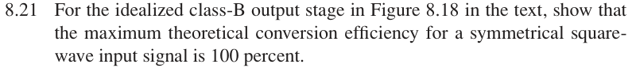
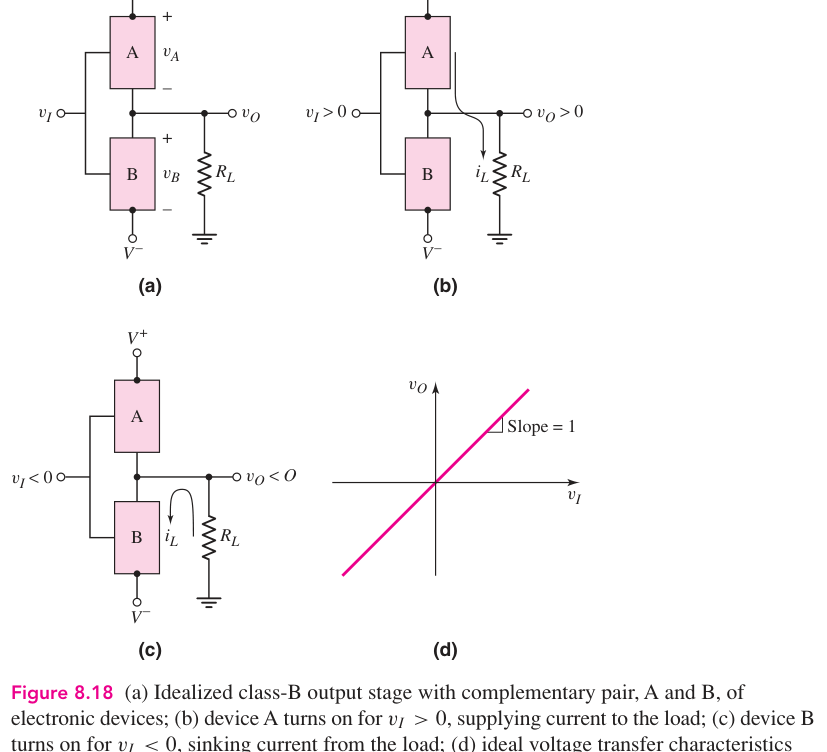

# 8.21 — class-B 方波效率

## 相关计算器

## 原题截图

## 对应图片：Figure 8.18

图片来源：教材页 576（PDF 第 599 页）。 这是章节正文中的图，图号没有 P 前缀。

[返回第 8 章目录](index.md)

<a href="../../../tools/chapter8-calculators.html#classb" target="_blank" rel="noopener" style="display:inline-block;margin:0.2rem 0.35rem 0.2rem 0;padding:0.5rem 0.7rem;border:1px solid #2563eb;border-radius:0.5rem;text-decoration:none;font-weight:600;">Class-B power / efficiency ↗</a>

来源：Donald A. Neamen, *Microelectronics: Circuit Analysis and Design*, 4th ed.，教材页 608（PDF 第 631 页）。

<!-- instantiated-calculator -->
## 代入本题数值的计算器

### 归一化理想 Class-B 对称方波（直接显示 100%）

<iframe src="../../../tools/chapter8-calculators.html?compact=1&tab=classb&bWave=square&bVcc=1&bVp=1&bRl=1&fig=fig-8-18.webp" title="Problem 8.21 calculator — 归一化理想 Class-B 对称方波（直接显示 100%）" style="width:100%;min-height:560px;border:1px solid #d1d5db;border-radius:12px;background:white;" loading="lazy"></iframe>

## 题目

For the idealized class-B output stage in Figure 8.18 in the text, show that the maximum theoretical conversion efficiency for a symmetrical square- wave input signal is 100 percent.

