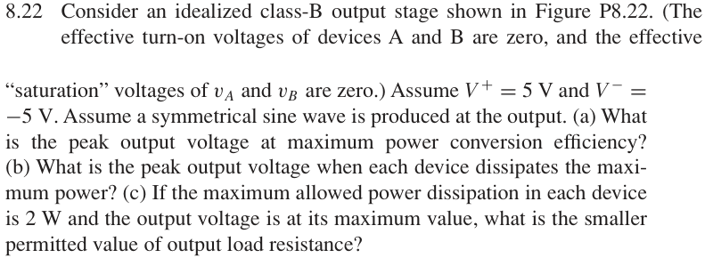

# 8.22 — 理想 class-B 功耗

## 相关计算器

<a href="../../../tools/chapter8-calculators.html#classb" target="_blank" rel="noopener" style="display:inline-block;margin:0.2rem 0.35rem 0.2rem 0;padding:0.5rem 0.7rem;border:1px solid #2563eb;border-radius:0.5rem;text-decoration:none;font-weight:600;">Ideal Class-B power / efficiency ↗</a>

来源：Donald A. Neamen, *Microelectronics: Circuit Analysis and Design*, 4th ed.，教材页 608, 609（PDF 第 631, 632 页）。

## 题目

Consider an idealized class-B output stage shown in Figure P8.22. (The effective turn-on voltages of devices A and B are zero, and the effective “saturation” voltages of vA and vB are zero.) Assume V+ = 5 V and V−= −5 V. Assume a symmetrical sine wave is produced at the output.

(a) What is the peak output voltage at maximum power conversion efficiency?

(b) What is the peak output voltage when each device dissipates the maximum power?

(c) If the maximum allowed power dissipation in each device is 2 W and the output voltage is at its maximum value, what is the smaller permitted value of output load resistance?

## 原题截图

## 对应图片：Figure P8.22

图片来源：教材页 608（PDF 第 631 页）。 该图上的参数是原图标注；解题时应采用本题题干给定的参数。

[返回第 8 章目录](index.md)
