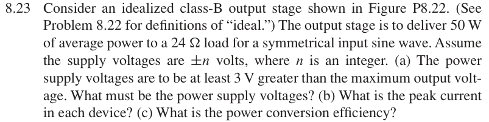
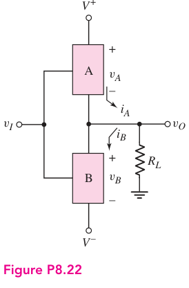

# 8.23 — 50 W class-B 设计

## 教材对应知识点

- **§8.3.2 Class-B Operation，教材 pp. 576–581**
- 由目标负载功率反推峰值输出电压/电流，再结合电源余量和 class-B efficiency 完成设计。

## 相关计算器

## 原题截图

## 对应图片：Figure P8.22

图片来源：教材页 608（PDF 第 631 页）。 该图上的参数是原图标注；解题时应采用本题题干给定的参数。

[返回第 8 章目录](index.md)

<a href="../../../tools/chapter8-calculators.html#classb" target="_blank" rel="noopener" style="display:inline-block;margin:0.2rem 0.35rem 0.2rem 0;padding:0.5rem 0.7rem;border:1px solid #2563eb;border-radius:0.5rem;text-decoration:none;font-weight:600;">Class-B output-power design ↗</a>

来源：Donald A. Neamen, *Microelectronics: Circuit Analysis and Design*, 4th ed.，教材页 609（PDF 第 632 页）。

<!-- instantiated-calculator -->
## 代入本题数值的计算器

### (a) 50 W into 24 Ω → Vp

<iframe src="../../../tools/chapter8-calculators.html?compact=1&tab=load&lMode=power&lRl=24&lPl=50&fig=fig-P8-22.webp" title="Problem 8.23 calculator — (a) 50 W into 24 Ω → Vp" style="width:100%;min-height:560px;border:1px solid #d1d5db;border-radius:12px;background:white;" loading="lazy"></iframe>

### 取 ±52 V 电源后的效率

<iframe src="../../../tools/chapter8-calculators.html?compact=1&tab=classb&bWave=sine&bVcc=52&bVp=48.9898&bRl=24&fig=fig-P8-22.webp" title="Problem 8.23 calculator — 取 ±52 V 电源后的效率" style="width:100%;min-height:560px;border:1px solid #d1d5db;border-radius:12px;background:white;" loading="lazy"></iframe>

## 题目

Consider an idealized class-B output stage shown in Figure P8.22. (See Problem 8.22 for definitions of “ideal.”) The output stage is to deliver 50 W of average power to a 24 Ω load for a symmetrical input sine wave. Assume the supply voltages are ±n volts, where n is an integer.

(a) The power supply voltages are to be at least 3 V greater than the maximum output voltage. What must be the power supply voltages?

(b) What is the peak current in each device?

(c) What is the power conversion efficiency?

